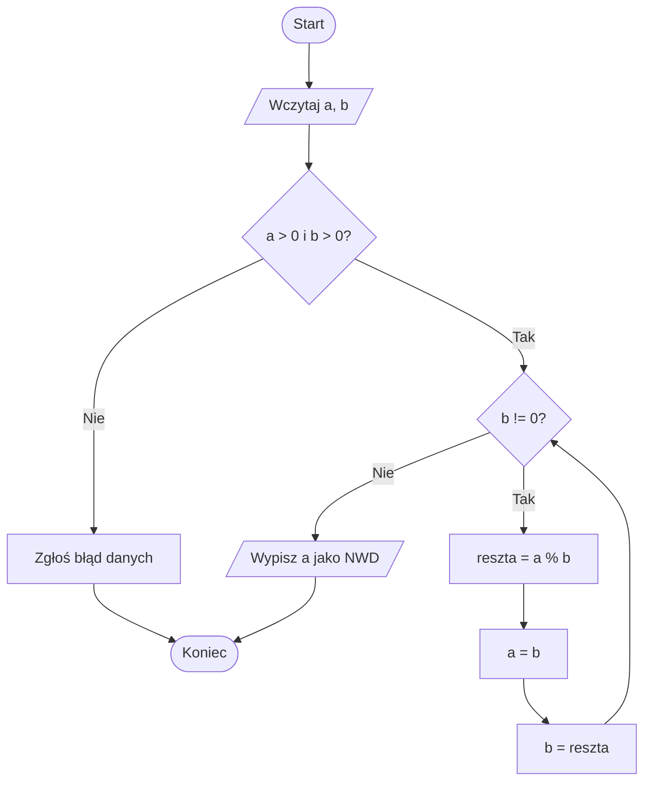
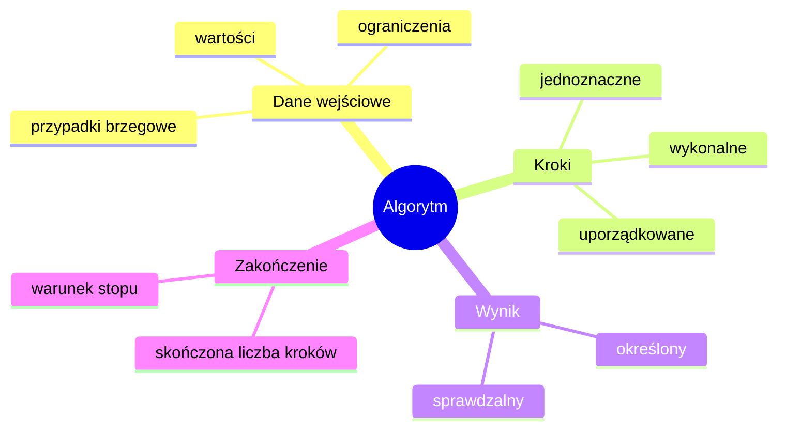

# 01. Pojęcie algorytmu

## Cele

Po zajęciach student:

- opisuje algorytm jako skończony, jednoznaczny i wykonalny przepis prowadzący od danych do wyniku,
- rozpoznaje dane wejściowe, dane wyjściowe, warunek zakończenia i przypadki brzegowe,
- potrafi przełożyć prosty algorytm na program w C#.

## Od problemu do algorytmu

Algorytm nie jest jeszcze programem. Jest metodą rozwiązania problemu, niezależną od konkretnego języka. Program jest implementacją tej metody w języku, który komputer potrafi skompilować lub zinterpretować.

Dobry opis algorytmu powinien odpowiadać na cztery pytania:

1. Jakie wartości otrzymujemy na wejściu?
2. Jaki wynik chcemy otrzymać?
3. Jakie kroki zawsze wykonujemy i w jakiej kolejności?
4. Kiedy kończymy i co robimy dla danych nietypowych?

Własności przydatne na pierwszych zajęciach:

- **skończoność** - procedura kończy się po skończonej liczbie kroków,
- **jednoznaczność** - kolejny krok nie zależy od domysłu wykonawcy,
- **wykonalność** - każdy krok można rzeczywiście wykonać,
- **ogólność** - rozwiązanie działa dla całej określonej klasy danych, a nie tylko dla jednego przykładu.

Nie każdy proces wykonywany według instrukcji jest algorytmem. „Powtarzaj, aż wynik będzie dobry” jest niejednoznaczne, jeśli nie zdefiniujemy „dobry” i nie wiemy, czy taki wynik na pewno się pojawi.

## Przykład: algorytm Euklidesa

Problem: dla dwóch dodatnich liczb całkowitych wyznaczyć największy wspólny dzielnik.

Opis postępowania:

1. Pobierz `a` i `b`.
2. Dopóki `b` jest różne od zera, zapamiętaj resztę z dzielenia `a` przez `b`, przesuń `b` do `a`, a resztę do `b`.
3. Zwróć `a`.

W każdym obrocie pętli druga liczba maleje, więc dla dodatnich danych algorytm kończy się. Niezmiennikiem jest to, że para `(a, b)` ma ten sam wspólny dzielnik co para początkowa.



Pełna wersja diagramu jest również dostępna w pliku [diagram-algorytm-euklidesa.mmd](diagram-algorytm-euklidesa.mmd).



Mapa właściwości jest zapisana także w pliku [diagram-wlasnosci-algorytmu.mmd](diagram-wlasnosci-algorytmu.mmd).

Kod projektu znajduje się w `Kod/AlgorytmEuclidesa/Program.cs`.

```csharp
static int Nwd(int a, int b)
{
    if (a <= 0 || b <= 0)
    {
        throw new ArgumentOutOfRangeException("Liczby muszą być dodatnie.");
    }

    while (b != 0)
    {
        int reszta = a % b;
        a = b;
        b = reszta;
    }

    return a;
}
```

Operator `%` wyznacza resztę z dzielenia całkowitego. Instrukcje przypisania aktualizują stan programu: po `a = b` poprzednia wartość `a` jest już dostępna tylko wtedy, gdy wcześniej została zachowana w innej zmiennej.

## Inne przykłady postępowania algorytmicznego

- Przepis kulinarny: dane to składniki i ich ilości, kroki mają kolejność, a wynikiem jest gotowa potrawa.
- Wyszukanie największej liczby w tablicy: przyjmij pierwszą wartość jako największą, przejrzyj pozostałe i aktualizuj rekord.
- Obliczenie średniej: zsumuj wartości, policz ich liczbę, podziel sumę przez liczbę; trzeba określić zachowanie dla pustego zbioru.
- Logowanie do systemu: pobierz identyfikator i hasło, zweryfikuj dane, nadaj jeden z określonych stanów; ograniczona liczba prób jest warunkiem zakończenia.

## Ćwiczenia dla studentów

1. Zapisz opis algorytmu, który dla trzech liczb zwraca najmniejszą. Wymień przypadki równości.
2. Narysuj diagram algorytmu zamiany wartości dwóch zmiennych. Wyjaśnij, dlaczego potrzebna jest zmienna tymczasowa.
3. Zmień program Euklidesa tak, aby wyświetlał każdą parę `(a, b)` przed wykonaniem kolejnego kroku.
4. Podaj dane, dla których naiwny algorytm „odejmuj mniejszą liczbę od większej” wykona więcej kroków niż algorytm z resztą z dzielenia.

### Rozwiązania i wyjaśnienia

Do zadania 1 można użyć dwóch porównań:

```csharp
static int Minimum(int a, int b, int c)
{
    int minimum = a;
    if (b < minimum) minimum = b;
    if (c < minimum) minimum = c;
    return minimum;
}
```

W zadaniu 2 poprawna kolejność to `tymczasowa = a`, `a = b`, `b = tymczasowa`. Bez pierwszego kroku poprzednia wartość `a` zostałaby utracona. Dla zadania 4 dobrym przykładem są liczby `1` i `1_000_000`: odejmowanie potrzebuje bardzo wielu powtórzeń, a reszta z dzielenia kończy obliczenie od razu.

## Laboratorium: budowanie i uruchamianie

W katalogu projektu wykonaj:

```powershell
dotnet build
dotnet run
```

Program przyjmuje dwie dodatnie liczby. Sprawdź wynik dla `48` i `18`, a następnie dla równości, większej pierwszej liczby, większej drugiej liczby oraz danych niepoprawnych. W Visual Studio Code ustaw punkt przerwania na początku pętli i obserwuj `a`, `b` oraz `reszta`.

## Źródła

- [C# methods](https://learn.microsoft.com/dotnet/csharp/programming-guide/classes-and-structs/methods),
- [while statement](https://learn.microsoft.com/dotnet/csharp/language-reference/statements/iteration-statements#the-while-statement),
- [Arithmetic operators](https://learn.microsoft.com/dotnet/csharp/language-reference/operators/arithmetic-operators),
- [Algorytm Euklidesa - Wikipedia](https://en.wikipedia.org/wiki/Euclidean_algorithm).
