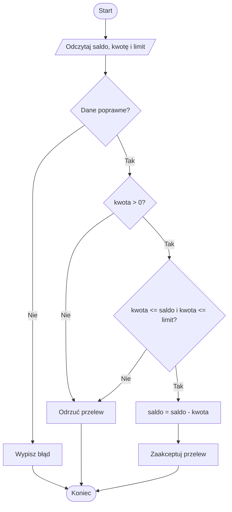
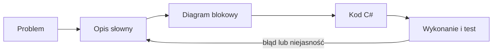

# 02. Sposoby przedstawiania algorytmów

## Po co kilka reprezentacji?

Ten sam pomysł można przedstawić na różnym poziomie szczegółowości. Opis słowny pomaga rozmawiać o problemie, diagram blokowy pokazuje przepływ decyzji, a kod C# precyzuje składnię i może zostać wykonany przez komputer. Reprezentacje nie konkurują ze sobą: zwykle zaczynamy od prostszej i stopniowo usuwamy niejednoznaczności.

### Opis postępowania

Opis powinien używać czasowników oznaczających działanie oraz jasno nazywać dane. Dla przelewu:

1. Odczytaj saldo, kwotę przelewu i limit jednorazowej operacji.
2. Jeżeli kwota jest niedodatnia, odrzuć operację.
3. Jeżeli kwota przekracza limit albo saldo, odrzuć operację.
4. W przeciwnym razie pomniejsz saldo i zaakceptuj przelew.

Warto od razu dopisać założenia: kwota jest typu `decimal`, pieniądze mają dokładność dziesiętną, a saldo nie może być ujemne.

### Diagram blokowy

Diagram blokowy uwidacznia kolejność, operacje i rozgałęzienia. W Mermaid stosujemy `flowchart`: prostokąt oznacza operację, romb decyzję, a strzałka przejście. Diagram kodu z `Kod/InstrukcjeWarunkowe/Program.cs` znajduje się w [diagram-przelew.mmd](diagram-przelew.mmd).



Źródło: [diagram-przelew.mmd](diagram-przelew.mmd).



Źródło: [diagram-reprezentacje.mmd](diagram-reprezentacje.mmd).

### Język programowania

Kod jest formalnym opisem, który podlega regułom składni i typów. W C# warunki zapisujemy w `if`, alternatywy w `else`, a wynik możemy zwrócić przez `return`:

```csharp
static bool CzyPrzelewMozliwy(decimal saldo, decimal kwota, decimal limit)
{
    return kwota > 0 && kwota <= saldo && kwota <= limit;
}
```

Wersja wykonywalna oprócz samego warunku musi obsłużyć wejście, błędy konwersji i komunikat dla użytkownika. Dlatego kod jest bardziej szczegółowy niż diagram.

## Jak przejść od diagramu do C#?

1. Nadaj nazwę każdej wartości z diagramu i wybierz jej typ.
2. Zamień blok wejścia na `Console.ReadLine()` oraz sprawdzenie `TryParse`.
3. Zamień romb na wyrażenie typu `bool` w `if`.
4. Zamień blok wyjścia na `Console.WriteLine`.
5. Dla każdego rozgałęzienia sprawdź przynajmniej jedną ścieżkę prawdziwą i fałszywą.

Nie należy przepisywać diagramu mechanicznie, gdy prowadzi to do nieczytelnego kodu. Dobrą praktyką jest wydzielenie decyzji do metody, której nazwa opisuje pytanie.

## Zadania

1. Narysuj diagram dla programu, który przyjmuje temperaturę i wypisuje `zimno`, gdy jest mniejsza niż 10, w przeciwnym razie `ciepło`.
2. Napisz algorytm sprawdzający, czy liczba całkowita jest podzielna przez 3 lub 5. Uwzględnij ujemne liczby.
3. Uzupełnij program przelewu o opłatę `0.50m`, pobieraną tylko wtedy, gdy przelew jest poprawny. Sprawdź, czy saldo po opłacie nadal wystarcza.

### Rozwiązania i wyjaśnienia

Warunek z zadania 2 w C# to `liczba % 3 == 0 || liczba % 5 == 0`. Operator `||` oznacza alternatywę, a reszta z dzielenia działa również dla liczb ujemnych, więc warunek nie wymaga osobnej gałęzi.

W zadaniu 3 najlepiej najpierw obliczyć całkowity koszt operacji:

```csharp
decimal oplata = 0.50m;
bool moznaWykonac = kwota > 0 && kwota <= limit && kwota + oplata <= saldo;
```

Takie rozwiązanie nie zmienia salda przed sprawdzeniem wszystkich warunków. To ważne, bo w przeciwnym razie odrzucona operacja mogłaby częściowo zmodyfikować stan.

## Laboratorium

```powershell
dotnet build
dotnet run
```

W debugerze ustaw punkt przerwania wewnątrz metody `CzyPrzelewMozliwy`. Uruchom program dla kwoty większej od salda, równej limitowi oraz niedodatniej. Obserwuj, które fragmenty instrukcji warunkowej są spełnione.

## Źródła

- [if and if-else statements](https://learn.microsoft.com/dotnet/csharp/language-reference/statements/selection-statements),
- [Boolean logical operators](https://learn.microsoft.com/dotnet/csharp/language-reference/operators/boolean-logical-operators),
- [Mermaid flowcharts](https://mermaid.js.org/syntax/flowchart.html),
- [C# programming guide](https://learn.microsoft.com/dotnet/csharp/programming-guide/).
