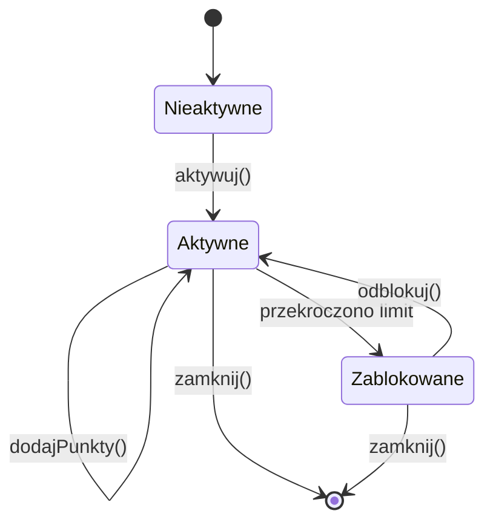
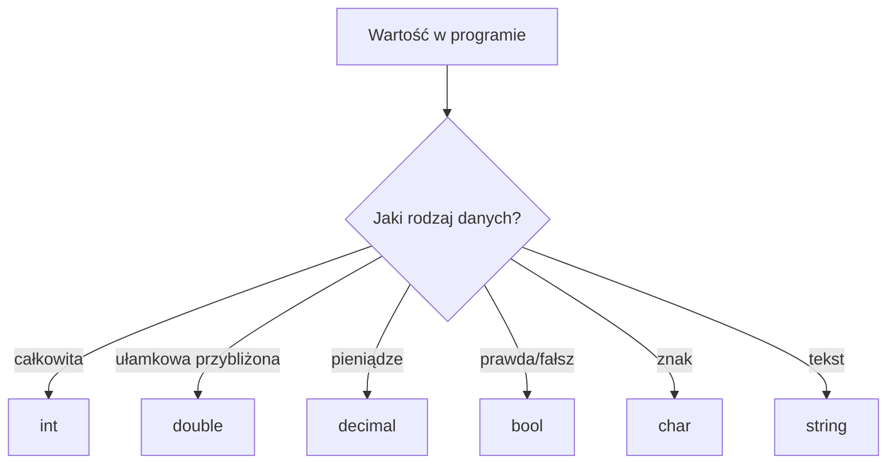

# 03. Program jako maszyna stanowa

## Stan programu

Program można traktować jak maszynę, która ma stan, otrzymuje zdarzenie lub dane wejściowe i przechodzi do nowego stanu. Stanem są wszystkie informacje potrzebne do przewidzenia dalszego działania: wartości zmiennych, pozycja wykonania oraz stan obiektów.

Przykład konta:

- `Nieaktywne` - konto nie jest jeszcze gotowe,
- `Aktywne` - można przyjmować punkty,
- `Zablokowane` - operacja jest niedostępna.

Diagram opisuje przejścia, a program przechowuje aktualny stan w zmiennej typu `enum`. Diagram znajduje się w [diagram-maszyna-stanowa.mmd](diagram-maszyna-stanowa.mmd).



Źródło: [diagram-maszyna-stanowa.mmd](diagram-maszyna-stanowa.mmd).

## Zmienne i typy

Zmienna jest nazwanym miejscem przechowującym wartość określonego typu. W C# typ jest częścią kontraktu programu:

```csharp
int liczbaOsob = 3;
double temperatura = 21.5;
decimal cena = 19.99m;
bool czyGotowe = false;
char pierwszaLitera = 'C';
string nazwa = "C#";
```

`int` przechowuje liczby całkowite, `double` przybliżone liczby zmiennoprzecinkowe, `decimal` nadaje się do obliczeń finansowych, `bool` ma wartości `true` lub `false`, `char` jeden znak, a `string` tekst. Sufiks `m` informuje kompilator, że literał ma typ `decimal`.



Źródło: [diagram-typy-zmiennych.mmd](diagram-typy-zmiennych.mmd).

### Silne i słabe typowanie

W języku statycznie typowanym typ zmiennej jest znany podczas kompilacji. C# jest statycznie i silnie typowany: kompilator pilnuje, aby nie dodawać bezpośrednio tekstu do liczby, a niejawne konwersje są ograniczone do bezpiecznych przypadków.

```csharp
int liczba = 10;
// liczba = "dziesięć"; // błąd kompilacji: string nie jest int
double przyblizenie = liczba; // dozwolone rozszerzenie int -> double
```

Słabe lub dynamiczne typowanie zwykle pozwala przesunąć więcej kontroli na czas wykonania. C# ma słowo `dynamic`, ale nie zmienia to domyślnego charakteru języka i powinno być używane świadomie:

```csharp
dynamic wartosc = 10;
wartosc = "tekst"; // kompilator pozwala, błąd może pojawić się dopiero przy operacji
```

Nie należy utożsamiać `var` z dynamicznym typowaniem. `var wynik = 10` nadal oznacza statycznie znany typ `int`; `var` tylko pozwala kompilatorowi wywnioskować typ z prawej strony.

## Operator przypisania i zmiana stanu

Podstawowe przypisanie to `zmienna = wyrażenie`. Najpierw obliczana jest prawa strona, potem wynik trafia do zmiennej po lewej:

```csharp
int punkty = 0;
punkty = 5;
punkty += 2; // punkty = punkty + 2
punkty -= 1;
punkty *= 3;
punkty /= 2;
punkty %= 2;
punkty++;    // zwiększenie o 1
punkty--;    // zmniejszenie o 1
```

Operatory złożone są skrótem, ale nie zmieniają idei: każdy z nich mutuje stan. Przed debugowaniem warto przewidzieć wartość zmiennej po każdej instrukcji.

## Wejście i wyjście w języku C sharp

`Console.WriteLine` wypisuje tekst i przechodzi do nowej linii. `Console.ReadLine` zwraca tekst wpisany przez użytkownika albo `null`, dlatego bezpieczny program sprawdza wynik konwersji:

```csharp
Console.Write("Podaj liczbę: ");
if (int.TryParse(Console.ReadLine(), out int liczba))
{
    Console.WriteLine($"Otrzymano {liczba}.");
}
else
{
    Console.WriteLine("To nie była liczba całkowita.");
}
```

Projekt [Kod/MaszynaStanowa/Program.cs](Kod/MaszynaStanowa/Program.cs) łączy typy, przypisania i przejścia stanów w jednym krótkim programie.

## Zadania

1. Dodaj do programu zmienną `decimal saldo` i przejście do stanu `Zablokowane`, gdy saldo spadnie poniżej zera.
2. Zastąp `var` jawnym typem wszędzie tam, gdzie typ ma znaczenie dydaktyczne. Wyjaśnij, dlaczego program nadal działa tak samo.
3. Napisz program, który pobiera wiek i wypisuje, czy osoba jest pełnoletnia. Obsłuż tekst, który nie jest liczbą.
4. Prześledź ręcznie wartość `punkty` dla instrukcji: `punkty = 7; punkty += 4; punkty *= 2; punkty /= 3;`.

### Rozwiązania i wyjaśnienia

Warunek pełnoletności może wyglądać tak:

```csharp
if (int.TryParse(Console.ReadLine(), out int wiek))
{
    Console.WriteLine(wiek >= 18 ? "pełnoletnia" : "niepełnoletnia");
}
else
{
    Console.WriteLine("Niepoprawny wiek.");
}
```

W zadaniu 4 wynikami po kolejnych krokach są `7`, `11`, `22`, `7`, ponieważ dzielenie dwóch wartości typu `int` jest całkowite.

## Laboratorium

```powershell
dotnet build
dotnet run
```

Ustaw punkt przerwania przed zmianą stanu i krokowo wykonuj program. Notuj tabelę: instrukcja, wartość `punkty`, wartość `stan`. To najprostszy model śledzenia maszyny stanowej.

## Źródła

- [Built-in types](https://learn.microsoft.com/dotnet/csharp/language-reference/builtin-types/built-in-types),
- [Implicitly typed local variables (`var`)](https://learn.microsoft.com/dotnet/csharp/language-reference/statements/declarations#implicitly-typed-local-variables),
- [Assignment operators](https://learn.microsoft.com/dotnet/csharp/language-reference/operators/assignment-operator),
- [Console class](https://learn.microsoft.com/dotnet/api/system.console),
- [Type testing and cast operators](https://learn.microsoft.com/dotnet/csharp/language-reference/operators/type-testing-and-cast).
