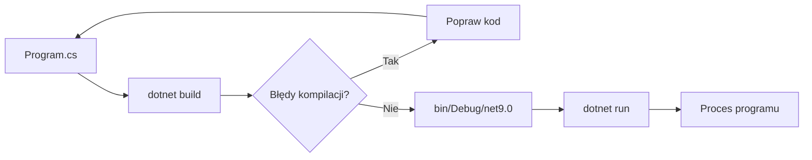

# 04. Pierwszy program (C#)

Pierwszy program powinien być mały, ale przedstawiony jako pełny cykl: pomysł, dane, algorytm, diagram, kod, kompilacja, uruchomienie i obserwacja wyniku.

## Problem

Program przywita użytkownika po imieniu. Jeśli użytkownik nic nie wpisze, użyje neutralnego komunikatu. To drobny przykład, ale zawiera wejście, decyzję i wyjście.

### Koncepcja algorytmu

1. Wyświetl prośbę o imię.
2. Odczytaj tekst z konsoli.
3. Jeżeli tekst jest pusty, przyjmij `student`.
4. Wyświetl powitanie.

```mermaid
flowchart TD
    A([Start]) --> B[/Napis "Podaj imię"/]
    B --> C[/Odczytaj imię/]
    C --> D{Puste?}
    D -- Tak --> E[imie = "student"]
    D -- Nie --> F[Zachowaj imię]
    E --> G[/Wypisz powitanie/]
    F --> G
    G --> H([Koniec])
```

Źródło: [diagram-pierwszy-program.mmd](diagram-pierwszy-program.mmd).

### Kod

```csharp
Console.Write("Podaj imię: ");
string imie = Console.ReadLine() ?? "";
if (string.IsNullOrWhiteSpace(imie))
{
    imie = "student";
}

Console.WriteLine($"Witaj, {imie}!");
```

W projekcie [Kod/PierwszyProgram/Program.cs](Kod/PierwszyProgram/Program.cs) kod jest zapisany jako top-level statements. C# pozwala pominąć ręczne umieszczenie instrukcji w `static void Main`, ale kompilator nadal tworzy punkt wejścia aplikacji.

## Jak kod staje się programem?

Plik `.cs` jest kodem źródłowym. `dotnet build` uruchamia kompilator C#, sprawdza składnię i typy, a następnie zapisuje wynik w katalogu `bin`. `dotnet run` buduje projekt, jeśli trzeba, i uruchamia wynikową aplikację. Schemat pokazuje rolę projektu i SDK.



Źródło: [diagram-cykl-pierwszego-programu.mmd](diagram-cykl-pierwszego-programu.mmd).

## Instrukcja krok po kroku

1. Otwórz katalog projektu w Visual Studio Code.
2. Przeczytaj `PierwszyProgram.csproj`; `TargetFramework` wskazuje `net9.0`.
3. Otwórz `Program.cs` i zmień komunikat.
4. W terminalu projektu wykonaj `dotnet build`.
5. Wykonaj `dotnet run` i wpisz imię.
6. Ustaw punkt przerwania przed `Console.WriteLine` i uruchom debugowanie przez `F5`.

## Zadania

1. Zmień program tak, aby pytał o kierunek studiów i wypisywał oba elementy w jednym zdaniu.
2. Dodaj pytanie o rok rozpoczęcia studiów i wyświetl, ile lat minęło od tej daty. Użyj `int.TryParse`.
3. Dodaj drugi wariant komunikatu dla imienia `Ada`.

### Rozwiązania i wyjaśnienia

Do zadania 2 potrzebna jest kontrola danych:

```csharp
Console.Write("Rok rozpoczęcia: ");
if (int.TryParse(Console.ReadLine(), out int rok))
{
    int lata = DateTime.Now.Year - rok;
    Console.WriteLine($"Studiujesz od około {lata} lat.");
}
else
{
    Console.WriteLine("Rok musi być liczbą całkowitą.");
}
```

Rozwiązanie nie zakłada, że wejście użytkownika jest poprawne. To pierwszy krok od programu działającego tylko dla przykładu do programu odpornego na dane spoza scenariusza.

## Laboratorium

```powershell
dotnet build
dotnet run
```

Porównaj zachowanie dla imienia, pustej linii i kilku spacji. W debugerze sprawdź wartość `imie` przed i po instrukcji `if`.

## Źródła

- [Tutorial: Create a C# console application](https://learn.microsoft.com/dotnet/core/tutorials/with-visual-studio-code),
- [Console.WriteLine](https://learn.microsoft.com/dotnet/api/system.console.writeline),
- [Console.ReadLine](https://learn.microsoft.com/dotnet/api/system.console.readline),
- [Top-level statements](https://learn.microsoft.com/dotnet/csharp/fundamentals/program-structure/top-level-statements).
