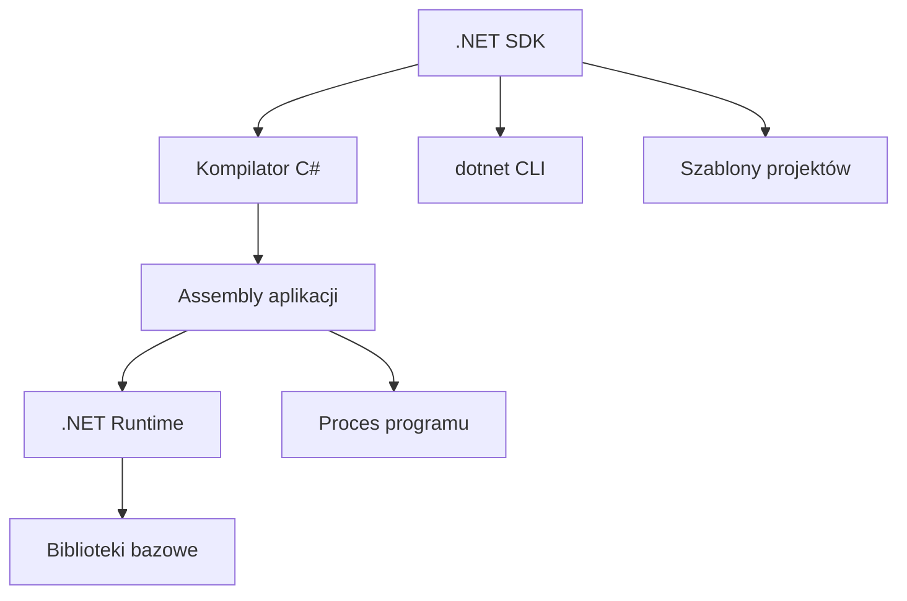
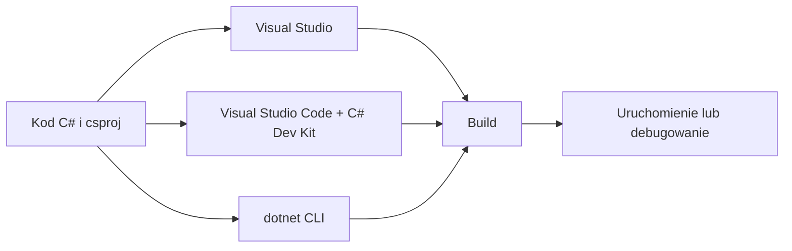

# 05. Środowisko .NET, Visual Studio i Visual Studio Code

## Czym jest .NET?

.NET to platforma uruchomieniowa i zestaw narzędzi do tworzenia aplikacji. W tym module używamy C# oraz SDK .NET 9 lub nowszego.

- **SDK** zawiera kompilator, szablony projektów i polecenia `dotnet`.
- **Runtime** zawiera elementy potrzebne do uruchamiania gotowej aplikacji.
- **Biblioteki bazowe** dostarczają typy takie jak `Console`, `String`, `DateTime` i kolekcje.
- **CLI** to interfejs wiersza poleceń, np. `dotnet new`, `dotnet build` i `dotnet run`.



Źródło: [diagram-dotnet.mmd](diagram-dotnet.mmd).

Sprawdzenie instalacji:

```powershell
dotnet --info
dotnet --list-sdks
dotnet --list-runtimes
```

Projekt z tego modułu wypisuje wersję środowiska i katalog bazowy procesu. Kod znajduje się w [Kod/InformacjeDotnet/Program.cs](Kod/InformacjeDotnet/Program.cs).

## Visual Studio a Visual Studio Code

**Visual Studio** jest kompletnym środowiskiem IDE dla Windows. Udostępnia kreatory projektów, edytor, debuger, zarządzanie rozwiązaniem, testy i narzędzia diagnostyczne w jednym interfejsie. Przy instalacji należy zaznaczyć obciążenie związane z tworzeniem aplikacji .NET.

**Visual Studio Code** jest lekkim edytorem. Po instalacji rozszerzenia C# Dev Kit dostaje obsługę projektu, IntelliSense, nawigację i debugowanie. Polecenia `dotnet` wykonuje się w zintegrowanym terminalu.



Źródło: [diagram-narzedzia.mmd](diagram-narzedzia.mmd).

Wybór narzędzia nie zmienia języka ani projektu. Ten sam plik `.csproj` można otworzyć w Visual Studio, Visual Studio Code i zbudować w terminalu.

## Znaczenie projektu

Projekt opisuje, jak zbudować aplikację. Minimalny plik:

```xml
<Project Sdk="Microsoft.NET.Sdk">
  <PropertyGroup>
    <OutputType>Exe</OutputType>
    <TargetFramework>net9.0</TargetFramework>
    <Nullable>enable</Nullable>
  </PropertyGroup>
</Project>
```

`TargetFramework` wybiera platformę docelową, `OutputType` mówi, że otrzymamy aplikację wykonywalną, a `Nullable` włącza analizę możliwej wartości `null`. Katalog `obj` przechowuje pliki pośrednie, a `bin` wynik kompilacji. Oba katalogi są generowane i nie powinny trafiać do repozytorium.

Utworzenie nowego projektu:

```powershell
mkdir MojaAplikacja
cd MojaAplikacja
dotnet new console -f net9.0
dotnet build
dotnet run
```

## Zadania

1. Zmień `TargetFramework` na wersję zainstalowaną w systemie i wyjaśnij wynik `dotnet --list-sdks`.
2. Uruchom program w Visual Studio Code, a następnie zbuduj go z terminala. Porównaj komunikaty.
3. Dodaj do programu argumenty wiersza poleceń i wypisz `args.Length`.
4. Usuń katalogi `bin` i `obj`, po czym uruchom `dotnet build`. Wyjaśnij, które katalogi powstały ponownie.

### Rozwiązania i wyjaśnienia

Argumenty są dostępne w top-level statements jako tablica `args`:

```csharp
Console.WriteLine($"Liczba argumentów: {args.Length}");
foreach (string argument in args)
{
    Console.WriteLine(argument);
}
```

`dotnet build` odtwarza `obj` oraz `bin`, ponieważ są to wyniki procesu budowania. Nie są częścią źródeł aplikacji.

## Laboratorium

Otwórz folder projektu w obu narzędziach. Zmień tekst w `Program.cs`, zbuduj projekt, uruchom go i sprawdź wersję .NET. W Visual Studio Code uruchom paletę poleceń `C# Dev Kit: Create C# Project`; w terminalu wykonaj ten sam proces przez `dotnet new`.

## Źródła

- [.NET overview](https://learn.microsoft.com/dotnet/core/introduction),
- [.NET CLI overview](https://learn.microsoft.com/dotnet/core/tools/),
- [Install .NET on Windows](https://learn.microsoft.com/dotnet/core/install/windows),
- [C# Dev Kit for Visual Studio Code](https://code.visualstudio.com/docs/csharp/get-started),
- [Create a C# console app in Visual Studio](https://learn.microsoft.com/visualstudio/get-started/csharp/tutorial-console),
- [MSBuild project file overview](https://learn.microsoft.com/visualstudio/msbuild/msbuild-project-file-schema-reference?view=visualstudio).
