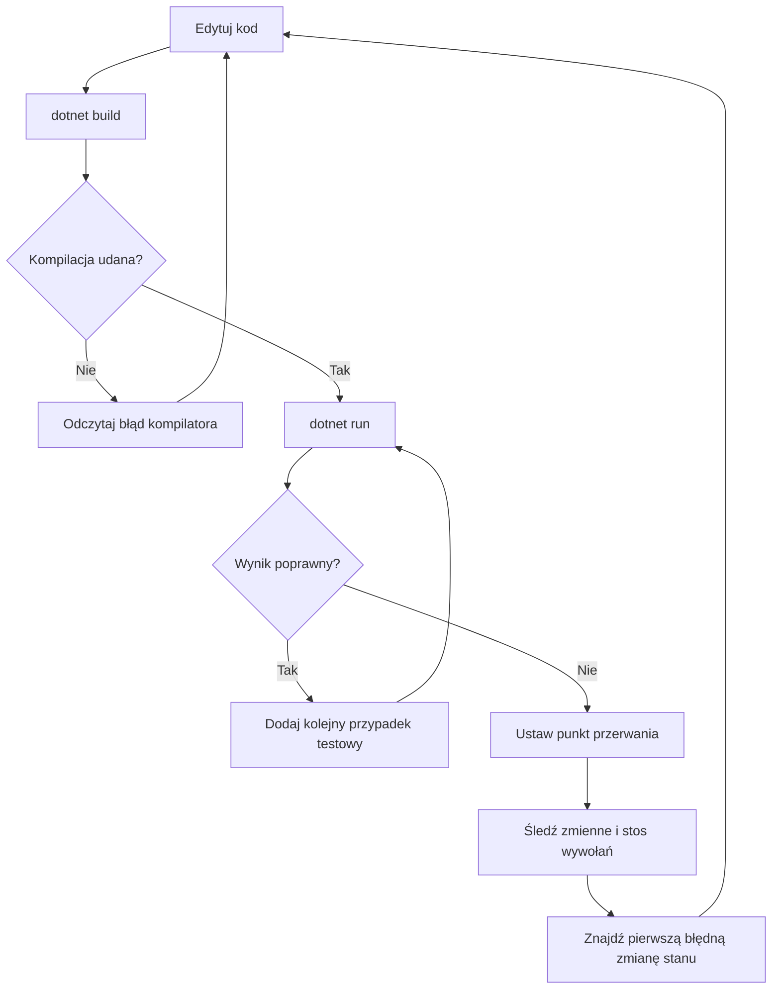
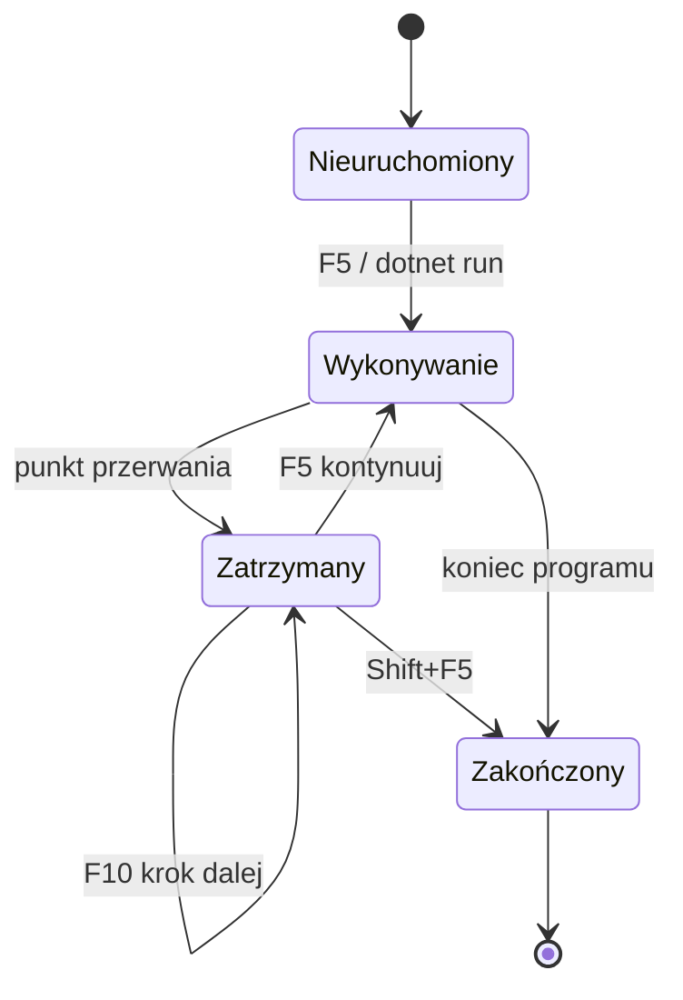

# 06. Projekt, kompilacja, uruchamianie i debugowanie

## Pełny cykl pracy

Praca nad aplikacją konsolową ma powtarzalny cykl:

1. Edytuj pliki źródłowe i projekt.
2. Zbuduj projekt przez `dotnet build`.
3. Popraw błędy kompilacji, jeśli wystąpią.
4. Uruchom aplikację przez `dotnet run`.
5. Sprawdź wynik na kilku danych.
6. Ustaw punkt przerwania i prześledź stan, gdy zachowanie jest niezrozumiałe.
7. Popraw kod i ponów sprawdzenie.



Źródło: [diagram-cykl-debugowania.mmd](diagram-cykl-debugowania.mmd).



Źródło: [diagram-stan-debugera.mmd](diagram-stan-debugera.mmd).

## Rodzaje błędów

- **Błąd składni lub kompilacji**: program nie powstaje, np. brak średnika albo niezgodny typ. Kompilator wskazuje plik i miejsce.
- **Błąd wykonania**: program się uruchamia, ale kończy wyjątkiem, np. przez dzielenie przez zero.
- **Błąd logiczny**: program działa, ale zwraca zły wynik, np. użyto dodawania zamiast mnożenia. Kompilator często nie może go wykryć.

Debuger jest szczególnie przydatny przy błędzie logicznym. Nie tylko zatrzymuje proces, ale pokazuje aktualne wartości zmiennych, stos wywołań i następną instrukcję.

## Debugowanie aplikacji konsolowej

W Visual Studio Code:

1. Otwórz folder zawierający `.csproj`.
2. Kliknij lewy margines przy instrukcji, aby ustawić czerwony punkt przerwania.
3. Naciśnij `F5` i wybierz konfigurację C# Dev Kit, jeśli pojawi się pytanie.
4. Użyj `F10` (Step Over), aby wykonać bieżącą instrukcję bez wchodzenia do metody, lub `F11` (Step Into), aby wejść do metody.
5. Obserwuj panel Variables, dodaj wyrażenie do Watch i sprawdź Call Stack.
6. Zatrzymaj debugowanie przez `Shift+F5`.

W Visual Studio ustaw punkt przerwania w edytorze i uruchom `Debug > Start Debugging` (`F5`). Okna Locals, Autos, Watch i Call Stack mają te same role.

## Przykład: cena koszyka

Program z [Kod/Debugowanie/Program.cs](Kod/Debugowanie/Program.cs) oblicza cenę po rabacie. Warto śledzić `cena`, `ilosc`, `suma`, `procentRabatu` i `doZaplaty`. Aby celowo pokazać błąd logiczny, można tymczasowo zmienić `cena * ilosc` na `cena + ilosc`, uruchomić program dla ceny 20 i ilości 3, a następnie porównać stan z oczekiwaniem `60`.

Najpierw warto postawić hipotezę: „błąd powstaje przed obliczeniem rabatu”. Punkt przerwania i krokowanie pozwolą ją potwierdzić albo odrzucić.

## Zadania

1. Dodaj walidację, która odrzuca cenę mniejszą lub równą zero.
2. Znajdź wartości zmiennych dla koszyka o cenie `80`, ilości `3` i rabacie `10%`.
3. Wprowadź błąd logiczny w obliczeniu rabatu, znajdź go debugerem i opisz instrukcję, w której wynik pierwszy raz odbiega od oczekiwania.
4. Dodaj metodę `ObliczRabat` i przejdź do niej przez `F11`.

### Rozwiązania i wyjaśnienia

Walidacja wejścia powinna wystąpić przed mnożeniem:

```csharp
if (cena <= 0 || ilosc <= 0)
{
    Console.WriteLine("Cena i liczba sztuk muszą być dodatnie.");
    return;
}
```

Dla ceny `80`, ilości `3` i rabatu `10%`: `suma = 240`, `kwotaRabatu = 24`, `doZaplaty = 216`. Zapisanie tych wartości przed uruchomieniem jest prostym oraklem testowym, czyli niezależnym oczekiwaniem wobec programu.

## Laboratorium

```powershell
dotnet build
dotnet run
```

Najpierw uruchom wersję poprawną, potem odtwórz opisany błąd. Zapisz: dane wejściowe, oczekiwany wynik, rzeczywisty wynik i ostatnią poprawną wartość zmiennej. Taki zapis jest krótkim raportem z debugowania.

## Źródła

- [dotnet build](https://learn.microsoft.com/dotnet/core/tools/dotnet-build),
- [dotnet run](https://learn.microsoft.com/dotnet/core/tools/dotnet-run),
- [Debug C# in Visual Studio Code](https://code.visualstudio.com/docs/csharp/debugging),
- [First look at the Visual Studio debugger](https://learn.microsoft.com/visualstudio/debugger/debugger-feature-tour),
- [Debugging in .NET](https://learn.microsoft.com/dotnet/core/diagnostics/).
