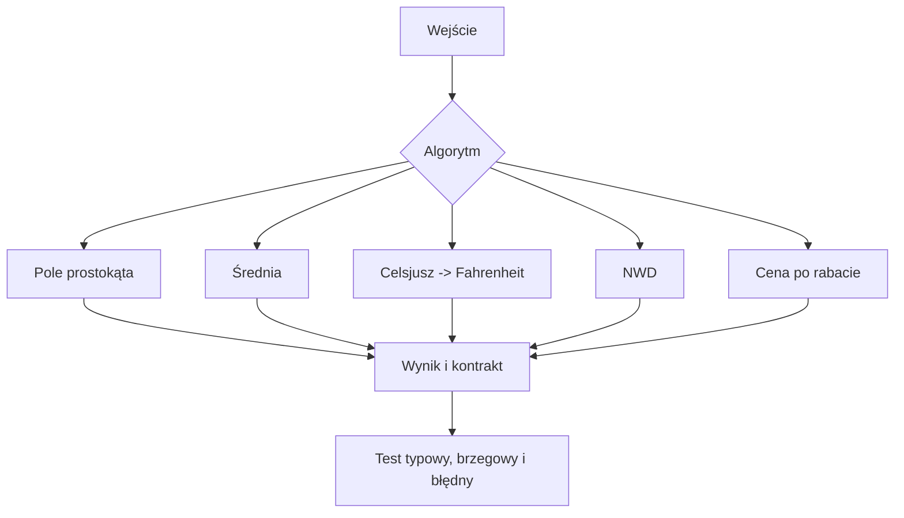
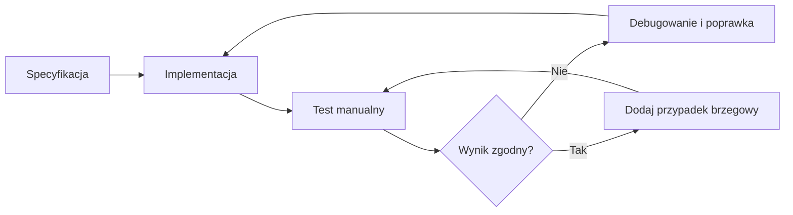

# 07. Obliczenia, poprawność algorytmu i testy

## Od wzoru do programu

Obliczenie matematyczne jest dobrym pierwszym zadaniem programistycznym, ale sam wzór nie gwarantuje poprawnego programu. Trzeba ustalić dziedzinę danych, kolejność operacji, reprezentację liczby oraz wynik dla danych spoza dziedziny.

Projekt [Kod/Obliczenia/Program.cs](Kod/Obliczenia/Program.cs) uruchamia zestaw ręcznie zapisanych testów. Implementacje znajdują się w [Kod/Obliczenia/Obliczenia.cs](Kod/Obliczenia/Obliczenia.cs).

## Pięć algorytmów

### 1. Pole prostokąta

Specyfikacja: dla długości boków `a >= 0` i `b >= 0` zwróć `a * b`. Wartości ujemne są odrzucane, ponieważ nie opisują długości.

### 2. Średnia arytmetyczna

Specyfikacja: dla niepustej listy zwróć sumę podzieloną przez liczbę elementów. Pusta lista nie ma średniej, więc metoda zgłasza `ArgumentException`.

### 3. Zamiana stopni Celsjusza na Fahrenheita

Wzór to $F = C \cdot \frac{9}{5} + 32$. Dla `0 C` oczekujemy `32 F`, a dla `-40 C` obie skale mają tę samą wartość.

### 4. Największy wspólny dzielnik

Algorytm Euklidesa powtarza `a % b`, dopóki `b` nie będzie równe zero. Dla dodatnich liczb zachowuje wspólny dzielnik i kończy się, ponieważ reszta jest mniejsza od dzielnika.

### 5. Cena po rabacie

Dla ceny `c >= 0` i procentu rabatu od `0` do `100` obliczamy `c * (100 - rabat) / 100`. Przypadki brzegowe to rabat `0%` i `100%`.



Źródło: [diagram-algorytmy-obliczen.mmd](diagram-algorytmy-obliczen.mmd).

## Co znaczy „algorytm jest poprawny”?

Poprawność należy odnosić do specyfikacji, a nie do jednego przykładu. Możemy sformułować:

- **warunek wstępny** - co musi być prawdą przed wywołaniem, np. cena nie jest ujemna,
- **warunek końcowy** - co ma być prawdą po zakończeniu, np. cena po rabacie odpowiada podanemu procentowi,
- **terminację** - algorytm kończy się dla każdego wejścia spełniającego warunek wstępny,
- **niezmiennik** - własność zachowywana po każdym kroku pętli.

Wyróżniamy poprawność częściową (jeśli program się kończy, wynik spełnia specyfikację) oraz całkowitą (wynik jest poprawny i program zawsze się kończy dla poprawnych danych). Dla algorytmu Euklidesa dowód opiera się na niezmienniku wspólnego dzielnika i malejącej nieujemnej reszcie.

Praktyczny proces uzasadniania poprawności:

1. Spisz kontrakt metody.
2. Wybierz przypadek typowy, brzegowy i niepoprawny.
3. Przelicz oczekiwany wynik niezależnie od programu.
4. Sprawdź kod krok po kroku oraz zdefiniowane wyjątki.
5. Dla pętli nazwij niezmiennik i argument zakończenia.

Przykłady pomagają znaleźć błędy, ale nie są formalnym dowodem, że błąd nie istnieje.

## Co dają testy manualne?

Test manualny to świadomie wybrane dane, oczekiwany wynik i porównanie z wynikiem programu. Testy:

- ujawniają rozbieżność między implementacją a specyfikacją,
- chronią przed powrotem wcześniej naprawionego błędu,
- dokumentują ważne przypadki użycia,
- pozwalają szybko sprawdzić hipotezę podczas laboratorium.

Przykładowa macierz:

| Algorytm | Typowy przypadek | Przypadek brzegowy | Błędne dane |
| --- | --- | --- | --- |
| Pole | `3, 4 -> 12` | `0, 5 -> 0` | `-1, 5 -> wyjątek` |
| Średnia | `[2, 4] -> 3` | jedna wartość | `[] -> wyjątek` |
| Celsjusz | `20 -> 68` | `-40 -> -40` | dziedzina obejmuje każdą wartość |
| NWD | `48, 18 -> 6` | `7, 7 -> 7` | `0, 5 -> wyjątek` |
| Rabat | `100, 20 -> 80` | `100, 0 -> 100` | `101% -> wyjątek` |

## Dlaczego pokrycie kodu jest ważne?

Pokrycie pokazuje, które fragmenty programu zostały wykonane przez testy. Pokrycie instrukcji mówi o uruchomionych liniach, a pokrycie gałęzi o przejściu obiema stronami decyzji. Jest wskaźnikiem informacji zwrotnej, nie certyfikatem poprawności: można wykonać każdą linię, a mimo to mieć błędne oczekiwania albo nieprzetestowane kombinacje warunków.

W przypadku początkującego dobra praktyka to testować:

- typową ścieżkę sukcesu,
- najmniejszą i największą sensowną wartość,
- zero i wartości ujemne, gdy mają znaczenie,
- puste kolekcje i niepoprawne argumenty,
- każdą gałąź `if` oraz co najmniej jeden obrót i zakończenie pętli.



Źródło: [diagram-petla-testowa.mmd](diagram-petla-testowa.mmd).

Do większych projektów można użyć xUnit, NUnit albo MSTest. Ten moduł celowo nie wymaga dodatkowych pakietów: `Program.cs` pokazuje mechanikę asercji w zwykłej aplikacji konsolowej, co ułatwia pierwsze laboratorium.

## Zadania

1. Dodaj algorytm obliczający obwód prostokąta i co najmniej trzy testy.
2. Dodaj test dla średniej z liczb ujemnych i wyjaśnij, dlaczego nie jest to przypadek błędny.
3. Zmień implementację rabatu tak, aby omyłkowo dzieliła przez `1000`, uruchom testy i wskaż pierwszy przypadek, który wykrywa błąd.
4. Zaproponuj przypadek, który zwiększy pokrycie gałęzi metody `CenaPoRabacie`.
5. Napisz niezmiennik pętli algorytmu NWD własnymi słowami.

### Rozwiązania i wyjaśnienia

Obwód można zaimplementować jako `2 * (a + b)` z takim samym kontraktem nieujemnych boków. Dla rabatu dzielenie przez `1000` wykryje już przypadek `100, 20 -> 80`, ponieważ program zwróci inną wartość niż oczekiwana.

Pokrycie gałęzi `CenaPoRabacie` wymaga między innymi wywołania dla poprawnego rabatu oraz osobnych wywołań, które odrzucają cenę, rabat ujemny i rabat większy niż `100`. Niezmiennik NWD można wyrazić tak: „bieżąca para liczb ma dokładnie te same wspólne dzielniki co para początkowa”.

## Laboratorium

```powershell
dotnet build
dotnet run
```

Program powinien wypisać wynik każdego testu oraz podsumowanie. Ustaw punkt przerwania w `Obliczenia.cs`, uruchom program przez `F5` i prześledź wartości pośrednie `suma`, `reszta` albo `procentRabatu`.

## Źródła

- [Unit testing in .NET](https://learn.microsoft.com/dotnet/core/testing/),
- [Code coverage](https://learn.microsoft.com/dotnet/core/testing/unit-testing-code-coverage),
- [xUnit.net documentation](https://xunit.net/docs/getting-started/v2/getting-started),
- [Exceptions and exception handling](https://learn.microsoft.com/dotnet/csharp/fundamentals/exceptions/),
- [Mathematical induction and loop invariants - Wikipedia](https://en.wikipedia.org/wiki/Loop_invariant).
