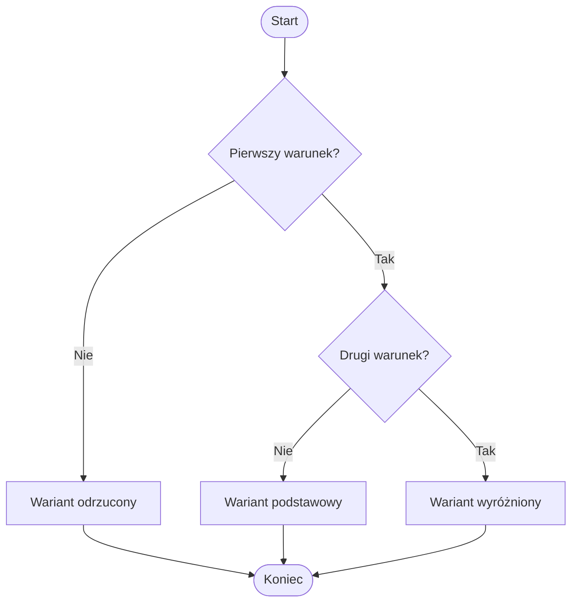

# 03. Zagnieżdżona instrukcja `if`

## Idea

Zagnieżdżony `if` znajduje się wewnątrz gałęzi innego `if`. Drugie pytanie ma sens dopiero po udzieleniu pierwszej odpowiedzi. Przykładowo najpierw sprawdzamy, czy student podał poprawny wynik, a dopiero potem klasyfikujemy wynik jako zaliczony lub bardzo dobry.



Źródło: [diagram-zagniezdzenie.mmd](diagram-zagniezdzenie.mmd).

## Przykład 1: klasyfikacja wyniku

Projekt [Kod/Nota/Program.cs](Kod/Nota/Program.cs) najpierw sprawdza zakres wyniku. Jeżeli wynik jest poprawny, zagnieżdżony `if` rozróżnia zaliczenie zwykłe i wynik bardzo dobry.

```csharp
if (punkty >= 0 && punkty <= 100)
{
    if (punkty >= 90)
    {
        Console.WriteLine("bardzo dobry");
    }
    else
    {
        Console.WriteLine(punkty >= 50 ? "zaliczony" : "niezaliczony");
    }
}
else
{
    Console.WriteLine("błędny zakres");
}
```

W przykładzie pokazano, że zagnieżdżenie może współpracować z operatorem `&&` oraz `?:`. Student powinien prześledzić każdą ścieżkę.

## Przykład 2: logowanie z rolą

Projekt [Kod/Uprawnienia/Program.cs](Kod/Uprawnienia/Program.cs) ma dwie zależne decyzje: najpierw poprawność kodu PIN, następnie rola użytkownika. Sprawdzanie roli przed poprawnością PIN byłoby błędną kolejnością, bo ujawniałoby informacje o niezweryfikowanym użytkowniku.

```csharp
if (pin == 1234)
{
    if (rola == "admin")
    {
        Console.WriteLine("pełny dostęp");
    }
    else
    {
        Console.WriteLine("dostęp standardowy");
    }
}
else
{
    Console.WriteLine("odmowa dostępu");
}
```

## Zagnieżdżenie czy warunek złożony?

Zagnieżdżenie jest czytelne, gdy drugi warunek zależy od pierwszego i każda decyzja ma własne działania. Jeżeli chcemy tylko wyrazić jeden fakt, prostszy może być warunek złożony:

```csharp
if (wiek >= 18 && maBilet)
{
    Console.WriteLine("można wejść");
}
```

Nie spłaszczaj zagnieżdżenia bezrefleksyjnie. Najpierw ustal, czy obie części mają ten sam sens i czy krótszy zapis nie utrudni debugowania.

## Zadania z rozwiązaniami

1. Napisz klasyfikację temperatury: najpierw odrzuć wartości poniżej `-50` lub powyżej `60`, potem rozróżnij mróz i temperaturę dodatnią.
2. Dla kwoty i typu klienta zastosuj darmową dostawę tylko wtedy, gdy kwota przekracza `100` i klient jest stały.
3. Przepisz zadanie 2 raz jako zagnieżdżone `if`, a raz jako jeden warunek `&&`. Porównaj czytelność.

Rozwiązanie zadania 2 w wariancie zagnieżdżonym powinno najpierw sprawdzić kwotę, a w jej gałęzi `true` dopiero typ klienta. W wariancie złożonym użyj `if (kwota > 100 && stalyKlient)`. Oba warianty powinny dać te same wyniki dla tabeli przypadków.

## Laboratorium

```powershell
dotnet build
dotnet run
```

Dla programu uprawnień sprawdź poprawny PIN administratora, poprawny PIN zwykłego użytkownika i błędny PIN. Ustaw punkty przerwania na obu `if` i zaobserwuj, że drugi warunek nie jest oceniany po odmowie.

## Źródła

- [The `if` statement](https://learn.microsoft.com/dotnet/csharp/language-reference/statements/selection-statements#if-statement),
- [Boolean logical operators](https://learn.microsoft.com/dotnet/csharp/language-reference/operators/boolean-logical-operators),
- [Conditional operator](https://learn.microsoft.com/dotnet/csharp/language-reference/operators/conditional-operator).
