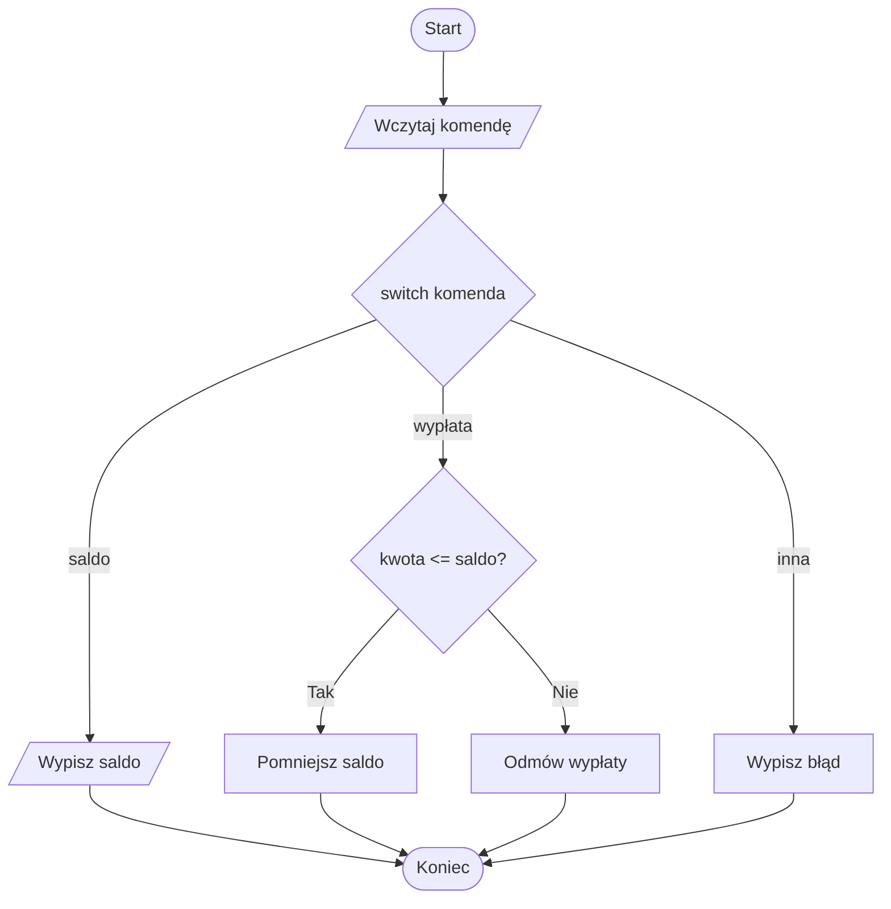

# 04. Instrukcja `switch`

## Kiedy używać `switch`?

`switch` wybiera sekcję kodu na podstawie wartości jednego wyrażenia. Jest czytelny, gdy porównujemy jedną wartość z kilkoma znanymi wariantami, na przykład kod menu, literę oceny albo nazwę dnia.

```csharp
switch (komenda)
{
    case "start":
        Console.WriteLine("Uruchamiam");
        break;
    case "stop":
        Console.WriteLine("Zatrzymuję");
        break;
    default:
        Console.WriteLine("Nieznana komenda");
        break;
}
```

W klasycznej instrukcji `switch` `break` kończy bieżącą sekcję. `default` obsługuje wartości, dla których nie zdefiniowano `case`. W C# nie występuje przypadkowe przejście z jednego niepustego `case` do następnego.

## Przykład 1: menu i `if`

Projekt [Kod/Menu/Program.cs](Kod/Menu/Program.cs) używa `switch` do wyboru działania. W wariancie salda dodatkowy `if` sprawdza, czy wypłata jest możliwa. To ważna współpraca: `switch` wybiera rodzaj operacji, a `if` weryfikuje warunek wykonania.



Źródło: [diagram-menu.mmd](diagram-menu.mmd).

## Przykład 2: dzień tygodnia i wspólna akcja

Projekt [Kod/DzienTygodnia/Program.cs](Kod/DzienTygodnia/Program.cs) klasyfikuje dzień numerem od `1` do `7`. Dwa warianty mogą prowadzić do tego samego komunikatu, a `if` przed `switch` odrzuca dane spoza zakresu.

```csharp
if (numer < 1 || numer > 7)
{
    Console.WriteLine("Niepoprawny numer dnia.");
    return;
}

switch (numer)
{
    case 1:
    case 7:
        Console.WriteLine("Weekend.");
        break;
    default:
        Console.WriteLine("Dzień roboczy.");
        break;
}
```

## `switch` a `if`

- `switch` wybierz, gdy pytasz „jaka jest wartość tej jednej zmiennej?”.
- `if` wybierz, gdy warunek zawiera zakresy, kilka różnych zmiennych albo zależności logiczne.
- Nie twórz sztucznego `switch`, jeśli każdy wariant wymaga innego skomplikowanego warunku.
- Zawsze rozważ `default`, aby nie pozostawić nieobsłużonego wejścia.

## Zadania z rozwiązaniami

1. Napisz menu kalkulatora z kodami `+`, `-`, `*`, `/` i `default` dla nieznanego operatora.
2. Dodaj do menu opcję `wypłata` i zabezpiecz dzielenie przez zero albo wypłatę większą niż saldo instrukcją `if`.
3. Zmień program dni tak, aby wypisywał nazwę dnia, nie używając tablic ani pętli.

W zadaniu 1 wyrażeniem `switch` może być tekst odczytany przez `Console.ReadLine()`. W zadaniu 2 walidacja dzielnika musi nastąpić przed operacją `/`. Dla wielu `case` można zastosować wspólny blok, tak jak dla soboty i niedzieli.

## Laboratorium

```powershell
dotnet build
dotnet run
```

Uruchom menu dla każdej komendy, nieznanej komendy, poprawnej wypłaty i wypłaty przekraczającej saldo. Ustaw punkt przerwania w `case "wyplata"` oraz wewnątrz `if`.

## Źródła

- [The `switch` statement](https://learn.microsoft.com/dotnet/csharp/language-reference/statements/selection-statements#the-switch-statement),
- [Selection statements](https://learn.microsoft.com/dotnet/csharp/language-reference/statements/selection-statements),
- [Break statement](https://learn.microsoft.com/dotnet/csharp/language-reference/statements/jump-statements#the-break-statement).
