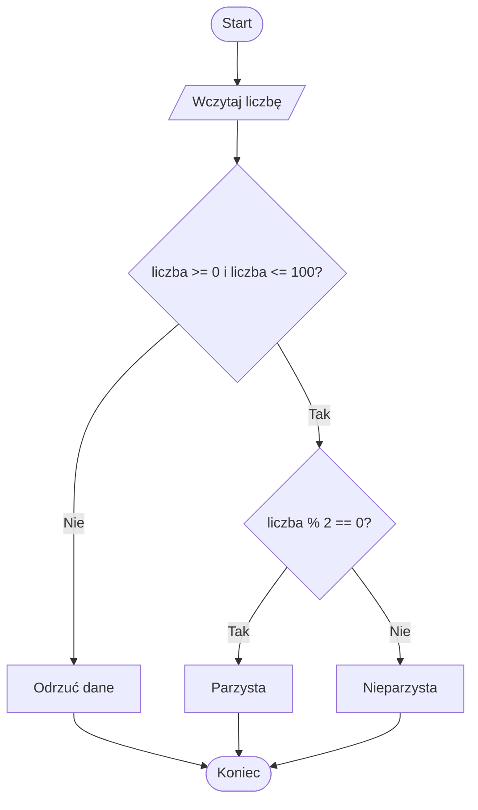

# 06. Wyrażanie warunków w języku C sharp

Warunek w instrukcji wyboru jest wyrażeniem typu `bool`. Można go zbudować na kilka sposobów, zależnie od tego, jakie pytanie chcemy zadać.

## Przegląd operatorów

### Porównania

Operatory `==`, `!=`, `<`, `>`, `<=` i `>=` porównują wartości. Wynikiem każdego porównania jest `true` albo `false`:

```csharp
bool czyRowny = a == b;
bool czyRozny = a != b;
bool czyWZakresie = wynik >= 0 && wynik <= 100;
```

### Operatory logiczne

- `&&` oznacza „i”; oba warunki muszą być prawdziwe,
- `||` oznacza „lub”; wystarczy jeden prawdziwy warunek,
- `!` oznacza negację; zamienia `true` na `false` i odwrotnie.

`&&` i `||` stosują krótkie spięcie. Jeśli wynik jest już znany po lewej stronie, prawa strona nie jest oceniana. Dzięki temu `czyPoprawny && wartosc > 0` może chronić dalsze sprawdzenie.

### Zmienna typu `bool`

Jeśli pytanie ma nazwę, przechowaj je w zmiennej:

```csharp
bool czyWeekend = dzien == 6 || dzien == 7;
if (czyWeekend)
{
    Console.WriteLine("odpoczynek");
}
```

Nazwa `czyWeekend` czyta się jak pytanie i ułatwia debugowanie.

### Nawiasy i kolejność

Nawiasy pokazują intencję oraz zmieniają kolejność obliczeń:

```csharp
bool dostepny = (wiek >= 18 && maBilet) || jestOpiekun;
```

Nie polegaj na pamięci kolejności operatorów, gdy warunek jest dłuższy. Najpierw wykonuje się `!`, następnie operatory porównań, `&&`, a potem `||`, ale nawiasy są czytelniejszym kontraktem.

## Przykład 1: kontrola zakresu i parzystości

Projekt [Kod/Liczba/Program.cs](Kod/Liczba/Program.cs) łączy porównania, `&&`, `||` i zmienną `bool`. Najpierw rozdziela dane niepoprawne od poprawnych, a potem odpowiada na dwa niezależne pytania.



Źródło: [diagram-warunki.mmd](diagram-warunki.mmd).

## Przykład 2: uprawnienie do wejścia

Projekt [Kod/Wejscie/Program.cs](Kod/Wejscie/Program.cs) pokazuje warunek `&&`, `||` i `!` w jednym problemie. Wstęp jest możliwy dla osoby pełnoletniej z biletem albo dla osoby z opiekunem; osoba z zakazem wejścia jest odrzucona niezależnie od pozostałych danych.

```csharp
bool mozeWejsc = !maZakaz && ((wiek >= 18 && maBilet) || jestZOpiekunem);
```

Warto rozbić złożony warunek na nazwane zmienne, gdy ułatwia to rozmowę i śledzenie stanu:

```csharp
bool pelnoletniZBiletem = wiek >= 18 && maBilet;
bool warunekOpiekuna = jestZOpiekunem;
bool mozeWejsc = !maZakaz && (pelnoletniZBiletem || warunekOpiekuna);
```

## Zadania z rozwiązaniami

1. Sprawdź, czy liczba należy do przedziału `10-20` włącznie.
2. Sprawdź, czy użytkownik może wypożyczyć film: ma co najmniej 15 lat i posiada kartę albo ma zgodę opiekuna.
3. Zapisz negację warunku `wiek >= 18` bez użycia `!`.
4. Podaj przykład, w którym nawiasy zmieniają wynik warunku z `&&` i `||`.

Rozwiązania:

```csharp
bool wPrzedziale = liczba >= 10 && liczba <= 20;
bool mozeWypozyczyc = (wiek >= 15 && maKarte) || maZgodeOpiekuna;
bool niepelnoletni = wiek < 18;
```

Bez nawiasów `true || false && false` daje `true`, ponieważ `&&` ma wyższy priorytet. `(true || false) && false` daje `false`. W realnym kodzie stosuj nawiasy, gdy odbiorca musi od razu zobaczyć zamierzoną grupę warunków.

## Laboratorium

```powershell
dotnet build
dotnet run
```

Dla programu liczby sprawdź `0`, `1`, `100`, `101` oraz wartość ujemną. Dla programu wejścia sprawdź wszystkie kombinacje: bilet, opiekun i zakaz. W debugerze obserwuj zmienne `pelnoletniZBiletem`, `warunekOpiekuna` i `mozeWejsc`.

## Źródła

- [Boolean logical operators](https://learn.microsoft.com/dotnet/csharp/language-reference/operators/boolean-logical-operators),
- [Comparison operators](https://learn.microsoft.com/dotnet/csharp/language-reference/operators/comparison-operators),
- [Operator precedence](https://learn.microsoft.com/dotnet/csharp/language-reference/operators/),
- [Built-in Boolean type](https://learn.microsoft.com/dotnet/csharp/language-reference/builtin-types/bool).
