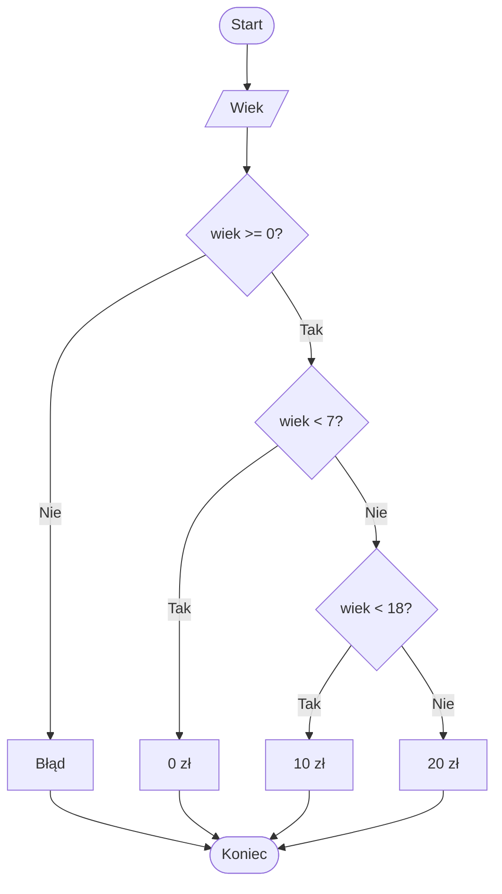
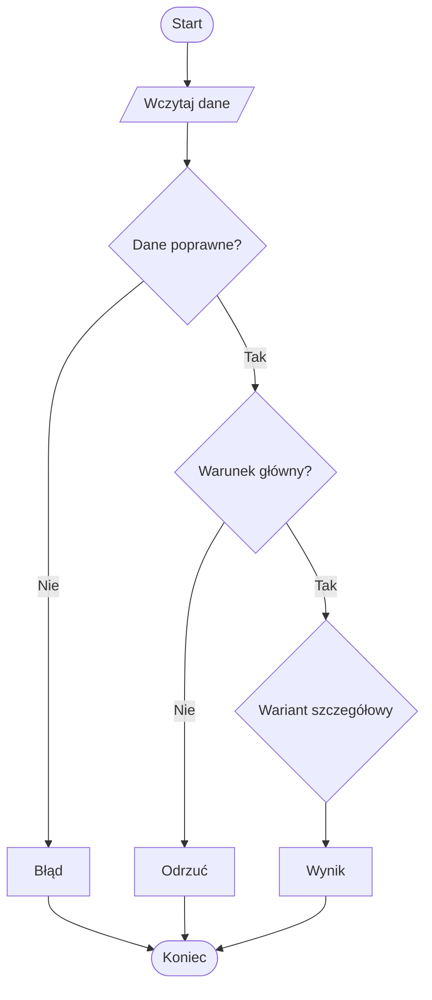

# 07. Programy wymagające instrukcji warunkowych i wielowariantowych

Ten temat łączy wszystkie wcześniejsze konstrukcje. Każdy przykład jest osobnym projektem konsolowym `net9.0`, dzięki czemu można go otworzyć w Visual Studio Code, budować i debugować bez przygotowywania wspólnego rozwiązania.

## Program 1: klasyfikator biletu

Projekt [Kod/Bilet/Program.cs](Kod/Bilet/Program.cs) używa zagnieżdżonego `if`. Najpierw sprawdza poprawność wieku, potem wybiera cenę według grupy wiekowej. Pokazuje walidację przed właściwym obliczeniem.



## Program 2: kalkulator rabatu

Projekt [Kod/Rabat/Program.cs](Kod/Rabat/Program.cs) łączy `if else` i operator `?:`. `if` wybiera procent rabatu dla kwoty, a `?:` tworzy komunikat o darmowej dostawie.

```csharp
decimal procent = wartosc >= 500 ? 20 : wartosc >= 200 ? 10 : 0;
decimal poRabacie = wartosc * (100 - procent) / 100;
string dostawa = poRabacie >= 200 ? "darmowa" : "płatna";
```

W kodzie produkcyjnym długie łańcuchy `?:` można zastąpić `if else if`, jeśli poprawi to czytelność. Tutaj zapis pokazuje wybór wartości.

## Program 3: menu urządzenia

Projekt [Kod/MenuUrzadzenia/Program.cs](Kod/MenuUrzadzenia/Program.cs) używa `switch` do wyboru trybu pracy, a w przypadku trybu nocnego dodatkowy `if` decyduje o jasności. To przykład instrukcji wielowariantowej z decyzją wewnątrz wariantu.

## Program 4: wynik egzaminu

Projekt [Kod/Egzamin/Program.cs](Kod/Egzamin/Program.cs) łączy walidację zakresu, zagnieżdżone warunki oraz operator `?:` do przygotowania krótkiej etykiety. Pokazuje, że najpierw trzeba odrzucić dane spoza specyfikacji.

## Program 5: walidator trójkąta

Projekt [Kod/Trojkat/Program.cs](Kod/Trojkat/Program.cs) używa warunku złożonego do sprawdzenia nierówności trójkąta, a następnie zagnieżdżonych `if` do rozróżnienia trójkąta równobocznego, równoramiennego i różnobocznego. Ten program ma więcej niż jedną ścieżkę sukcesu.



Źródło: [diagram-programy.mmd](diagram-programy.mmd).

## Zestawienie konstrukcji

| Program | Główna konstrukcja | Dodatkowa idea |
| --- | --- | --- |
| Bilet | zagnieżdżony `if` | przedziały i walidacja |
| Rabat | `if else` i `?:` | obliczenie po wyborze |
| Menu urządzenia | `switch` | `if` wewnątrz `case` |
| Egzamin | `if` i `?:` | zakres oraz etykieta |
| Trójkąt | operatory logiczne i zagnieżdżony `if` | warunek konieczny i klasyfikacja |

## Zadania dla studentów

1. Do biletu dodaj kategorię seniora dla wieku co najmniej `65` i cenę `12`.
2. Do rabatu dodaj ograniczenie, że rabat nigdy nie może przekroczyć `20%`.
3. Do menu urządzenia dodaj tryb `eco`, który jest dostępny tylko wtedy, gdy bateria przekracza `20%`.
4. Do egzaminu dodaj komunikat `celujący` dla dokładnie `100` punktów.
5. Do walidatora trójkąta dodaj rozpoznawanie trójkąta prostokątnego dla boków `3, 4, 5` oraz analogicznych proporcji.

### Rozwiązania i wyjaśnienia

1. W klasyfikatorze seniora sprawdź przed wariantem osoby dorosłej, aby warunek `wiek >= 65` nie został przesłonięty przez wcześniejsze `wiek >= 18`.
2. W rabacie waliduj procent po jego obliczeniu albo zapisz warunki progów tak, by najwyższy wynik wynosił `20`.
3. W `case "eco"` umieść `if (bateria > 20)` i obsłuż obie gałęzie.
4. Sprawdź `punkty == 100` przed ogólnym warunkiem `punkty >= 90`.
5. Najpierw sprawdź poprawność trójkąta, potem porównaj kwadraty boków. Na tym etapie można użyć kilku warunków `||` dla wyboru najdłuższego boku.

## Laboratorium i debugowanie

Każdy projekt uruchamiaj w jego katalogu:

```powershell
dotnet build
dotnet run
```

Dla każdego programu przygotuj tabelę przypadków: dane wejściowe, wybrana gałąź, oczekiwany wynik i rzeczywisty wynik. Ustaw punkt przerwania na pierwszym warunku oraz na instrukcji wyświetlającej wynik. Krokowo sprawdź, gdzie po raz pierwszy program wybiera ścieżkę.

Minimalny zestaw przypadków:

- wartość typowa dla każdego wariantu,
- wartość dokładnie na granicy przedziału,
- wartość tuż przed i tuż za granicą,
- dane niepoprawne lub niespełniające warunku głównego.

## Źródła

- [if and switch statements](https://learn.microsoft.com/dotnet/csharp/language-reference/statements/selection-statements),
- [Conditional operator](https://learn.microsoft.com/dotnet/csharp/language-reference/operators/conditional-operator),
- [Boolean logical operators](https://learn.microsoft.com/dotnet/csharp/language-reference/operators/boolean-logical-operators),
- [Comparison operators](https://learn.microsoft.com/dotnet/csharp/language-reference/operators/comparison-operators),
- [Debug C# in Visual Studio Code](https://code.visualstudio.com/docs/csharp/debugging).
