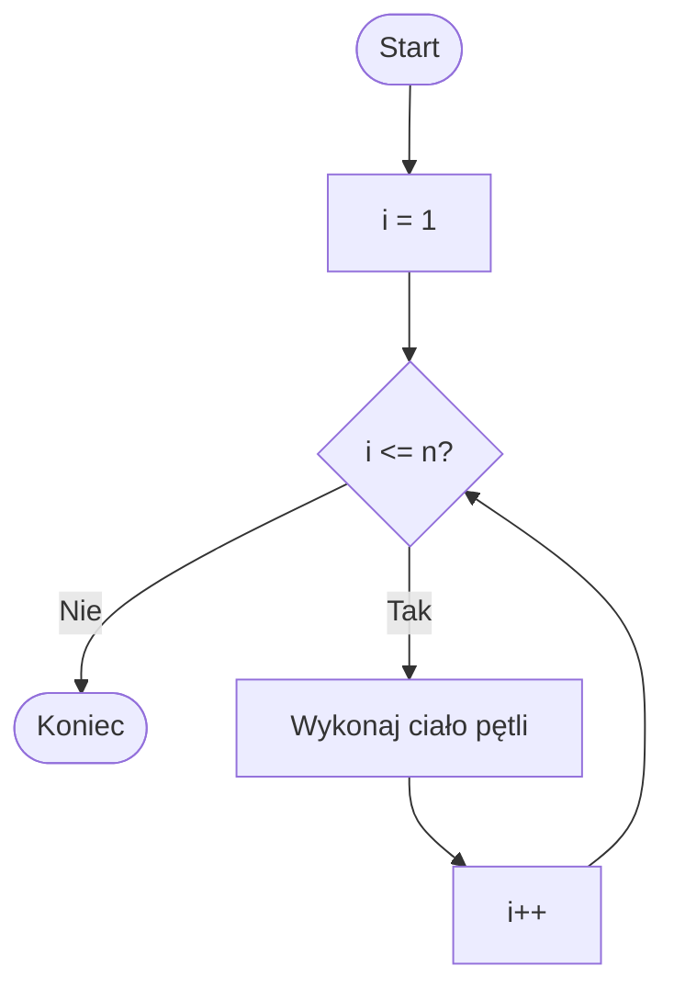
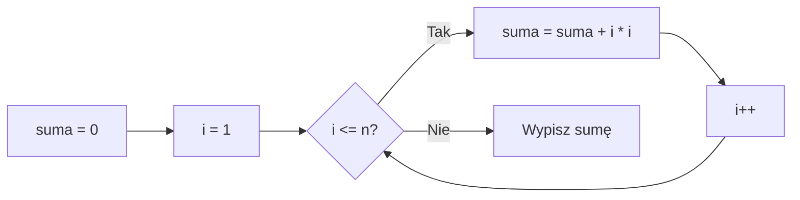

# 01. Pętla `for`

## Budowa i kolejność kroków

Pętla `for` jest wygodna, gdy znamy licznik lub naturalną liczbę powtórzeń. Jej zapis ma trzy części:

```csharp
for (inicjalizacja; warunek; krok)
{
    ciało pętli;
}
```

Kolejność jest następująca:

1. `inicjalizacja` wykonuje się raz przed pierwszą próbą.
2. `warunek` jest sprawdzany przed każdym wykonaniem ciała.
3. Jeżeli warunek jest prawdziwy, wykonuje się ciało.
4. Wykonuje się `krok`, na przykład `i++`.
5. Program wraca do punktu 2.



Źródło: [diagram-for.mmd](diagram-for.mmd).

## Przykład 1: liczby od 1 do n

Projekt [Kod/Licznik/Program.cs](Kod/Licznik/Program.cs) wypisuje liczby od `1` do podanej wartości. Dla `n = 0` ciało nie wykona się ani razu.

```csharp
for (int i = 1; i <= n; i++)
{
    Console.WriteLine(i);
}
```

Wartość `i` jest dostępna tylko w pętli, ponieważ została zadeklarowana w części inicjalizacji.

## Przykład 2: suma kwadratów

Projekt [Kod/SumaKwadratow/Program.cs](Kod/SumaKwadratow/Program.cs) pokazuje akumulator. W każdej iteracji aktualizuje `suma`, a licznik określa, dla której liczby wykonujemy obliczenie.



Źródło: [diagram-suma-kwadratow.mmd](diagram-suma-kwadratow.mmd).

## Kiedy używać `for`?

Użyj `for`, gdy liczba powtórzeń wynika z licznika, zakresu albo indeksu. Jeśli zakończenie zależy od danych pojawiających się w trakcie działania i liczba iteracji nie jest znana, naturalniejszy będzie `while` albo `do while`.

## Zadania z rozwiązaniami

1. Wypisz liczby parzyste od `0` do `n`.
2. Oblicz sumę liczb od `1` do `n`.
3. Oblicz silnię `n!` dla nieujemnego `n`.

Przykładowe rozwiązanie zadania 1:

```csharp
for (int i = 0; i <= n; i += 2)
{
    Console.WriteLine(i);
}
```

Dla sumy użyj `int suma = 0` i instrukcji `suma += i`. Dla silni wartość początkowa akumulatora musi wynosić `1`, ponieważ `0!` i `1!` są równe `1`.

## Laboratorium i debugowanie

```powershell
dotnet build
dotnet run
```

Sprawdź `n = 0`, `n = 1` i `n = 5`. Ustaw punkt przerwania w ciele pętli i obserwuj `i` oraz `suma`. Przed każdym krokiem przewiduj, czy następna kontrola warunku zakończy pętlę.

## Źródła

- [The `for` statement](https://learn.microsoft.com/dotnet/csharp/language-reference/statements/iteration-statements#the-for-statement),
- [Arithmetic operators](https://learn.microsoft.com/dotnet/csharp/language-reference/operators/arithmetic-operators),
- [C# language specification: for statement](https://learn.microsoft.com/dotnet/csharp/language-reference/language-specification/statements#1394-the-for-statement).
