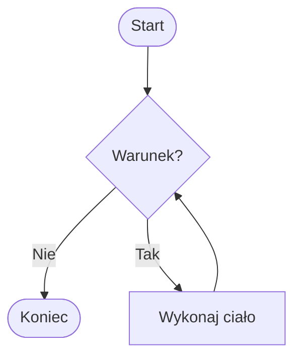
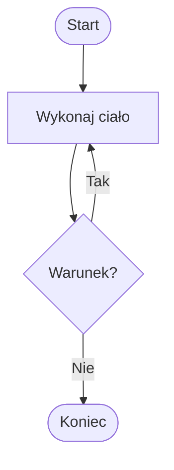

# 02. Pętle `while` i `do while`

## `while`: warunek przed ciałem

Pętla `while` najpierw sprawdza warunek, a dopiero potem wykonuje ciało. Może wykonać się zero razy:

```csharp
while (warunek)
{
    // ciało
}
```



Źródło: [diagram-while.mmd](diagram-while.mmd).

Projekt [Kod/Countdown/Program.cs](Kod/Countdown/Program.cs) odlicza od podanej liczby do zera. Zmienna `pozostalo` musi zmieniać się w ciele, inaczej pętla mogłaby nigdy się nie zakończyć.

## `do while`: ciało przed warunkiem

Pętla `do while` wykonuje ciało co najmniej raz, a warunek sprawdza na końcu:

```csharp
do
{
    // ciało
}
while (warunek);
```



Źródło: [diagram-do-while.mmd](diagram-do-while.mmd).

Projekt [Kod/Menu/Program.cs](Kod/Menu/Program.cs) wyświetla menu przynajmniej raz i powtarza je, dopóki użytkownik nie wybierze `0`.

## Różnice i zastosowania

| Konstrukcja | Kiedy sprawdza warunek? | Minimalna liczba wykonań ciała | Typowe zastosowanie |
| --- | --- | --- | --- |
| `for` | przed iteracją | `0` | znany licznik lub zakres |
| `while` | przed iteracją | `0` | powtarzanie do zdarzenia lub stanu |
| `do while` | po iteracji | `1` | menu i pierwsza próba wczytania |

Każdą pętlę można teoretycznie przepisać na inną, ale zmienia się czytelność. Najważniejsze jest jasne wskazanie, gdzie następuje pierwszy test oraz co zmienia stan.

## Zadania z rozwiązaniami

1. Napisz `while`, który wypisuje potęgi dwójki nie większe niż `limit`.
2. Napisz `do while`, który prosi o liczbę dodatnią i powtarza pytanie dla danych niepoprawnych.
3. Przepisz odliczanie z `while` na `for` i wskaż, która wersja lepiej komunikuje liczbę iteracji.

Przykładowe rozwiązanie zadania 2:

```csharp
int liczba;
do
{
    Console.Write("Podaj liczbę dodatnią: ");
}
while (!int.TryParse(Console.ReadLine(), out liczba) || liczba <= 0);

Console.WriteLine($"Otrzymano {liczba}.");
```

Pętla `do while` pasuje tu dlatego, że pytanie powinno pojawić się przynajmniej raz.

## Laboratorium i debugowanie

```powershell
dotnet build
dotnet run
```

Dla odliczania sprawdź `0`, `1` i `3`. Dla menu zakończ je od razu przez `0`, a następnie wybierz inną opcję i dopiero potem `0`. Obserwuj, kiedy wykonywany jest warunek `while`.

## Źródła

- [The `while` statement](https://learn.microsoft.com/dotnet/csharp/language-reference/statements/iteration-statements#the-while-statement),
- [The `do` statement](https://learn.microsoft.com/dotnet/csharp/language-reference/statements/iteration-statements#the-do-statement),
- [Iteration statements](https://learn.microsoft.com/dotnet/csharp/language-reference/statements/iteration-statements).
