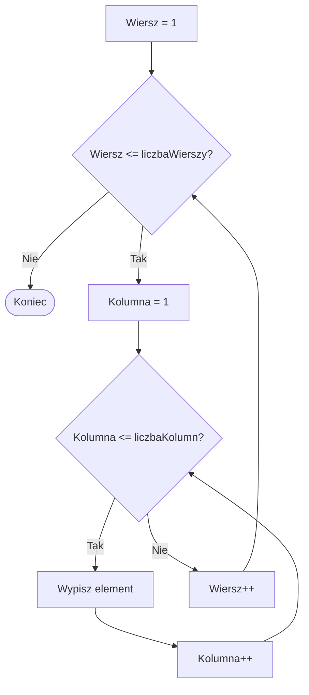
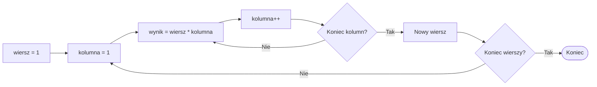

# 03. Zagnieżdżanie pętli

## Jedna pętla wewnątrz drugiej

Zagnieżdżenie oznacza, że ciało jednej pętli zawiera drugą pętlę. Dla każdej iteracji pętli zewnętrznej pętla wewnętrzna wykonuje cały swój przebieg.

```csharp
for (int wiersz = 1; wiersz <= 3; wiersz++)
{
    for (int kolumna = 1; kolumna <= 4; kolumna++)
    {
        Console.Write($"({wiersz},{kolumna}) ");
    }

    Console.WriteLine();
}
```

Jeśli pętla zewnętrzna wykonuje się `r` razy, a wewnętrzna `k` razy dla każdego wiersza, ciało wewnętrzne wykona się `r * k` razy. Dlatego ważne jest, aby oba liczniki miały jasne nazwy.



Źródło: [diagram-zagniezdzenie.mmd](diagram-zagniezdzenie.mmd).

## Przykład 1: prostokąt znaków

Projekt [Kod/Prostokat/Program.cs](Kod/Prostokat/Program.cs) wypisuje prostokąt złożony z gwiazdek. Pętla zewnętrzna odpowiada za wiersze, a wewnętrzna za znaki w jednym wierszu.

```csharp
for (int wiersz = 0; wiersz < wysokosc; wiersz++)
{
    for (int kolumna = 0; kolumna < szerokosc; kolumna++)
    {
        Console.Write('*');
    }

    Console.WriteLine();
}
```

## Przykład 2: tabliczka mnożenia

Projekt [Kod/Tabliczka/Program.cs](Kod/Tabliczka/Program.cs) wypisuje iloczyny dla wierszy i kolumn od `1` do `n`. Wartość `wiersz * kolumna` zależy od obu liczników.



## Zadania z rozwiązaniami

1. Wypisz kwadrat złożony z `n` wierszy i `n` kolumn.
2. Wypisz trójkąt: w pierwszym wierszu jedna gwiazdka, w drugim dwie, aż do `n`.
3. Wypisz wszystkie pary liczb `(a, b)` od `1` do `n`, dla których `a + b == n`.

Rozwiązanie zadania 2:

```csharp
for (int wiersz = 1; wiersz <= n; wiersz++)
{
    for (int kolumna = 1; kolumna <= wiersz; kolumna++)
    {
        Console.Write('*');
    }

    Console.WriteLine();
}
```

W zadaniu 3 pętla wewnętrzna może działać od `1` do `n`, a warunek `if (a + b == n)` decyduje, czy wypisać parę. To przykład połączenia zagnieżdżonych pętli z instrukcją warunkową.

## Laboratorium i debugowanie

```powershell
dotnet build
dotnet run
```

Dla prostokąta sprawdź wysokość `0`, szerokość `1` i wartości większe. Ustaw punkt przerwania w pętli wewnętrznej i obserwuj, że po zakończeniu kolumn zwiększa się `wiersz`, a `kolumna` rozpoczyna przebieg od początku.

## Źródła

- [Nested iteration statements](https://learn.microsoft.com/dotnet/csharp/language-reference/statements/iteration-statements),
- [The `for` statement](https://learn.microsoft.com/dotnet/csharp/language-reference/statements/iteration-statements#the-for-statement),
- [Mermaid flowcharts](https://mermaid.js.org/syntax/flowchart.html).
