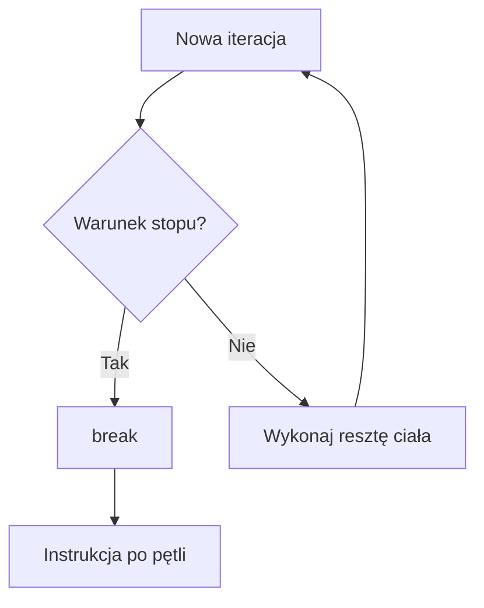
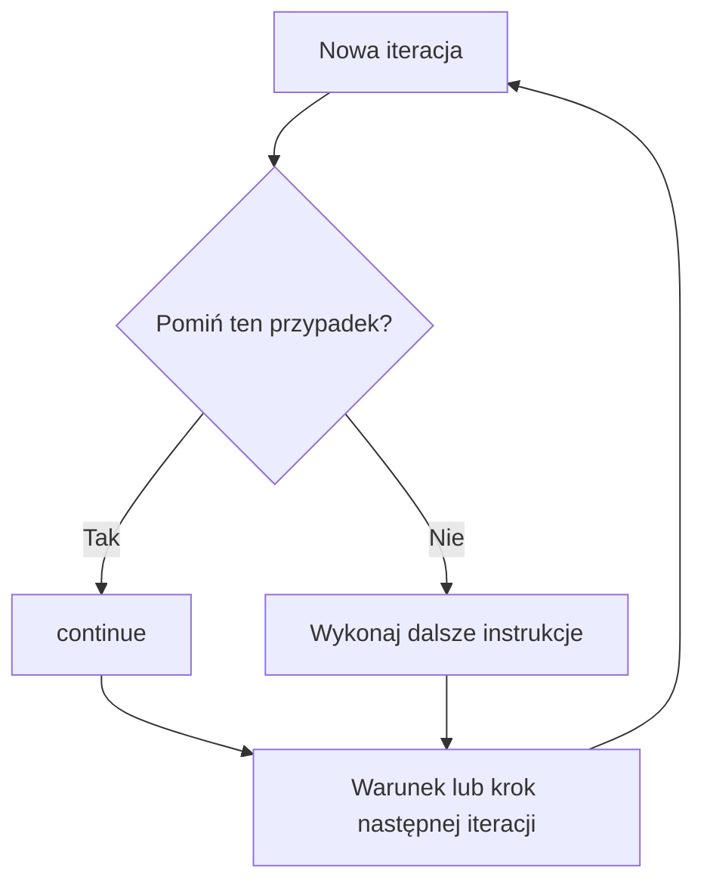

# 04. Instrukcje `break` i `continue`

## `break`: zakończ najbliższą pętlę

`break` natychmiast kończy najbliższą pętlę `for`, `while` albo `do while`. Program przechodzi do pierwszej instrukcji po pętli. Używaj go, gdy dalsze sprawdzanie nie ma sensu, na przykład znaleziono szukaną wartość albo wykryto błąd uniemożliwiający dalszą pracę.



Źródło: [diagram-break.mmd](diagram-break.mmd).

## `continue`: pomiń resztę bieżącej iteracji

`continue` nie kończy całej pętli. Pomija pozostałe instrukcje ciała i przechodzi do następnej iteracji. W `for` oznacza to również wykonanie sekcji kroku, na przykład `i++`.



Źródło: [diagram-continue.mmd](diagram-continue.mmd).

## Przykład 1: `break` przy wyszukiwaniu

Projekt [Kod/Szukaj/Program.cs](Kod/Szukaj/Program.cs) szuka pierwszego dzielnika liczby. Po znalezieniu dzielnika dalsze sprawdzanie nie daje nowej informacji, więc `break` kończy pętlę.

```csharp
int dzielnik = 0;
for (int kandydat = 2; kandydat < liczba; kandydat++)
{
    if (liczba % kandydat == 0)
    {
        dzielnik = kandydat;
        break;
    }
}
```

## Przykład 2: `continue` przy filtrowaniu

Projekt [Kod/Pomijanie/Program.cs](Kod/Pomijanie/Program.cs) wypisuje liczby od `1` do `n`, ale pomija wielokrotności `3`. `continue` sprawia, że `Console.WriteLine` nie wykonuje się dla pomijanej liczby.

```csharp
for (int i = 1; i <= n; i++)
{
    if (i % 3 == 0)
    {
        continue;
    }

    Console.WriteLine(i);
}
```

## Kiedy stosować?

- `break` stosuj przy znalezieniu wyniku, błędzie lub wyraźnym warunku stopu.
- `continue` stosuj, gdy pojedynczy przypadek nie powinien być dalej przetwarzany, ale pętla ma działać dalej.
- Nie używaj ich do ukrywania niejasnego warunku głównego; najpierw spróbuj zapisać warunek pętli wprost.
- W zagnieżdżeniu zwykły `break` kończy tylko najbliższą pętlę. Jeśli trzeba zakończyć obie, lepiej wydzielić metodę albo użyć jawnego stanu, zamiast komplikować przepływ.

## Zadania z rozwiązaniami

1. Znajdź pierwszą liczbę od `1` do `n`, która jest podzielna przez `7`, używając `break`.
2. Wypisz liczby od `1` do `n`, pomijając jednocześnie wielokrotności `2` i `3`.
3. W zagnieżdżonej pętli znajdź pierwszą parę `(wiersz, kolumna)` spełniającą warunek i wyjaśnij, którą pętlę kończy zwykły `break`.

Rozwiązanie zadania 2:

```csharp
for (int i = 1; i <= n; i++)
{
    if (i % 2 == 0 || i % 3 == 0)
    {
        continue;
    }

    Console.WriteLine(i);
}
```

Zwykły `break` w zadaniu 3 kończy pętlę, w której bezpośrednio się znajduje. Aby zakończyć oba poziomy w sposób czytelny, można zapisać wynik i sprawdzić go w pętli zewnętrznej albo umieścić wyszukiwanie w osobnej metodzie.

## Laboratorium i debugowanie

```powershell
dotnet build
dotnet run
```

Dla programu wyszukiwania sprawdź liczbę pierwszą i złożoną. Dla programu pomijania sprawdź `n = 6`. Ustaw punkty przerwania zarówno na `break`/`continue`, jak i na instrukcji po nich, aby zobaczyć różnicę w przepływie.

## Źródła

- [The `break` statement](https://learn.microsoft.com/dotnet/csharp/language-reference/statements/jump-statements#the-break-statement),
- [The `continue` statement](https://learn.microsoft.com/dotnet/csharp/language-reference/statements/jump-statements#the-continue-statement),
- [Iteration statements](https://learn.microsoft.com/dotnet/csharp/language-reference/statements/iteration-statements).
