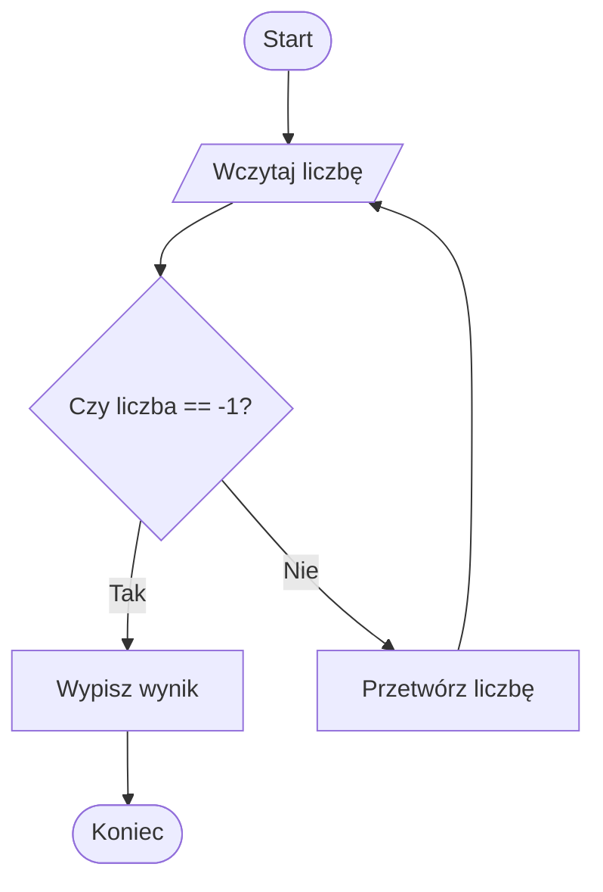
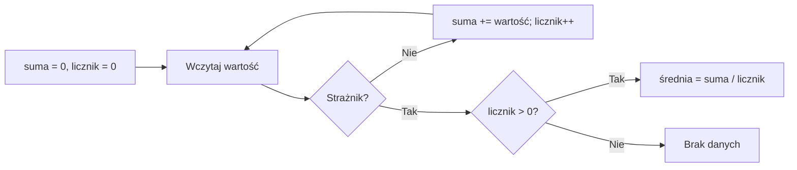

# 05. Pętla ze strażnikiem

## Czym jest strażnik?

Strażnik to specjalna wartość wejściowa, która nie jest zwykłą daną i oznacza „zakończ wczytywanie”. Pętla przetwarza wszystkie inne wartości, ale nie dołącza strażnika do wyniku.

Przykład: program sumuje nieujemne liczby, a `-1` kończy wczytywanie. Wartość `-1` nie może być jednocześnie poprawną liczbą danych.



Źródło: [diagram-straznik.mmd](diagram-straznik.mmd).

## Schemat z `while`

Przy `while` pierwszą wartość wczytujemy przed pętlą, ponieważ warunek musi być znany przed pierwszym wejściem:

```csharp
int liczba = WczytajLiczbe();
while (liczba != -1)
{
    suma += liczba;
    liczba = WczytajLiczbe();
}
```

Ważne są dwa miejsca wczytania: przed pętlą oraz na jej końcu. Pominięcie drugiego wczytania powoduje pętlę nieskończoną.

## Schemat z `do while`

Gdy program ma zawsze zadać pytanie przynajmniej raz, wygodny jest `do while`:

```csharp
int liczba;
do
{
    liczba = WczytajLiczbe();
    if (liczba != -1)
    {
        suma += liczba;
    }
}
while (liczba != -1);
```

Strażnik jest sprawdzany, ale nie jest dodawany do sumy. To odróżnia go od zwykłej wartości.

## Przykład 1: suma do strażnika

Projekt [Kod/Suma/Suma.cs](Kod/Suma/Suma.cs) sumuje liczby nieujemne do momentu wpisania `-1`. Wartość ujemna inna niż `-1` jest odrzucana jako błąd danych.

## Przykład 2: średnia do strażnika

Projekt [Kod/Srednia/Srednia.cs](Kod/Srednia/Srednia.cs) zlicza elementy i sumę, a następnie oblicza średnią. Dla samego strażnika nie dzieli przez zero, tylko informuje, że nie podano danych.



Źródło: [diagram-srednia.mmd](diagram-srednia.mmd).

## Kiedy stosować?

Strażnik jest dobry, gdy użytkownik podaje dowolną liczbę danych i potrzebujemy prostego, jawnego końca. Wybierz wartość spoza dziedziny poprawnych danych, opisz ją w komunikacie i nie przetwarzaj jej jak zwykłego elementu.

Jeśli każda wartość z dziedziny może być poprawna, użyj innego mechanizmu, na przykład osobnej liczby elementów, końca pliku albo tekstowej komendy. Strażnik nie powinien kolidować z poprawnymi danymi.

## Zadania z rozwiązaniami

1. Zmień sumowanie tak, aby strażnikiem było `0`, a dane były dodatnie.
2. Oblicz minimum i maksimum liczb do strażnika `-1`.
3. Dodaj licznik wartości parzystych, nie wliczając strażnika.

W zadaniu 2 ustaw `minimum` i `maksimum` dopiero po wczytaniu pierwszej prawdziwej wartości. Dzięki temu nie trzeba wymyślać sztucznego minimum początkowego. Dla braku danych wypisz osobny komunikat.

## Laboratorium i debugowanie

```powershell
dotnet build
dotnet run
```

Sprawdź: samo `-1`, jedną liczbę i kilka liczb zakończonych `-1`. Ustaw punkt przerwania na instrukcji aktualizującej sumę i upewnij się, że strażnik nie zmienia `suma` ani `licznik`.

## Źródła

- [The `while` statement](https://learn.microsoft.com/dotnet/csharp/language-reference/statements/iteration-statements#the-while-statement),
- [The `do` statement](https://learn.microsoft.com/dotnet/csharp/language-reference/statements/iteration-statements#the-do-statement),
- [Console.ReadLine](https://learn.microsoft.com/dotnet/api/system.console.readline).
