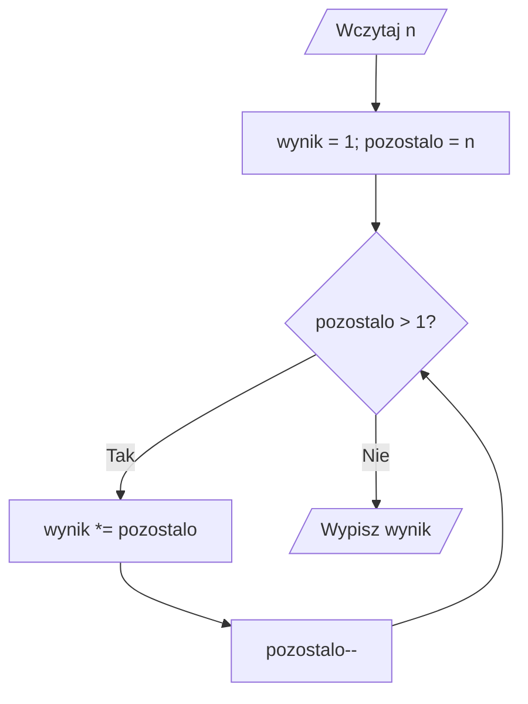
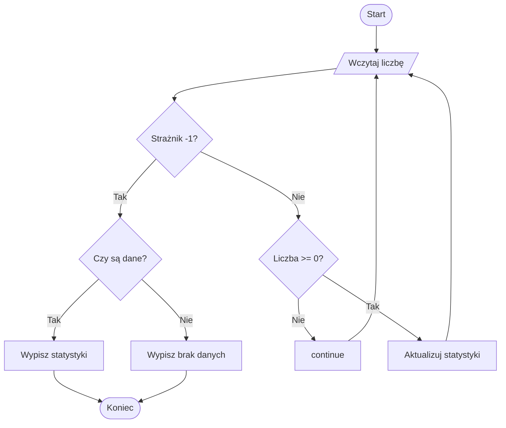

# 06. Programy z pętlami

Poniższe pięć projektów pokazuje różne zastosowania pętli. Każdy jest niezależną aplikacją konsolową `net9.0` i może być prezentowany osobno podczas laboratorium.

## Program 1: suma zakresu

Projekt [Kod/SumaZakresu/Program.cs](Kod/SumaZakresu/Program.cs) używa `for` do obliczenia sumy liczb od `a` do `b`. Pokazuje znany zakres, akumulator i przypadek pustego zakresu.

## Program 2: silnia

Projekt [Kod/Silnia/Program.cs](Kod/Silnia/Program.cs) używa `while`. Liczba powtórzeń wynika z wartości wejściowej, ale konstrukcja pozwala wyraźnie obserwować zmniejszanie kopii `pozostalo`.



Źródło: [diagram-programy-petle.mmd](diagram-programy-petle.mmd).

## Program 3: tabliczka mnożenia

Projekt [Kod/Tabliczka/Program.cs](Kod/Tabliczka/Program.cs) wykorzystuje zagnieżdżone `for`. Student widzi relację między wierszem, kolumną i liczbą wykonań.

## Program 4: liczby pierwsze

Projekt [Kod/LiczbyPierwsze/Program.cs](Kod/LiczbyPierwsze/Program.cs) łączy `for`, warunek i `break`. Dla każdej liczby kandydatów sprawdza dzielniki tylko do momentu znalezienia pierwszego albo przekroczenia pierwiastka z liczby.

## Program 5: statystyki do strażnika

Projekt [Kod/Statystyki/Program.cs](Kod/Statystyki/Program.cs) używa `do while`, strażnika `-1`, akumulatora i `continue` do pomijania niepoprawnych wartości ujemnych. Oblicza minimum, maksimum, sumę i średnią.



Źródło: [diagram-statyki.mmd](diagram-statyki.mmd).

## Porównanie trudności

| Projekt | Główna konstrukcja | Nowa trudność |
| --- | --- | --- |
| Suma zakresu | `for` | akumulator |
| Silnia | `while` | zmniejszający się stan |
| Tabliczka | zagnieżdżone `for` | dwa liczniki |
| Liczby pierwsze | `for` i `break` | wcześniejsze zakończenie |
| Statystyki | `do while`, strażnik, `continue` | dane o nieznanej liczbie |

## Zadania z rozwiązaniami

1. Do sumy zakresu dodaj sumę tylko liczb parzystych.
2. Zabezpiecz silnię przed przepełnieniem przez sprawdzenie, czy następne mnożenie mieści się w `int`.
3. Zmień tabliczkę tak, aby wypisywała tylko przekątną `wiersz == kolumna`.
4. W programie liczb pierwszych użyj `break` po znalezieniu dzielnika i wyjaśnij, dlaczego nie trzeba sprawdzać pozostałych.
5. Do statystyk dodaj licznik wartości pominiętych przez `continue`.

Rozwiązanie zadania 5 wymaga zmiennej `int pominiete = 0`. Przed `continue` zwiększ ją o `1`, a po zakończeniu pętli wypisz jej wartość. Strażnika nie należy liczyć ani jako dane poprawne, ani jako dane pominięte.

## Laboratorium i debugowanie

Każdy projekt uruchamiaj w jego katalogu:

```powershell
dotnet build
dotnet run
```

Przygotuj przypadki: najmniejszy poprawny, przypadek graniczny, kilka iteracji i dane kończące. Ustaw punkt przerwania wewnątrz każdej pętli oraz na instrukcji po pętli. W debugerze sprawdzaj, czy licznik, akumulator i warunek zakończenia zmieniają się zgodnie z planem.

## Źródła

- [Iteration statements](https://learn.microsoft.com/dotnet/csharp/language-reference/statements/iteration-statements),
- [Jump statements](https://learn.microsoft.com/dotnet/csharp/language-reference/statements/jump-statements),
- [Arithmetic operators](https://learn.microsoft.com/dotnet/csharp/language-reference/operators/arithmetic-operators),
- [Integer numeric types](https://learn.microsoft.com/dotnet/csharp/language-reference/builtin-types/integral-numeric-types),
- [Debug C# in Visual Studio Code](https://code.visualstudio.com/docs/csharp/debugging).
