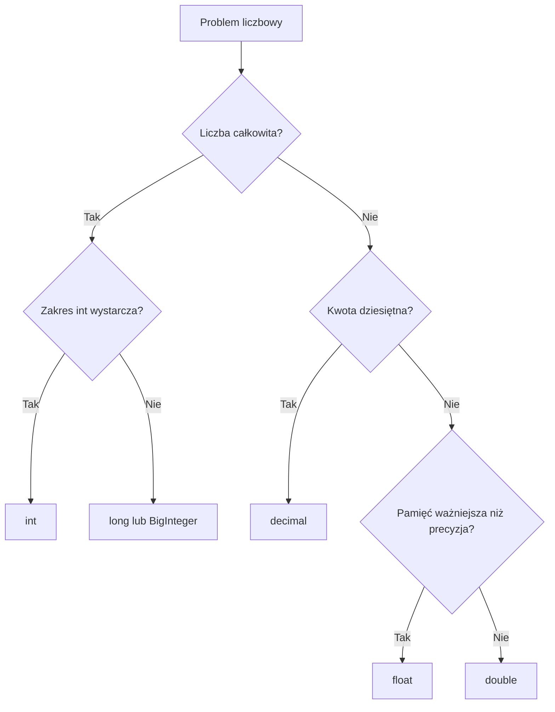

# 01. Typy całkowite i zmiennoprzecinkowe

## Liczby całkowite

Typy całkowite przechowują liczby bez części ułamkowej. W typowych programach najczęściej używamy `int`, który ma 32 bity i zakres od `-2_147_483_648` do `2_147_483_647`. `long` ma 64 bity i wybieramy go, gdy zakres `int` jest za mały. `byte` jest dobry dla wartości od `0` do `255`, na przykład składowych koloru lub danych bajtowych.

```csharp
int liczbaStudentow = 120;
long liczbaOperacji = 5_000_000_000L;
byte poziom = 255;
```

Typ nie określa tylko wyglądu wartości. Określa również zakres, rozmiar, dozwolone konwersje i zachowanie przepełnienia. Dla zwykłych liczników i indeksów wybierz `int`; nie używaj `long` bez potrzeby.

## `float`, `double` i `decimal`

Typy zmiennoprzecinkowe przechowują liczby rzeczywiste w reprezentacji przybliżonej. `float` zajmuje 4 bajty i ma około 6-9 cyfr znaczących, `double` 8 bajtów i około 15-17 cyfr. `decimal` zajmuje 16 bajtów, ma 28-29 cyfr precyzji dziesiętnej i jest właściwy dla kwot finansowych.

| Typ | Typowe użycie | Cechy |
| --- | --- | --- |
| `float` | grafika, duże tablice pomiarów | mniej pamięci, mniejsza precyzja |
| `double` | geometria, symulacje, pomiary | domyślny typ literału ułamkowego, szybkie obliczenia |
| `decimal` | pieniądze, ceny, podatki | precyzja dziesiętna, większy koszt obliczeń |

```csharp
float temperatura = 21.5f;
double odleglosc = 12.75;
decimal cena = 19.99m;
```

Sufiksy `f` i `m` są ważne: bez sufiksu `19.99` jest typu `double`, a `19.99m` typu `decimal`. Nie mieszaj bezpośrednio `decimal` z `float` lub `double`; wybierz jawne rzutowanie, jeśli naprawdę jest potrzebne.

## Reprezentacja i dokładność

Liczba całkowita jest przechowywana dokładnie, o ile mieści się w zakresie typu. Liczby `float` i `double` używają reprezentacji binarnej z częścią znaczącą i wykładnikiem. Niektóre liczby dziesiętne, na przykład `0.1`, nie mają skończonej reprezentacji binarnej.

```csharp
double a = 0.1;
double b = 0.2;
Console.WriteLine(a + b == 0.3); // nie należy zakładać, że wynik będzie true

decimal c = 0.1m;
decimal d = 0.2m;
Console.WriteLine(c + d == 0.3m); // true dla tych wartości dziesiętnych
```

Dla `double` porównuj wartości z tolerancją, gdy wynik jest obliczeniem przybliżonym. Dla pieniędzy używaj `decimal` i ustal zasady zaokrąglania.



Źródło: [diagram-dobor-typu.mmd](diagram-dobor-typu.mmd).

## Przykład: pomiar i cena

Projekt [Kod/Liczby/Program.cs](Kod/Liczby/Program.cs) pokazuje wszystkie trzy rodziny typów i wypisuje rozmiary przez `sizeof` dla typów prostych.

## Zadania z rozwiązaniami

1. Wybierz typ dla liczby mieszkańców kraju, ceny produktu, temperatury z czujnika i liczby bajtów pliku.
2. Sprawdź wynik `5 / 2`, `5 / 2.0` i `5m / 2m` oraz wyjaśnij różnicę.
3. Pokaż w programie, że `double` może dać wynik z błędem zaokrąglenia, a `decimal` lepiej reprezentuje `0.1m + 0.2m`.

Rozwiązanie: mieszkańcy zwykle `int` lub `long`, cena `decimal`, temperatura `double`, a rozmiar pojedynczego bajtu `byte` lub większy typ całkowity. `5 / 2` wykonuje dzielenie całkowite i daje `2`; obecność `double` lub `decimal` zmienia rodzaj dzielenia.

## Laboratorium

```powershell
dotnet build
dotnet run
```

Ustaw punkt przerwania przed każdym obliczeniem i obserwuj typ oraz wartość. Sprawdź skrajne wartości `int`, wynik dzielenia całkowitego i różnicę między `double` a `decimal`.

## Źródła

- [Integral numeric types](https://learn.microsoft.com/dotnet/csharp/language-reference/builtin-types/integral-numeric-types),
- [Floating-point numeric types](https://learn.microsoft.com/dotnet/csharp/language-reference/builtin-types/floating-point-numeric-types),
- [Arithmetic operators](https://learn.microsoft.com/dotnet/csharp/language-reference/operators/arithmetic-operators).
