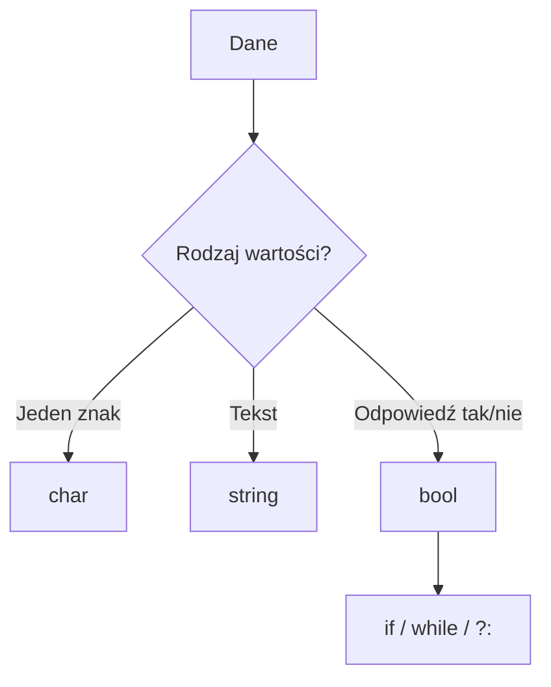

# 02. Typ znakowy `char` i logiczny `bool`

## `char`

`char` przechowuje pojedynczą jednostkę kodu UTF-16 i zapisuje się go w apostrofach. `string` jest tekstem złożonym z wielu wartości `char`.

```csharp
char litera = 'A';
char symbol = '\u03A9';
Console.WriteLine(litera);
Console.WriteLine((int)litera); // kod znaku
```

`char` nie jest jednoznacznie tym samym co pełny znak użytkownika, ponieważ niektóre znaki Unicode są reprezentowane przez parę jednostek UTF-16. Na poziomie początkującego kursu wystarczy pamiętać, że `char` przechowuje pojedynczy element tekstu, a `string` całą sekwencję.

## `bool`

`bool` ma dokładnie dwie wartości: `true` i `false`. Wynikiem porównań oraz operatorów logicznych jest `bool`:

```csharp
bool czyPelnoletni = wiek >= 18;
bool czyWeekend = dzien == 6 || dzien == 7;
bool czyMoznaWejsc = !maZakaz && maBilet;
```

`bool` steruje `if`, `while`, `do while`, `for` i operatorem `?:`. C# nie konwertuje automatycznie liczby `0` na `false`, a liczby `1` na `true`.



Źródło: [diagram-char-bool.mmd](diagram-char-bool.mmd).

## Przykład 1: klasyfikowanie znaku

Projekt [Kod/Znak/Program.cs](Kod/Znak/Program.cs) rozpoznaje cyfrę, wielką literę i pozostałe znaki za pomocą porównań `char`.

```csharp
if (znak >= '0' && znak <= '9')
{
    Console.WriteLine("cyfra");
}
else if (znak >= 'A' && znak <= 'Z')
{
    Console.WriteLine("wielka litera");
}
else
{
    Console.WriteLine("inny znak");
}
```

## Przykład 2: logika zgody

Projekt [Kod/Zgoda/Program.cs](Kod/Zgoda/Program.cs) zamienia tekst `tak`/`nie` na `bool`, a potem tworzy logiczny warunek dostępu.

```csharp
bool maBilet = odpowiedz == "tak";
bool maZgode = maBilet && wiek >= 18;
Console.WriteLine(maZgode ? "zgoda" : "brak zgody");
```

## Zadania z rozwiązaniami

1. Wczytaj znak i sprawdź, czy jest małą literą.
2. Wczytaj trzy odpowiedzi `tak`/`nie` i sprawdź, czy wszystkie są pozytywne.
3. Wypisz kod Unicode znaku i wyjaśnij wynik rzutowania `char` na `int`.

Rozwiązanie zadania 1:

```csharp
bool malaLitera = znak >= 'a' && znak <= 'z';
Console.WriteLine(malaLitera ? "mała litera" : "to nie jest mała litera");
```

## Laboratorium

```powershell
dotnet build
dotnet run
```

Przetestuj cyfry, litery, spację oraz znak Unicode. W debugerze obserwuj wartości `char` i `bool` przed wykonaniem `if`.

## Źródła

- [The `char` type](https://learn.microsoft.com/dotnet/csharp/language-reference/builtin-types/char),
- [The `bool` type](https://learn.microsoft.com/dotnet/csharp/language-reference/builtin-types/bool),
- [Boolean logical operators](https://learn.microsoft.com/dotnet/csharp/language-reference/operators/boolean-logical-operators).
