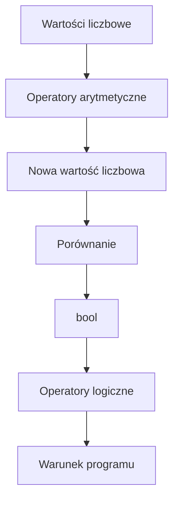

# 05. Operatory arytmetyczne, relacyjne i logiczne

## Operatory arytmetyczne

`+`, `-`, `*`, `/` i `%` służą do obliczeń. `++`, `--`, `+=` i podobne operatory zmieniają wartość zmiennej. Dla `int` dzielenie jest całkowite, a dla `double` i `decimal` zachowuje część ułamkową.

```csharp
int suma = 7 + 3;
int reszta = 7 % 3;
double iloraz = 7.0 / 3;
```

## Operatory relacyjne i równości

`<`, `>`, `<=`, `>=`, `==` i `!=` zwracają `bool`:

```csharp
bool wZakresie = wynik >= 0 && wynik <= 100;
bool rozne = pierwsza != druga;
```

## Operatory logiczne

`&&` oznacza koniunkcję, `||` alternatywę, a `!` negację. Operatory `&&` i `||` stosują krótkie spięcie, więc prawa strona może nie zostać obliczona.



Źródło: [diagram-operatory.mmd](diagram-operatory.mmd).

## Przykład 1: kalkulator dwóch liczb

Projekt [Kod/Kalkulator/Program.cs](Kod/Kalkulator/Program.cs) pokazuje podstawowe operatory arytmetyczne oraz kontrolę dzielenia przez zero.

## Przykład 2: sprawdzenie zakresu

Projekt [Kod/Warunek/Program.cs](Kod/Warunek/Program.cs) łączy operatory relacyjne i logiczne, aby sprawdzić, czy wynik mieści się w przedziale oraz czy jest parzysty.

```csharp
bool poprawny = liczba >= 0 && liczba <= 100;
bool parzysty = liczba % 2 == 0;
Console.WriteLine(poprawny && parzysty ? "Poprawny i parzysty" : "Warunek nie jest spełniony");
```

## Zadania z rozwiązaniami

1. Napisz kalkulator pola i obwodu prostokąta.
2. Sprawdź, czy rok jest przestępny według reguły: podzielny przez 400 albo podzielny przez 4 i niepodzielny przez 100.
3. Dla trzech liczb sprawdź, czy przynajmniej dwie są równe.

Rozwiązanie zadania 2:

```csharp
bool przestepny = rok % 400 == 0 || (rok % 4 == 0 && rok % 100 != 0);
```

Nawiasy pokazują grupę warunków i chronią przed pomyłką w odczytaniu reguły.

## Laboratorium

```powershell
dotnet build
dotnet run
```

Sprawdź dzielenie przez zero, wartości równe granicom i różne kombinacje `true`/`false`. W debugerze obserwuj wynik każdego podwyrażenia.

## Źródła

- [Arithmetic operators](https://learn.microsoft.com/dotnet/csharp/language-reference/operators/arithmetic-operators),
- [Comparison operators](https://learn.microsoft.com/dotnet/csharp/language-reference/operators/comparison-operators),
- [Boolean logical operators](https://learn.microsoft.com/dotnet/csharp/language-reference/operators/boolean-logical-operators).
