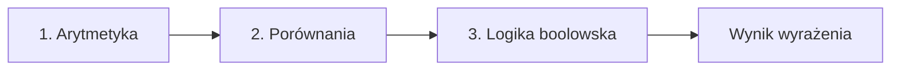
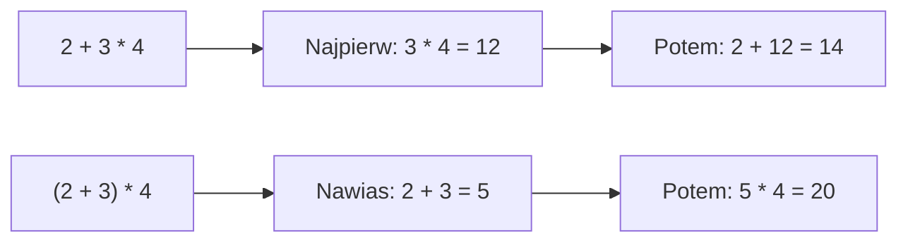
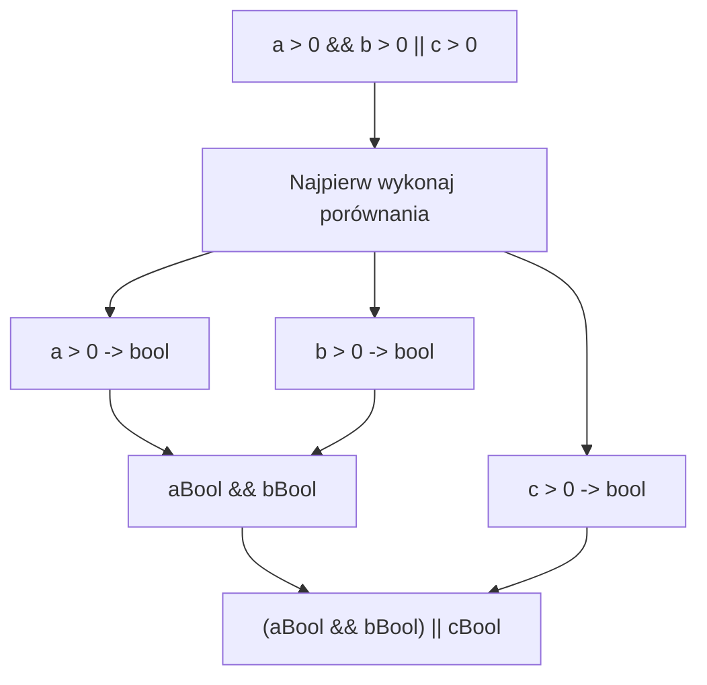
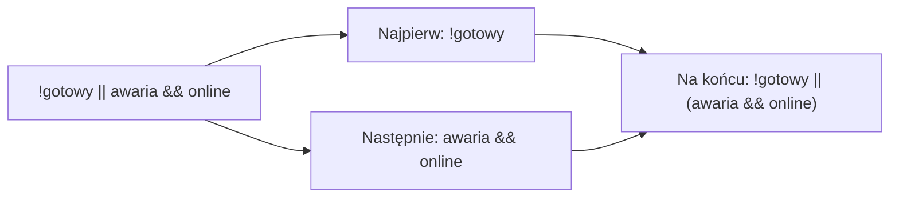
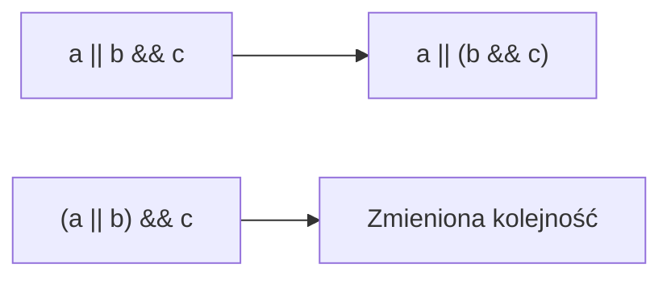

# 06. Priorytety operatorów i nawiasowanie

## Dlaczego priorytety są ważne?

Gdy wyrażenie zawiera kilka operatorów, C# ustala kolejność ich wykonywania. Operator o wyższym priorytecie działa wcześniej. Operatory o tym samym priorytecie mają określoną łączność, zwykle od lewej do prawej.

```csharp
int pierwszy = 2 + 3 * 4;
int drugi = (2 + 3) * 4;
bool warunek = a > 0 && b > 0 || c > 0;
```

W arytmetyce `*`, `/` i `%` mają wyższy priorytet niż `+` i `-`. W logice `!` działa przed `&&`, a `&&` przed `||`. Porównania są wykonywane przed operatorami logicznymi.

Diagramy poniżej pokazują **grupowanie fragmentów wyrażenia**, a nie ciąg osobnych instrukcji, który program zawsze wykonuje od góry do dołu. Im wyższy priorytet operatora, tym wcześniej C# wiąże go z operandami. Nawiasy mogą tę kolejność zmienić.

### Mapa modułu



Źródło: [diagram-priorytety.mmd](diagram-priorytety.mmd).

### 1. Arytmetyka: mnożenie przed dodawaniem



Bez nawiasów `*`, `/` i `%` są wiązane przed `+` i `-`. Nawiasy tworzą własną grupę, więc w drugim przykładzie dodawanie jest wykonane przed mnożeniem. Operatory o tym samym priorytecie, na przykład `20 / 5 * 2`, są odczytywane od lewej do prawej.

Źródło: [diagram-priorytet-arytmetyczny.mmd](diagram-priorytet-arytmetyczny.mmd).

### 2. Porównania: liczby stają się wartościami `bool`



Operatory `>`, `<`, `>=`, `<=`, `==` i `!=` nie zwracają liczby, tylko `bool`. Dlatego najpierw powstają wartości `aBool`, `bBool` i `cBool`. Dopiero potem `&&` łączy dwa wyniki, a `||` łączy wynik koniunkcji z trzecim warunkiem. To oznacza, że zapis jest równoważny `((a > 0 && b > 0) || c > 0)`.

Źródło: [diagram-priorytet-porownania.mmd](diagram-priorytet-porownania.mmd).

### 3. Logika: `!` przed `&&`, a `&&` przed `||`



Operator `!` odwraca jeden `bool`, `&&` wymaga prawdziwości obu stron, a `||` wymaga prawdziwości przynajmniej jednej strony. C# odczyta ten przykład jako `(!gotowy) || (awaria && online)`, nie jako `(!gotowy || awaria) && online`. Gdy intencja nie jest oczywista, nawiasy powinny ją zapisać wprost.

Źródło: [diagram-priorytet-logika.mmd](diagram-priorytet-logika.mmd).

## Kiedy stosować nawiasy?

Nawiasy są potrzebne, gdy chcemy zmienić domyślną kolejność. Są również wskazane, gdy wyrażenie jest ważne biznesowo i bez nawiasów wymagałoby pamiętania reguł języka.

```csharp
bool mozeWejsc = (wiek >= 18 && maBilet) || jestOpiekunem;
decimal cena = (netto + dostawa) * (1 + vat);
```

Nawiasy są dokumentacją intencji autora.

## Przykład 1: arytmetyka

Projekt [Kod/Obliczenia/Program.cs](Kod/Obliczenia/Program.cs) pokazuje, że `2 + 3 * 4` i `(2 + 3) * 4` są różnymi wyrażeniami.

## Przykład 2: logika

Projekt [Kod/Logika/Program.cs](Kod/Logika/Program.cs) porównuje `a || b && c` z `(a || b) && c`. Oba zapisy są poprawne składniowo, ale mogą oznaczać inne wymagania.



Źródło: [diagram-nawiasy.mmd](diagram-nawiasy.mmd).

## Zadania z rozwiązaniami

1. Oblicz ręcznie `10 + 2 * 3`, `(10 + 2) * 3`, `20 / 5 * 2` i `20 / (5 * 2)`.
2. Dodaj nawiasy do warunku „pełnoletni z biletem albo opiekun”.
3. Zapisz wyrażenie ceny brutto tak, aby najpierw dodać dostawę do netto, a potem zastosować VAT.

Wyniki zadania 1 to odpowiednio `16`, `36`, `8` i `2`. Rozwiązania zadań 2-3:

```csharp
bool mozeWejsc = (wiek >= 18 && maBilet) || maOpiekuna;
decimal brutto = (netto + dostawa) * (1 + stawkaVat);
```

## Laboratorium i debugowanie

```powershell
dotnet build
dotnet run
```

Przed uruchomieniem zapisz przewidywany wynik. Ustaw punkt przerwania po przypisaniu zmiennej i porównaj wartość z obliczeniem rozpisanym na części.

## Źródła

- [Operators and expressions](https://learn.microsoft.com/dotnet/csharp/language-reference/operators/),
- [Arithmetic operators](https://learn.microsoft.com/dotnet/csharp/language-reference/operators/arithmetic-operators),
- [Boolean logical operators](https://learn.microsoft.com/dotnet/csharp/language-reference/operators/boolean-logical-operators).
