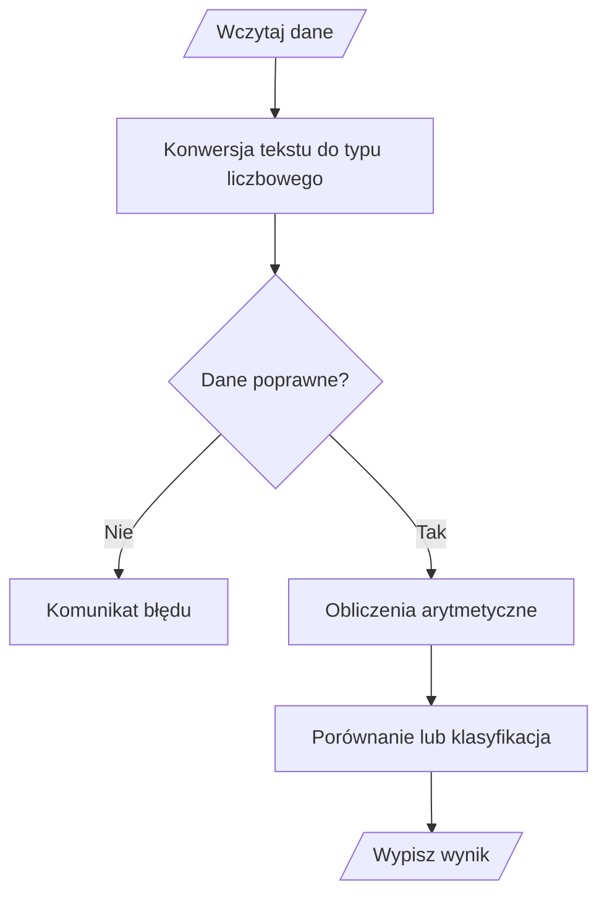

# 07. Programy wykorzystujące typy i operatory

Poniższe projekty łączą wszystkie pojęcia modułu. Każdy jest osobną aplikacją konsolową `net9.0` i może być prezentowany na wykładzie albo wykonany krokowo na laboratorium.

## Program 1: BMI

Projekt [Kod/Bmi/Program.cs](Kod/Bmi/Program.cs) używa `double` do pomiaru masy i wzrostu, operatorów arytmetycznych oraz relacyjnych do klasyfikacji wyniku.

Wzór: $BMI = \frac{masa}{wzrost^2}$.

## Program 2: faktura

Projekt [Kod/Faktura/Program.cs](Kod/Faktura/Program.cs) używa `decimal` dla kwot, `const` dla stawki VAT i nawiasowania, aby najpierw zsumować pozycje, a potem naliczyć podatek.

```csharp
const decimal Vat = 0.23m;
decimal brutto = (cenaNetto * ilosc) * (1 + Vat);
```

## Program 3: konwerter sekund

Projekt [Kod/Czas/Program.cs](Kod/Czas/Program.cs) używa dzielenia całkowitego i operatora `%` do rozbicia liczby sekund na godziny, minuty i sekundy. Pokazuje także, dlaczego kolejność operacji ma znaczenie.

## Program 4: lokata

Projekt [Kod/Lokata/Program.cs](Kod/Lokata/Program.cs) używa `decimal`, stałej stawki podatku i operatorów arytmetycznych do obliczenia odsetek netto. Warunek relacyjny sprawdza, czy kwota spełnia minimum.

## Program 5: geometria trójkąta

Projekt [Kod/Geometria/Program.cs](Kod/Geometria/Program.cs) używa `double`, konwersji tekstu przez `TryParse`, operatorów logicznych do walidacji boków i wzoru Herona do obliczenia pola.



Źródło: [diagram-programy.mmd](diagram-programy.mmd).

## Zestawienie

| Program | Typy | Najważniejsze operatory |
| --- | --- | --- |
| BMI | `double` | `/`, `*`, `>`, `<=` |
| Faktura | `decimal`, `const` | `*`, `+`, nawiasy |
| Czas | `int` | `/`, `%` |
| Lokata | `decimal`, `const` | `*`, `-`, `>=` |
| Geometria | `double` | `+`, `-`, `*`, `/`, `&&` |

## Zadania dla studentów

1. Do BMI dodaj klasyfikację z granicami i komunikat dla danych niedodatnich.
2. Do faktury dodaj rabat `10%`, stosowany przed VAT-em tylko dla sumy netto powyżej `500`.
3. Do konwertera sekund dodaj konwersję na dni.
4. Do lokaty dodaj sprawdzenie, czy okres lokaty jest dodatnią liczbą całkowitą.
5. Do geometrii dodaj obliczenie obwodu i sprawdzanie, czy trójkąt jest równoboczny.

### Rozwiązania i wyjaśnienia

1. Klasyfikację BMI wykonaj po sprawdzeniu `masa > 0 && wzrost > 0`; granice zapisuj w nazwanych stałych.
2. Najpierw oblicz `nettoPoRabacie`, a następnie `brutto = nettoPoRabacie * (1 + Vat)`. Kolejność ma znaczenie.
3. Dzień oblicz przez `sekundy / 86_400`, a resztę pozostaw do obliczenia godzin przez `% 86_400`.
4. Użyj `int.TryParse` i warunku `okres > 0`, zanim wykonasz obliczenia.
5. Obwód to `a + b + c`, a równoboczność wymaga `a == b && b == c` po pozytywnej walidacji trójkąta.

## Laboratorium i debugowanie

Każdy projekt uruchamiaj w jego katalogu:

```powershell
dotnet build
dotnet run
```

Dla każdego programu przygotuj przypadek typowy, graniczny i błędny. W debugerze zatrzymaj wykonanie po konwersji wejścia, po obliczeniu wartości pośredniej i przed wypisaniem wyniku.

## Źródła

- [Numeric types](https://learn.microsoft.com/dotnet/csharp/language-reference/builtin-types/numeric-types),
- [Numeric conversions](https://learn.microsoft.com/dotnet/csharp/language-reference/builtin-types/numeric-conversions),
- [The `const` keyword](https://learn.microsoft.com/dotnet/csharp/language-reference/keywords/const),
- [Operators and expressions](https://learn.microsoft.com/dotnet/csharp/language-reference/operators/),
- [Math.Sqrt](https://learn.microsoft.com/dotnet/api/system.math.sqrt).
