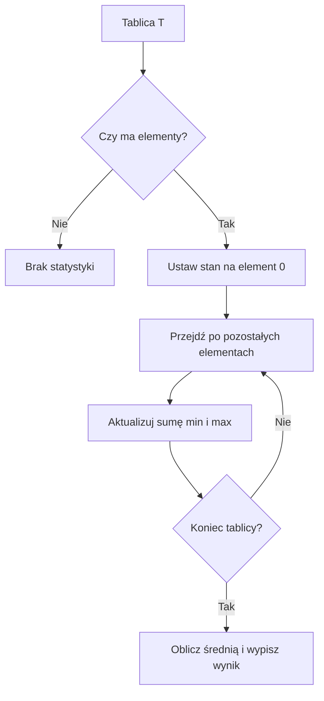

# 01. Tablice jednowymiarowe

## Model danych

Tablica jednowymiarowa `T[]` przechowuje ustaloną liczbę elementów typu `T`. Elementy są numerowane od `0`, więc dla tablicy o długości `n` poprawne indeksy tworzą zakres od `0` do `n - 1`.

```csharp
int[] temperatury = { 18, 21, 19, 23 };
Console.WriteLine(temperatury[0]);
Console.WriteLine(temperatury[temperatury.Length - 1]);
```

`Length` oznacza liczbę elementów, a nie ostatni indeks. Pomylenie tych pojęć jest źródłem częstego `IndexOutOfRangeException`.

## Utworzenie i inicjalizacja

```csharp
int[] puste = new int[4];
int[] jawne = new int[] { 3, 5, 8, 13 };
int[] skrocone = { 2, 4, 6, 8 };
```

`new int[4]` tworzy cztery wartości `0`. Dla tablic typów referencyjnych wartości początkowe są `null`, dlatego tablicę `string[]` trzeba wypełnić przed użyciem tekstu. Rozmiar tablicy pozostaje stały po utworzeniu; można zmieniać elementy, ale nie liczbę elementów.

Od C# 12 dostępne są także wyrażenia kolekcji, na przykład `int[] liczby = [1, 2, 3]`. W materiałach używamy głównie składni z klamrami, ponieważ łatwiej pokazuje ona inicjalizator tablicy znany z wcześniejszych wersji C#.

## Przechodzenie po elementach

`for` daje dostęp do indeksu, więc jest właściwy, gdy trzeba zmienić element albo znać jego pozycję. `foreach` jest czytelniejszy, gdy tylko odczytujemy wartości.

```csharp
for (int indeks = 0; indeks < temperatury.Length; indeks++)
{
    Console.WriteLine($"[{indeks}] = {temperatury[indeks]}");
}

foreach (int temperatura in temperatury)
{
    Console.WriteLine(temperatura);
}
```

## Tablica jako argument metody

Tablica jest typem referencyjnym. Metoda otrzymuje kopię referencji do tego samego obiektu, więc zmiana elementu wewnątrz metody jest widoczna po powrocie.

```csharp
static void PodniesPierwszy(int[] liczby)
{
    liczby[0]++;
}
```

Nie oznacza to, że można zmienić długość istniejącej tablicy. Do zmiennej można przypisać inną tablicę, ale wtedy jest to już inny obiekt.

## Algorytm statystyk

Dla tablicy liczb możemy wykonać jeden przebieg i utrzymywać stan:

- `suma` przechowuje sumę elementów,
- `minimum` i `maksimum` przechowują najlepsze dotychczas wartości,
- `indeks` mówi, który element przetwarzamy.

Dla niepustej tablicy inicjalizacja minimum pierwszym elementem jest bezpieczniejsza niż rozpoczęcie od `0`, bo działa także dla liczb ujemnych.



Źródło: [diagram-tablica-jednowymiarowa.mmd](diagram-tablica-jednowymiarowa.mmd).

## Projekt demonstracyjny

Projekt [Kod/Statystyki/Program.cs](Kod/Statystyki/Program.cs) tworzy tablicę pomiarów, wypisuje indeksy, oblicza sumę, minimum, maksimum i średnią oraz odwraca kopię tablicy. Zatrzymaj debugger na aktualizacji `minimum`, aby zobaczyć niezmiennik: po przetworzeniu elementów od `0` do `i` zmienna `minimum` jest najmniejszym z tych elementów.

## Zadania

1. Napisz metodę zwracającą liczbę elementów parzystych w `int[]`.
2. Napisz metodę odwracającą tablicę w miejscu, bez tworzenia drugiej tablicy.
3. Znajdź indeks pierwszego maksimum. Dla pustej tablicy zwróć `-1`.
4. Oblicz średnią tylko z wartości dodatnich i zwróć informację, gdy nie ma żadnej takiej wartości.

### Rozwiązania i wyjaśnienia

Dla zadania 1 wystarczy akumulator:

```csharp
int parzyste = 0;
foreach (int liczba in liczby)
{
    if (liczba % 2 == 0)
    {
        parzyste++;
    }
}
```

Odwracanie w miejscu wymaga zamiany par elementów: `0` z `Length - 1`, potem `1` z `Length - 2`, aż do środka. Złożoność czasowa wynosi $O(n)$, a dodatkowa pamięć $O(1)$. Indeks pierwszego maksimum aktualizuj tylko przy `>`, a nie przy `>=`, aby duplikat nie przesunął wyniku.

## Laboratorium

1. Uruchom projekt i sprawdź wynik dla tablicy zawierającej liczby ujemne, zero i duplikaty.
2. Zmień pętlę `for` na `foreach`, a następnie wyjaśnij, dlaczego nie można w niej bezpośrednio użyć indeksu.
3. Ustaw punkt przerwania przy `minimum` i `maksimum`.
4. Dodaj test dla tablicy jednoelementowej oraz pustej.

```powershell
dotnet build
dotnet run
```

## Źródła

- [Arrays - C# reference](https://learn.microsoft.com/dotnet/csharp/language-reference/builtin-types/arrays),
- [Array.Length property](https://learn.microsoft.com/dotnet/api/system.array.length),
- [foreach statement](https://learn.microsoft.com/dotnet/csharp/language-reference/statements/iteration-statements#the-foreach-statement).
