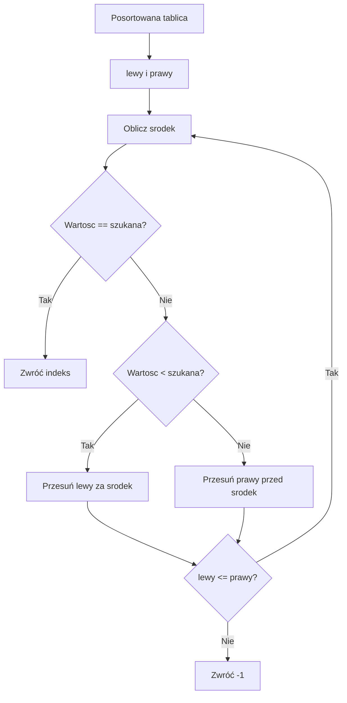

# 03. Wyszukiwanie w tablicach

## Wyszukiwanie liniowe

Wyszukiwanie liniowe sprawdza elementy od początku do końca. Kończy się po znalezieniu wartości albo po sprawdzeniu całej tablicy. Nie wymaga sortowania i działa dla dowolnego typu, dla którego można porównać elementy.

```csharp
static int SzukajLiniowo(int[] liczby, int szukana)
{
    for (int indeks = 0; indeks < liczby.Length; indeks++)
    {
        if (liczby[indeks] == szukana)
        {
            return indeks;
        }
    }
    return -1;
}
```

Jeżeli element jest na początku, koszt może wynieść jedno porównanie. Jeżeli go nie ma albo znajduje się na końcu, potrzebujemy do `n` porównań. Złożoność pesymistyczna to $O(n)$, a pamięć dodatkowa $O(1)$.

## Wyszukiwanie binarne

Wyszukiwanie binarne działa tylko wtedy, gdy tablica jest posortowana zgodnie z tym samym porządkiem, którego używa porównanie. W każdej iteracji wybieramy środek przedziału i odrzucamy połowę elementów:

```csharp
static int SzukajBinarnie(int[] liczby, int szukana)
{
    int lewy = 0;
    int prawy = liczby.Length - 1;

    while (lewy <= prawy)
    {
        int srodek = lewy + (prawy - lewy) / 2;
        if (liczby[srodek] == szukana)
        {
            return srodek;
        }

        if (liczby[srodek] < szukana)
        {
            lewy = srodek + 1;
        }
        else
        {
            prawy = srodek - 1;
        }
    }

    return -1;
}
```

Wzór na środek zapisany jako `lewy + (prawy - lewy) / 2` unika przepełnienia, które może powstać przy `(lewy + prawy) / 2` dla bardzo dużych indeksów. Złożoność wyszukiwania binarnego to $O(\\log n)$.



Źródło: [diagram-wyszukiwanie.mmd](diagram-wyszukiwanie.mmd).

## Wyszukiwanie biblioteczne

C# udostępnia `Array.IndexOf` dla wyszukiwania równościowego oraz `Array.BinarySearch` dla posortowanej tablicy. `Array.BinarySearch` zwraca indeks, gdy element istnieje. Gdy elementu nie ma, zwraca liczbę ujemną, a `~wynik` wskazuje miejsce, w którym można go wstawić.

```csharp
Array.Sort(liczby);
int indeks = Array.BinarySearch(liczby, 17);
if (indeks < 0)
{
    int miejsce = ~indeks;
}
```

Biblioteka jest właściwa w kodzie produkcyjnym, ale implementacja własnej metody jest wartościowa dydaktycznie: pokazuje niezmiennik przedziału i warunek zakończenia.

## Projekt demonstracyjny

Projekt [Kod/Wyszukiwanie/Program.cs](Kod/Wyszukiwanie/Program.cs) porównuje wyszukiwanie liniowe, własne wyszukiwanie binarne i `Array.BinarySearch`. Wypisuje liczbę porównań, dzięki czemu różnica jest widoczna na danych o różnym rozmiarze.

## Zadania

1. Zmień wyszukiwanie liniowe tak, aby zwracało liczbę wystąpień wartości.
2. Napisz metodę zwracającą pierwszy indeks wartości w posortowanej tablicy, gdy duplikatów jest wiele.
3. Napisz wyszukiwanie binarne dla tablicy uporządkowanej malejąco.
4. Porównaj liczbę porównań dla tablicy 10, 1000 i 1 000 000 elementów.

### Rozwiązania i wyjaśnienia

Liniowe zliczanie nie może zakończyć się przy pierwszym trafieniu. Wariant „pierwszy indeks” po znalezieniu wartości zapisuje wynik i przesuwa `prawy` na `srodek - 1`, aby sprawdzić, czy wcześniejsza kopia istnieje. Dla porządku malejącego należy odwrócić decyzję: jeśli środek jest mniejszy od szukanej, szukamy po lewej stronie.

Dla $n = 1\,000\,000$ wyszukiwanie liniowe może wykonać milion porównań, a binarne około $\log_2(n)$, czyli około 20. To porównanie ma sens dopiero wtedy, gdy koszt posortowania danych i utrzymywania ich w porządku jest uzasadniony.

## Laboratorium

1. Uruchom przykład dla elementu na początku, na końcu i nieobecnego.
2. Dodaj duplikaty i obserwuj, który indeks zwracają różne metody.
3. Usuń sortowanie przed wyszukiwaniem binarnym i zapisz, dla jakiego wejścia wynik staje się błędny.
4. W debuggerze obserwuj `lewy`, `prawy` i `srodek`.

```powershell
dotnet build
dotnet run
```

## Źródła

- [Array.IndexOf method](https://learn.microsoft.com/dotnet/api/system.array.indexof),
- [Array.BinarySearch method](https://learn.microsoft.com/dotnet/api/system.array.binarysearch),
- [Binary search algorithm](https://en.wikipedia.org/wiki/Binary_search_algorithm).
