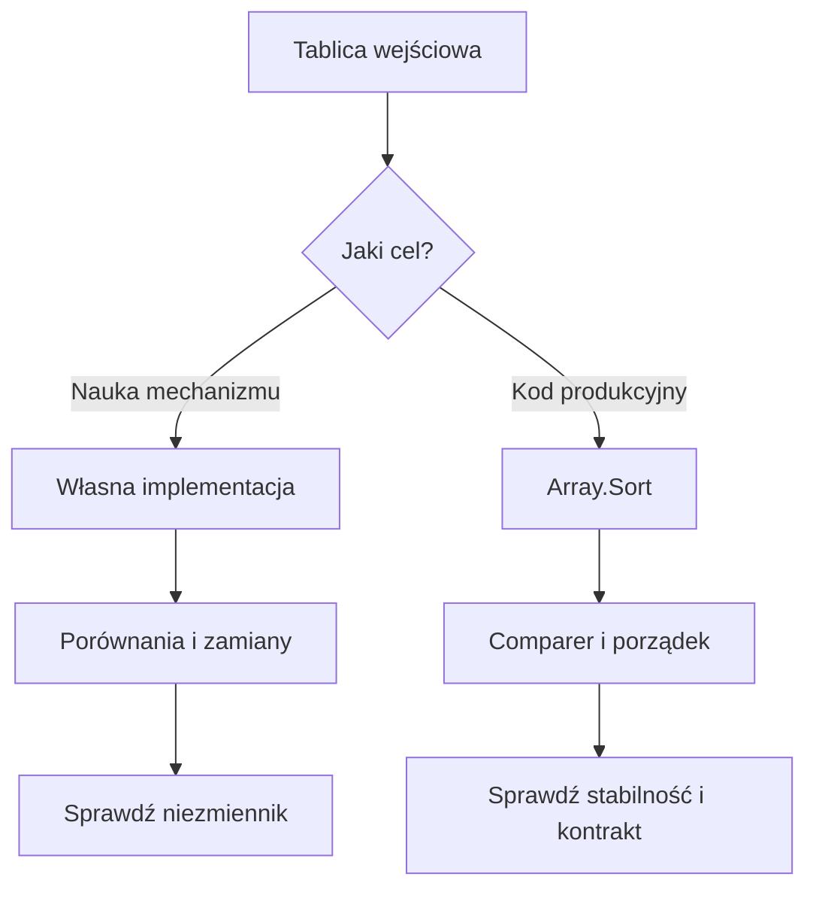

# 04. Sortowanie tablic

Sortowanie układa elementy według określonego porządku, na przykład rosnąco, malejąco albo alfabetycznie. Wykład powinien pokazać nie tylko kod, ale także pytanie, które algorytm rozwiązuje: jak uzyskać uporządkowany wynik, ile pracy wykonać i czy zachować kolejność elementów równych.

## Podstawowe pojęcia

Dla algorytmu sortowania analizujemy:

- **porównania** - ile razy algorytm sprawdza relację między elementami,
- **zamiany lub przesunięcia** - ile razy przenosi dane,
- **złożoność czasową** - jak rośnie koszt wraz z liczbą elementów `n`,
- **pamięć dodatkową** - ile miejsca potrzebuje poza sortowaną tablicą,
- **stabilność** - czy elementy równe zachowują swoją kolejność,
- **sortowanie w miejscu** - czy wynik powstaje głównie w tej samej tablicy.

Stabilność ma znaczenie, gdy sortujemy rekordy po jednym polu. Jeżeli dwa pomiary mają tę samą temperaturę, stabilne sortowanie zachowa ich wcześniejszą kolejność, na przykład kolejność czasu pomiaru.

## Przegląd algorytmów

| Algorytm | Najlepszy przypadek | Średni przypadek | Najgorszy przypadek | Pamięć | Stabilny |
| --- | ---: | ---: | ---: | ---: | --- |
| Bąbelkowe z flagą | $O(n)$ | $O(n^2)$ | $O(n^2)$ | $O(1)$ | Tak |
| Przez wybieranie | $O(n^2)$ | $O(n^2)$ | $O(n^2)$ | $O(1)$ | Zwykle nie |
| Przez wstawianie | $O(n)$ | $O(n^2)$ | $O(n^2)$ | $O(1)$ | Tak |
| Scalanie | $O(n \\log n)$ | $O(n \\log n)$ | $O(n \\log n)$ | $O(n)$ | Tak |
| Szybkie | $O(n \\log n)$ | $O(n \\log n)$ | $O(n^2)$ | $O(\\log n)$ średnio | Zwykle nie |
| Kopcowanie | $O(n \\log n)$ | $O(n \\log n)$ | $O(n \\log n)$ | $O(1)$ | Nie |
| `Array.Sort` | $O(n \\log n)$ | $O(n \\log n)$ | $O(n \\log n)$ | zależna od implementacji | Nie gwarantuje |

Złożoność opisuje wzrost kosztu, a nie dokładny czas dla jednego uruchomienia. Dla małych tablic prosty insertion sort może być szybszy od bardziej złożonego algorytmu, ponieważ wykonuje mniej narzutu organizacyjnego.

## Sortowanie bąbelkowe

W jednym przebiegu porównujemy sąsiednie elementy i zamieniamy je, gdy są w złej kolejności. Po każdym pełnym przebiegu największy nieuporządkowany element przesuwa się na koniec. Flaga `zamiana` pozwala zakończyć działanie, gdy tablica już jest uporządkowana.

```csharp
static void SortowanieBabelkowe(int[] liczby)
{
    for (int koniec = liczby.Length - 1; koniec > 0; koniec--)
    {
        bool zamiana = false;
        for (int indeks = 0; indeks < koniec; indeks++)
        {
            if (liczby[indeks] > liczby[indeks + 1])
            {
                (liczby[indeks], liczby[indeks + 1]) =
                    (liczby[indeks + 1], liczby[indeks]);
                zamiana = true;
            }
        }

        if (!zamiana)
        {
            return;
        }
    }
}
```

Niezmiennik po zakończeniu przebiegu z `koniec` równym `k` brzmi: elementy od `k` do końca są już na właściwych pozycjach.

## Sortowanie przez wybieranie

Dla każdej pozycji `poczatek` algorytm znajduje najmniejszy element w nieuporządkowanym sufiksie i zamienia go z elementem na pozycji `poczatek`. Wykonuje wiele porównań nawet wtedy, gdy dane są już posortowane, ale liczbę zamian ogranicza do najwyżej `n - 1`.

```csharp
static void SortowaniePrzezWybieranie(int[] liczby)
{
    for (int poczatek = 0; poczatek < liczby.Length - 1; poczatek++)
    {
        int indeksMinimum = poczatek;
        for (int indeks = poczatek + 1; indeks < liczby.Length; indeks++)
        {
            if (liczby[indeks] < liczby[indeksMinimum])
            {
                indeksMinimum = indeks;
            }
        }

        if (indeksMinimum != poczatek)
        {
            (liczby[poczatek], liczby[indeksMinimum]) =
                (liczby[indeksMinimum], liczby[poczatek]);
        }
    }
}
```

## Sortowanie przez wstawianie

Algorytm utrzymuje posortowany prefiks. Następny element, zwany kluczem, przesuwa większe elementy w prawo i wstawia klucz w wolne miejsce. Bardzo dobrze działa dla danych prawie posortowanych, na przykład dla strumienia, do którego dopisano kilka nowych wartości.

```csharp
static void SortowaniePrzezWstawianie(int[] liczby)
{
    for (int indeks = 1; indeks < liczby.Length; indeks++)
    {
        int klucz = liczby[indeks];
        int pozycja = indeks - 1;

        while (pozycja >= 0 && liczby[pozycja] > klucz)
        {
            liczby[pozycja + 1] = liczby[pozycja];
            pozycja--;
        }

        liczby[pozycja + 1] = klucz;
    }
}
```

Niezmiennik po iteracji `indeks` mówi, że prefiks od `0` do `indeks` jest posortowany. W porównaniu z bąbelkowym kod pokazuje przesunięcia, a nie serię zamian.

## Sortowanie przez scalanie

Merge sort dzieli tablicę na połowy, sortuje każdą połowę rekurencyjnie i scala dwa posortowane fragmenty. Główna operacja scalania porównuje tylko pierwsze jeszcze niewykorzystane elementy obu fragmentów. Każdy poziom drzewa rekurencji przetwarza łącznie `n` elementów, a liczba poziomów wynosi około `log n`, stąd $O(n \\log n)$. Ceną jest dodatkowa tablica.

W praktycznej implementacji trzeba pilnować granic `lewy`, `srodek` i `prawy`, a po wyczerpaniu jednej połowy przepisać resztę drugiej. Merge sort jest dobrym przykładem algorytmu stabilnego i dzielącego problem na mniejsze problemy.

## Sortowanie szybkie i kopcowanie

Quick sort wybiera pivot, dzieli dane na elementy mniejsze i większe, a następnie sortuje podtablice. Średnio działa w $O(n \\log n)$, ale niekorzystny pivot może prowadzić do $O(n^2)$. W praktyce stosuje się strategie wyboru pivota i ograniczenie głębokości rekurencji.

Heap sort buduje kopiec, czyli strukturę pozwalającą szybko pobrać największy albo najmniejszy element. Gwarantuje $O(n \\log n)$ i działa w miejscu, ale nie jest stabilny.

## `Array.Sort` w .NET

Współczesny .NET sortuje tablice jednowymiarowe przez introsort: łączy quick sort, heap sort i insertion sort. Dokumentacja opisuje między innymi przejście do insertion sort dla małych partycji i użycie heap sort, gdy rekurencja quick sort staje się zbyt głęboka. `Array.Sort` nie gwarantuje stabilności.

```csharp
int[] liczby = { 9, 2, 7, 2, 5 };
Array.Sort(liczby);

string[] nazwy = { "sensor-3", "sensor-1", "sensor-2" };
Array.Sort(nazwy, StringComparer.Ordinal);
```

Dwa powiązane jednowymiarowe array można sortować razem:

```csharp
string[] identyfikatory = { "B", "A", "C" };
int[] pomiary = { 20, 10, 30 };
Array.Sort(identyfikatory, pomiary);
```

Po operacji `identyfikatory[0]` to `"A"`, a `pomiary[0]` to `10`. Taki kod wymaga identycznego znaczenia indeksów w obu tablicach. W większych programach lepszym modelem jest zwykle tablica obiektów, ale na tym etapie warto zobaczyć, jak łatwo rozłączyć dane przez sortowanie tylko jednej tablicy.



Źródło: [diagram-sortowanie.mmd](diagram-sortowanie.mmd).

## Projekt demonstracyjny

Projekt [Kod/Porownanie/Program.cs](Kod/Porownanie/Program.cs) uruchamia sortowanie bąbelkowe, przez wybieranie, przez wstawianie, przez scalanie, szybkie, kopcowanie oraz `Array.Sort` na kopiach tych samych danych. Raportuje wynik, liczbę porównań i operacji przenoszenia. Ustaw punkt przerwania w sortowaniu przez wstawianie i prześledź niezmiennik posortowanego prefiksu; w merge sort obserwuj scalanie dwóch posortowanych połówek, a w heap sort własność kopca.

## Zadania

1. Dodaj wersję sortowania bąbelkowego malejąco.
2. Zaimplementuj merge sort dla `int[]` i policz porównania podczas scalania.
3. Zaimplementuj quick sort z pivotem wybieranym jako środkowy element przedziału.
4. Posortuj dwie powiązane tablice według wyniku malejąco, zachowując identyfikatory.
5. Przygotuj eksperyment dla tablic losowych, posortowanych i odwrotnie posortowanych. Porównaj trzy algorytmy własne i `Array.Sort`.
6. Wyjaśnij, dlaczego `Array.Sort` nie można bezpośrednio zastosować do `int[,]`.

### Rozwiązania i wyjaśnienia

W zadaniu 1 wystarczy odwrócić relację `>` na `<`. W zadaniu 2 podczas scalania porównuj elementy na początku obu połówek i zapisuj mniejszy do bufora. W zadaniu 3 po podziale sortuj przedziały `[lewy, granica - 1]` oraz `[granica + 1, prawy]`.

Dla powiązanych tablic użyj `Array.Sort(klucze, wartosci, comparer)` z komparatorem odwracającym kolejność. Nie sortuj `wartosci` osobno, bo utracisz relację między rekordem a wynikiem. W eksperymencie zapisz rozmiar wejścia i czas lub liczbę operacji; pojedynczy pomiar dla małej tablicy nie wystarcza do wniosków o złożoności.

## Laboratorium

```powershell
dotnet build
dotnet run
```

1. Uruchom wszystkie algorytmy na tych samych kopiach danych.
2. Sprawdź tablicę pustą, jednoelementową, z duplikatami i już posortowaną.
3. W debuggerze obserwuj przedział pracy quick sort oraz klucz w insertion sort.
4. Porównaj wynik każdej metody z `Array.Sort` przez `SequenceEqual`.
5. Zapisz wnioski o kosztach, stabilności i pamięci dodatkowej.

## Źródła

- [Array.Sort method](https://learn.microsoft.com/dotnet/api/system.array.sort),
- [Sorting algorithms](https://en.wikipedia.org/wiki/Sorting_algorithm),
- [Insertion sort](https://en.wikipedia.org/wiki/Insertion_sort),
- [Quicksort](https://en.wikipedia.org/wiki/Quicksort),
- [Heapsort](https://en.wikipedia.org/wiki/Heapsort),
- [Merge sort](https://en.wikipedia.org/wiki/Merge_sort).
