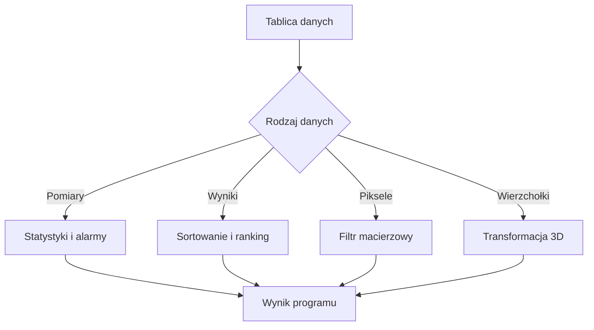

# 06. Programy wykorzystujące tablice

Poniższe cztery projekty są kompletne i niezależne. Każdy może być pokazany na wykładzie, a następnie rozszerzony przez studentów na laboratorium. Wszystkie używają aplikacji konsolowych `net9.0` i pokazują, że tablica jest modelem danych, a nie tylko ćwiczeniem z indeksów.

## Program 1: monitoring temperatury

Projekt [Kod/Monitoring/Program.cs](Kod/Monitoring/Program.cs) przechowuje serię pomiarów temperatury w `double[]`. Oblicza minimum, maksimum, średnią, liczbę alarmów oraz wyszukuje pierwszy pomiar przekraczający limit.

Zastosowanie: telemetria urządzeń IoT, logi czujników i monitoring serwera. W prawdziwym systemie dane przychodziłyby strumieniowo, ale tablica dobrze pokazuje analizę ustalonego okna pomiarowego.

## Program 2: ranking wyników

Projekt [Kod/Ranking/Program.cs](Kod/Ranking/Program.cs) przechowuje identyfikatory studentów i wyniki w dwóch powiązanych tablicach. Sortuje je malejąco przez `Array.Sort(wyniki, identyfikatory)`, a następnie wypisuje podium.

Zastosowanie: ranking wyników, kolejka priorytetów i sortowanie rekordów po kluczu. Wniosek projektowy: równoległe tablice są możliwe, lecz łatwo utracić zgodność indeksów; przy większym programie warto użyć obiektów lub rekordów.

## Program 3: filtr obrazu

Projekt [Kod/Obraz/Program.cs](Kod/Obraz/Program.cs) reprezentuje obraz w skali szarości jako `int[,]`. Nakłada filtr średniej `3 x 3`, pomijając sąsiadów spoza obrazu, oraz wypisuje macierz przed i po filtracji.

Zastosowanie: wstępne przetwarzanie obrazu, wygładzanie pomiarów przestrzennych i macierze map. Program pokazuje, dlaczego wynik trzeba zapisywać do nowej macierzy, a nie zmieniać wejście w trakcie obliczeń.

## Program 4: transformacja modelu 3D

Projekt [Kod/Model3D/Program.cs](Kod/Model3D/Program.cs) przechowuje osiem wierzchołków prostopadłościanu w `Vector3[]`. Tworzy wspólną macierz skalowania, obrotu i przesunięcia, a następnie transformuje każdy wierzchołek.

Zastosowanie: grafika komputerowa, wizualizacja CAD i symulacja położenia obiektu. `Vector3[]` jest naturalnym wyborem dla zbioru punktów, a `Matrix4x4` pozwala zastosować identyczną transformację do całego modelu.



Źródło: [diagram-programy-tablice.mmd](diagram-programy-tablice.mmd).

## Zestawienie

| Program | Struktura | Główna idea | Koszt przykładu |
| --- | --- | --- | ---: |
| Monitoring | `double[]` | jeden przebieg i alarmy | $O(n)$ |
| Ranking | `int[]` + `string[]` | sortowanie powiązanych danych | $O(n \\log n)$ dla `Array.Sort` |
| Obraz | `int[,]` | sąsiedztwo i filtr `3 x 3` | $O(r \\cdot c)$ |
| Model 3D | `Vector3[]` | wspólna macierz transformacji | $O(n)$ |

## Zadania

1. Do monitoringu dodaj medianę, odchylenie od średniej i alarm, gdy trzy kolejne pomiary przekroczą limit.
2. Do rankingu dodaj remis: przy tych samych punktach sortuj identyfikatory alfabetycznie. Zachowaj zgodność danych.
3. Do obrazu dodaj filtr medianowy i porównaj go z filtrem średniej dla pojedynczego jasnego zakłócenia.
4. Do modelu 3D dodaj obrót wokół osi Y oraz wypisz zakres współrzędnych po transformacji.
5. Przygotuj testy przypadków: puste dane, jeden element, duplikaty, macierz jednowierszowa i punkt w początku układu.

### Rozwiązania i wyjaśnienia

Mediana wymaga kopii tablicy, jej sortowania i wybrania środka; nie sortuj tablicy pomiarów, jeżeli jej kolejność czasowa jest potrzebna do wykrywania kolejnych alarmów. Dla rankingu użyj `Array.Sort` z porównaniem wyników malejąco, a przy równości nazwą rosnąco, albo przejdź na tablicę rekordów `WynikStudenta`.

Filtr medianowy gromadzi wartości istniejących sąsiadów, sortuje małą tablicę pomocniczą i wybiera wartość środkową. Zwykle ogranicza wpływ pojedynczego impulsu lepiej niż średnia. Dla modelu 3D połącz obrót Y z pozostałymi transformacjami w ustalonej kolejności i zastosuj tę samą macierz do każdego wierzchołka.

## Instrukcja laboratorium

W każdym projekcie:

```powershell
dotnet build
dotnet run
```

Zatrzymuj wykonanie po utworzeniu tablicy, po sortowaniu lub obliczeniu wartości pośredniej oraz przed wypisaniem wyniku. W oknie Locals obserwuj `Length`, indeks bieżącego elementu, rozmiary macierzy i wynik transformacji. Każdy program powinien mieć przypadek typowy, graniczny i błędny.

## Źródła

- [Arrays - C# reference](https://learn.microsoft.com/dotnet/csharp/language-reference/builtin-types/arrays),
- [Array.Sort method](https://learn.microsoft.com/dotnet/api/system.array.sort),
- [Matrix4x4 structure](https://learn.microsoft.com/dotnet/api/system.numerics.matrix4x4),
- [Vector3 structure](https://learn.microsoft.com/dotnet/api/system.numerics.vector3).
