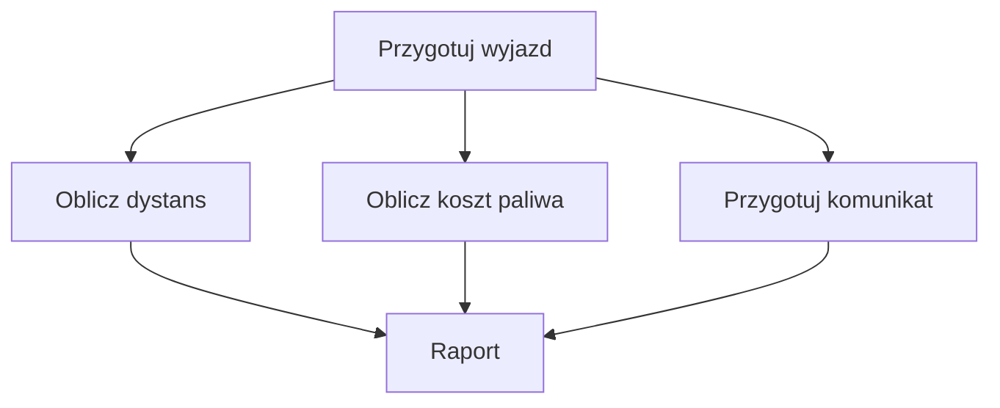

# 1. Metody, funkcje i procedury

## Od podprogramu do metody w C\#

W programach maszynowych i wczesnych językach programowania wielokrotnie wykonywany fragment umieszczano pod nazwą, a sterowanie przekazywano do niego instrukcją skoku. Z czasem pojawiły się pojęcia **podprogramu**, **procedury** i **funkcji**. Funkcja była zwykle kojarzona z obliczaniem i oddawaniem wyniku, a procedura z wykonaniem działania. Współczesne języki często łączą te role.

W C# podstawowym pojęciem jest **metoda**: nazwany blok kodu zdefiniowany w typie, na przykład w klasie lub strukturze. Metoda może przyjmować parametry, zwracać wartość albo mieć typ `void`. W rozmowie dydaktycznej słowa „funkcja” i „procedura” są użyteczne, ale w składni C# piszemy zawsze deklarację metody.

```csharp
static double ObliczKoszt(double cena, int liczbaSztuk)
{
    return cena * liczbaSztuk;
}

double koszt = ObliczKoszt(12.50, 3);
```

W deklaracji widzimy kolejno modyfikator `static`, typ wyniku, nazwę i listę parametrów. Wywołanie dostarcza argumenty. `cena` i `liczbaSztuk` są parametrami, a `12.50` i `3` argumentami konkretnego wywołania.

## Dziel i zwyciężaj w życiu codziennym

Przygotowanie podróży można podzielić na mniejsze zadania: wyznacz trasę, oszacuj koszt paliwa, sprawdź czas i przygotuj podsumowanie. Każde zadanie ma własne wejście i wynik. Dzięki temu nie trzeba rozumieć wszystkich szczegółów naraz, a pojedynczy krok można poprawić bez przepisywania całego planu.



Źródło: [diagram-metoda-dziel-i-zwyciezaj.mmd](diagram-metoda-dziel-i-zwyciezaj.mmd).

W kodzie główna część programu powinna koordynować, a nie wykonywać każdą operację naraz:

```csharp
double dystans = ObliczDystans(kilometryPoczatkowe, kilometryKoncowe);
double koszt = ObliczKosztPaliwa(dystans, spalanie, cenaPaliwa);
WypiszPodsumowanie(dystans, koszt);
```

To nie oznacza, że każdą linijkę trzeba przenosić do osobnej metody. Metoda powinna mieć jedną czytelną odpowiedzialność, a jej nazwa ma ułatwiać odczytanie intencji.

## Dziel i zwyciężaj w kodzie

Projekt [Kod/PlanerPodrozy/Program.cs](Kod/PlanerPodrozy/Program.cs) pokazuje trzy metody: obliczenie dystansu, obliczenie kosztu i prezentację raportu. `Main` składa ich wyniki w jedną historię programu.

```csharp
static double ObliczKosztPaliwa(double dystans, double spalanie, double cena)
{
    double litry = dystans * spalanie / 100;
    return litry * cena;
}
```

Wartość `litry` jest lokalna dla metody. Kod wywołujący nie powinien jej modyfikować, bo nie jest częścią kontraktu metody.

## Zadania

1. Dodaj metodę `ObliczCzas(double dystans, double predkosc)`. Obsłuż prędkość mniejszą lub równą zero.
2. Wydziel metodę, która formatuje koszt do dwóch miejsc po przecinku.
3. Zmień dane wejściowe tak, aby program obsługiwał drogę powrotną jako osobny dystans.

### Rozwiązania i wyjaśnienia

```csharp
static double ObliczCzas(double dystans, double predkosc)
{
    if (predkosc <= 0)
    {
        throw new ArgumentOutOfRangeException(nameof(predkosc));
    }

    return dystans / predkosc;
}
```

Metoda nie wypisuje błędu, ponieważ jej odpowiedzialnością jest obliczenie. O tym, czy wyjątek zostanie przechwycony i pokazany użytkownikowi, może zdecydować warstwa sterująca.

## Laboratorium i debugowanie

```powershell
dotnet build
dotnet run
```

Ustaw punkt przerwania w `ObliczKosztPaliwa` i przejdź do niej przez `F11`. Sprawdź, że wartości `dystans`, `spalanie`, `cena` i `litry` mają sens. Następnie wywołaj metodę dla `0` kilometrów oraz dla prędkości `0` w dodanym zadaniu.

## Źródła

- [Methods - C#](https://learn.microsoft.com/dotnet/csharp/programming-guide/classes-and-structs/methods),
- [Methods in the C# programming guide](https://learn.microsoft.com/dotnet/csharp/programming-guide/classes-and-structs/methods),
- [Program structure](https://learn.microsoft.com/dotnet/csharp/fundamentals/program-structure/).
