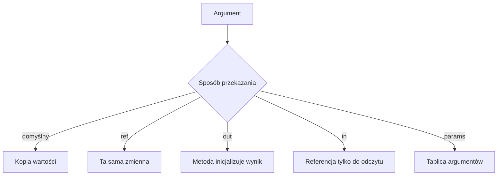

# 2. Przekazywanie parametrów

## Parametr i argument

**Parametr** jest nazwą i typem zapisanym w deklaracji metody. **Argument** jest konkretną wartością podaną podczas wywołania. W C# argumenty są domyślnie przekazywane przez wartość. Oznacza to, że metoda otrzymuje kopię wartości.

```csharp
static void ZwiekszKopie(int liczba)
{
    liczba++;
}

int wynik = 10;
ZwiekszKopie(wynik);
Console.WriteLine(wynik); // 10
```

`liczba` i `wynik` są dwiema zmiennymi. Zmiana kopii nie zmienia oryginału. W przypadku typu wartości, na przykład `int`, jest to intuicyjne. W przypadku typu referencyjnego trzeba rozdzielić dwie kwestie: kopiowana jest referencja, ale obie referencje mogą wskazywać ten sam obiekt.

```csharp
static void ZmienSaldo(Konto konto)
{
    konto.Saldo += 50; // zmiana obiektu jest widoczna u wywołującego
}

static void PodmienKonto(Konto konto)
{
    konto = new Konto(0); // zmiana lokalnej kopii referencji
}
```

Po `ZmienSaldo` wywołujący zobaczy nowe saldo. Po `PodmienKonto` nadal ma poprzedni obiekt. To nadal jest przekazywanie referencji przez wartość, a nie automatyczne przekazywanie zmiennej przez referencję.

## Przekazanie przez zmienną: `ref`

Jeżeli metoda ma zmienić samą zmienną wywołującego, używamy `ref` w deklaracji i przy wywołaniu:

```csharp
static void Zwieksz(ref int liczba)
{
    liczba++;
}

int wynik = 10;
Zwieksz(ref wynik);
// wynik == 11
```

Zmienna przekazywana z `ref` musi być wcześniej zainicjalizowana. `ref` powinno być świadomym elementem kontraktu, bo metoda może zastąpić wartość w miejscu należącym do kodu wywołującego.

## `out`, `in` i `params`

- `out` służy do oddania wartości pomocniczej. Wywołujący nie musi wcześniej inicjalizować zmiennej, ale metoda musi przypisać jej wartość przed zakończeniem.
- `in` przekazuje argument przez referencję tylko do odczytu. Jest użyteczne głównie dla dużych struktur wartościowych; na początku kursu najważniejszy jest zakaz modyfikacji.
- `params` pozwala przekazać zero lub więcej argumentów tego samego typu. Parametr `params` musi być ostatni.



Źródło: [diagram-parametry.mmd](diagram-parametry.mmd).

## Projekt demonstracyjny

Projekt [Kod/Parametry/Program.cs](Kod/Parametry/Program.cs) uruchamia każdy wariant i wypisuje stan przed oraz po wywołaniu. Ustaw punkty przerwania w metodach `ZwiekszKopie`, `Zwieksz` i `PodmienKonto`; obserwuj różnicę między wartością parametru a zmienną w `Main`.

## Zadania

1. Napisz `Zamien(ref int a, ref int b)` i sprawdź, że po wywołaniu zmienne zamieniły wartości.
2. Napisz `SprobujPobracPierwszy(int[] liczby, out int pierwszy)`, zwracając `false` dla pustej tablicy.
3. Napisz metodę `Suma(params int[] liczby)` i wywołaj ją z zerową, jedną oraz czterema liczbami.
4. Wyjaśnij eksperymentem, dlaczego zmiana pola obiektu jest widoczna po przekazaniu przez wartość, ale podmiana parametru nie jest.

### Rozwiązania i wyjaśnienia

```csharp
static void Zamien(ref int a, ref int b)
{
    (a, b) = (b, a);
}

static bool SprobujPobracPierwszy(int[] liczby, out int pierwszy)
{
    if (liczby.Length == 0)
    {
        pierwszy = 0;
        return false;
    }

    pierwszy = liczby[0];
    return true;
}

static int Suma(params int[] liczby)
{
    int suma = 0;
    foreach (int liczba in liczby)
    {
        suma += liczba;
    }

    return suma;
}
```

W `out` dla pustej tablicy również trzeba przypisać wartość, mimo że zwracamy `false`. Dzięki temu każda ścieżka metody spełnia kontrakt kompilatora.

## Laboratorium i debugowanie

```powershell
dotnet build
dotnet run
```

Przetestuj liczby `10`, tablicę pustą oraz obiekt z saldem `100`. W debugerze porównaj adres logiczny obiektu i wartości pól; nie wyciągaj wniosku, że każdy parametr typu `class` jest przekazywany przez referencję.

## Źródła

- [Method parameters and modifiers](https://learn.microsoft.com/dotnet/csharp/language-reference/keywords/method-parameters),
- [Passing value-type parameters](https://learn.microsoft.com/dotnet/csharp/language-reference/keywords/method-parameters#value-type-parameters),
- [Passing reference-type parameters](https://learn.microsoft.com/dotnet/csharp/language-reference/keywords/method-parameters#reference-type-parameters),
- [`params` parameter modifier](https://learn.microsoft.com/dotnet/csharp/language-reference/keywords/method-parameters#params-modifier).
