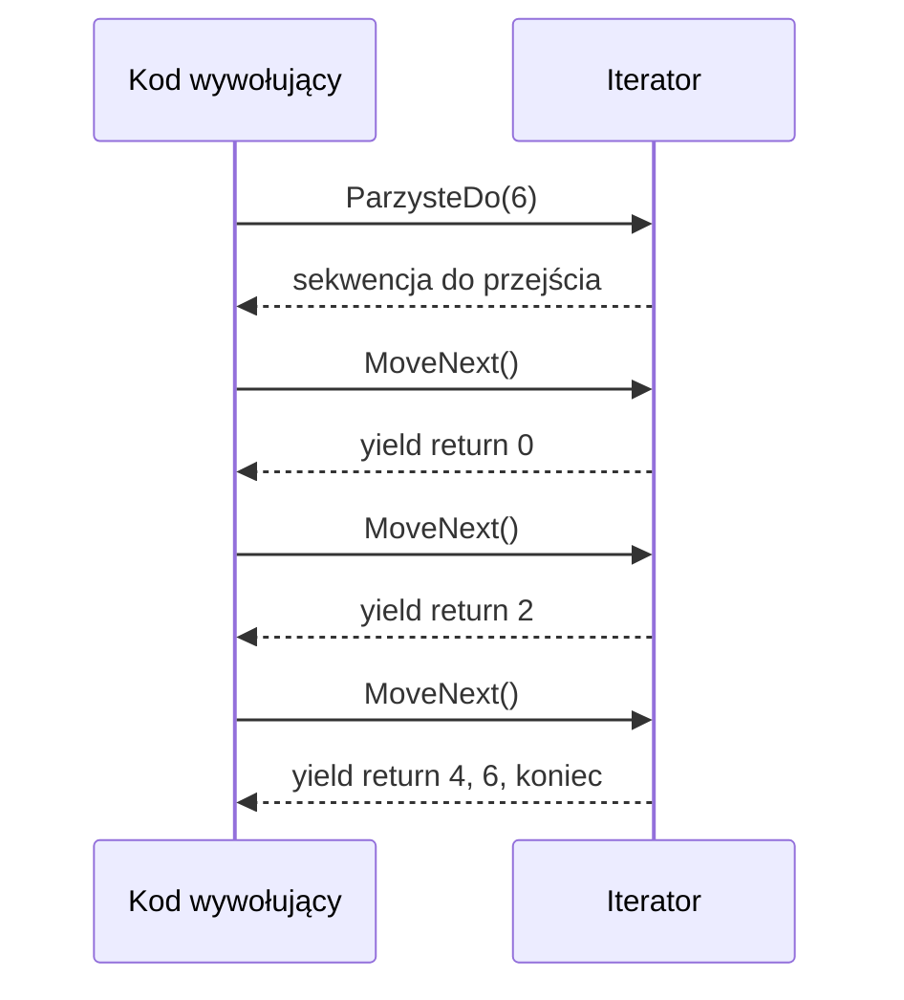

# 3. Zwracanie wartości

## Co znaczy „oddać wartość”?

Wywołanie metody może być wyrażeniem, którego wyniku użyjemy w przypisaniu, obliczeniu, warunku albo kolejnym wywołaniu. Gdy metoda ma typ wyniku różny od `void`, każda ścieżka kończąca jej wykonanie musi dostarczyć wartość zgodną z deklaracją.

```csharp
static int PoleProstokata(int a, int b)
{
    return a * b;
}

int pole = PoleProstokata(4, 5);
Console.WriteLine(PoleProstokata(2, 3) + pole);
```

`return` robi dwie rzeczy: przekazuje wartość do miejsca wywołania oraz kończy bieżące wykonanie metody. W metodzie `void` można użyć samego `return`, aby zakończyć ją wcześniej, ale nie można zwrócić wartości.

## Czy tylko `return`?

Najczęściej wynik zwracamy przez `return`, lecz C# ma kilka mechanizmów przekazywania danych na zewnątrz:

1. zwykły wynik `return`, na przykład `double` albo `string`,
2. krotka wartości, gdy metoda ma oddać kilka logicznie powiązanych wyników,
3. parametr `out`, gdy wynik jest dodatkowo przekazywany do zmiennej wywołującego,
4. iterator z `yield return`, który oddaje kolejne elementy podczas `foreach`,
5. specjalistyczny `ref return`, gdy trzeba oddać referencję do istniejącego miejsca w pamięci.

Krotka często jest czytelniejsza niż kilka parametrów `out`:

```csharp
static (int iloraz, int reszta) Podziel(int a, int b)
{
    return (a / b, a % b);
}

(int iloraz, int reszta) = Podziel(17, 5);
```

## `out` jako wynik pomocniczy

Wzorzec `TryParse` pokazuje połączenie informacji „czy się udało” i wartości wyniku:

```csharp
if (int.TryParse("42", out int liczba))
{
    Console.WriteLine(liczba);
}
```

Metoda z `out` musi przypisać argument przed każdym `return`. Zwykle zwraca `bool`, aby wywołujący nie musiał używać wyjątku dla spodziewanego niepowodzenia.

## `yield return` i iterator

`yield return` nie zwraca całej kolekcji jednorazowo. Tworzy metodę iteratora, która zatrzymuje się po oddaniu elementu i wznawia działanie przy następnym kroku `foreach`.

```csharp
static IEnumerable<int> ParzysteDo(int maksimum)
{
    for (int liczba = 0; liczba <= maksimum; liczba += 2)
    {
        yield return liczba;
    }
}
```

Samo wywołanie `ParzysteDo(6)` nie musi jeszcze wykonać pętli. Wykonanie rozpoczyna się podczas enumeracji. Iterator może użyć `yield break`, aby zakończyć sekwencję wcześniej. Metoda iteratora nie może mieć parametrów `ref` ani `out`.



Źródło: [diagram-zwracanie.mmd](diagram-zwracanie.mmd).

## Projekt demonstracyjny

Projekt [Kod/Zwracanie/Program.cs](Kod/Zwracanie/Program.cs) pokazuje wynik prosty, krotkę, `out` oraz iterator. Komentarze na ekranie pozwalają zauważyć opóźnione wykonanie metody z `yield return`.

## Zadania

1. Napisz `Statystyki(int[] liczby)`, która zwraca krotkę `(int minimum, int maksimum, double srednia)`.
2. Napisz `SprobujOdrocic(int liczba, out int wynik)`, zwracając `false` dla liczb ujemnych.
3. Napisz iterator `DodatnieDoPierwszegoZera(IEnumerable<int> liczby)` z `yield break`.
4. Dodaj do programu przypadek pustej tablicy i wybierz jawny kontrakt: wyjątek albo wartość `bool` plus `out`.

### Rozwiązania i wyjaśnienia

```csharp
static (int minimum, int maksimum, double srednia) Statystyki(int[] liczby)
{
    if (liczby.Length == 0)
    {
        throw new ArgumentException("Tablica nie może być pusta.", nameof(liczby));
    }

    return (liczby.Min(), liczby.Max(), liczby.Average());
}

static IEnumerable<int> DodatnieDoPierwszegoZera(IEnumerable<int> liczby)
{
    foreach (int liczba in liczby)
    {
        if (liczba == 0)
        {
            yield break;
        }

        if (liczba > 0)
        {
            yield return liczba;
        }
    }
}
```

Wybór między krotką a `out` jest decyzją o czytelności kontraktu. Krotka pasuje do zestawu wyników obliczenia, a `bool` plus `out` do operacji, która może się nie udać.

## Laboratorium i debugowanie

```powershell
dotnet build
dotnet run
```

Ustaw punkt przerwania po `yield return` i obserwuj, że kolejne wejście do metody następuje dopiero po następnym `MoveNext` wywołanym przez `foreach`.

## Źródła

- [Return values - Methods](https://learn.microsoft.com/dotnet/csharp/programming-guide/classes-and-structs/methods#return-values),
- [The `return` statement](https://learn.microsoft.com/dotnet/csharp/language-reference/statements/jump-statements#the-return-statement),
- [`yield` statement](https://learn.microsoft.com/dotnet/csharp/language-reference/statements/yield),
- [Tuple types](https://learn.microsoft.com/dotnet/csharp/language-reference/builtin-types/value-tuples).
