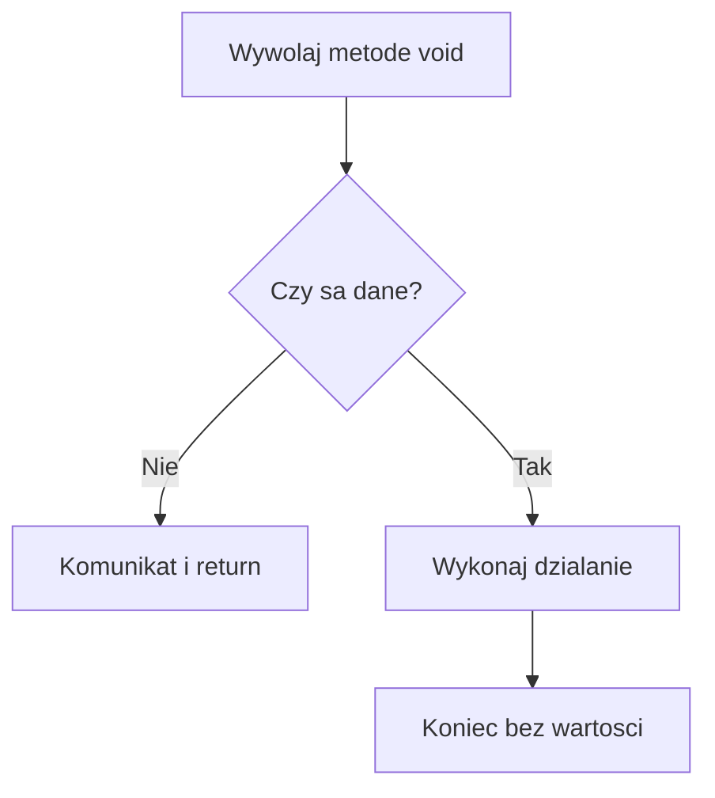

# 4. Metody zwracające `void`

## Znaczenie `void`

`void` jest deklaracją, że metoda nie oddaje wartości do miejsca wywołania. Nie oznacza, że metoda nic nie robi. Taka metoda może wypisywać komunikat, zapisywać dane, zmieniać przekazaną kolekcję, aktualizować obiekt albo zatrzymać działanie przez `return` bez wartości.

```csharp
static void WypiszNaglowek(string tekst)
{
    Console.WriteLine($"=== {tekst} ===");
}

WypiszNaglowek("Raport");
```

Wywołania `void` nie można użyć jako części wyrażenia:

```csharp
// int wynik = WypiszNaglowek("Raport"); // błąd kompilacji
```

## Po co używać `void`?

Metoda `void` jest sensowna, gdy głównym celem jest jawne działanie, a nie obliczenie:

- prezentacja wyniku użytkownikowi,
- zapis do logu lub pliku,
- wysłanie komunikatu,
- zmiana obiektu albo kolekcji przekazanej przez wywołującego,
- obsługa zdarzenia interfejsu.

Dobra granica polega na rozdzieleniu obliczenia od prezentacji. `ObliczSume` może zwrócić `decimal`, a `WypiszSume` może być `void`. Dzięki temu obliczenie można przetestować bez przechwytywania konsoli.

```csharp
static decimal ObliczSume(IEnumerable<decimal> ceny)
{
    return ceny.Sum();
}

static void WypiszSume(decimal suma)
{
    Console.WriteLine($"Suma: {suma:F2} zł");
}
```

## Działanie uboczne i `return`

Metoda `void` może zakończyć się na dwa sposoby: dojść do końca bloku albo wykonać `return;`. Wczesne zakończenie jest przydatne, gdy nie ma danych do wypisania.

```csharp
static void WypiszPierwszy(IReadOnlyList<string> elementy)
{
    if (elementy.Count == 0)
    {
        Console.WriteLine("Brak elementów.");
        return;
    }

    Console.WriteLine(elementy[0]);
}
```

Nie należy używać `void` tylko dlatego, że wynik „na razie nie jest potrzebny”. Jeśli wynik opisuje ważną informację i może być użyty przez inne miejsce, lepszy jest typ zwracany. `void` komunikuje, że kontrakt opiera się na wykonaniu działania.



Źródło: [diagram-void.mmd](diagram-void.mmd).

## Projekt demonstracyjny

Projekt [Kod/ListaZadan/Program.cs](Kod/ListaZadan/Program.cs) rozdziela metody obliczeniowe od `void`, a następnie przekazuje listę przez wartość referencji i modyfikuje jej zawartość. Warto sprawdzić, że metoda nie musi zwracać listy, aby dopisać do istniejącej listy.

## Zadania

1. Dodaj `WyczyscListe(List<string> zadania)`, która usuwa wszystkie elementy i wypisuje liczbę usuniętych pozycji.
2. Wydziel `ObliczLiczbeUkonczonych`, zwracającą `int`, zamiast liczyć elementy w metodzie wypisującej.
3. Dodaj `WypiszJesliNiepusta`, która używa wczesnego `return`.
4. Wyjaśnij, dlaczego `DodajZadanie` może modyfikować listę bez `ref`, ale nie może podmienić listy wywołującego bez `ref`.

### Rozwiązania i wyjaśnienia

```csharp
static int ObliczLiczbeUkonczonych(IEnumerable<bool> statusy)
{
    return statusy.Count(status => status);
}

static void WyczyscListe(List<string> zadania)
{
    int liczbaUsunietych = zadania.Count;
    zadania.Clear();
    Console.WriteLine($"Usunięto: {liczbaUsunietych}");
}
```

Listę modyfikujemy przez skopiowaną referencję do tego samego obiektu. Podmiana parametru na `new List<string>()` zmieniłaby tylko lokalną kopię referencji, tak samo jak w poprzednim temacie.

## Laboratorium i debugowanie

```powershell
dotnet build
dotnet run
```

Ustaw punkt przerwania przed `return`, gdy lista jest pusta, oraz po `Clear`. Obserwuj, że `void` nie ma okna wartości zwracanej, ale stan listy po wywołaniu jest zmieniony.

## Źródła

- [Methods - C#](https://learn.microsoft.com/dotnet/csharp/programming-guide/classes-and-structs/methods),
- [The `return` statement](https://learn.microsoft.com/dotnet/csharp/language-reference/statements/jump-statements#the-return-statement),
- [List&lt;T&gt;.Clear method](https://learn.microsoft.com/dotnet/api/system.collections.generic.list-1.clear).
