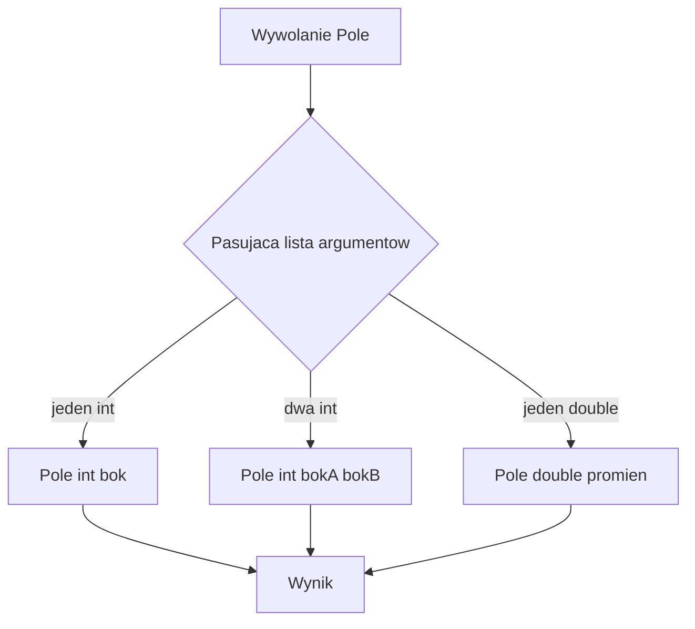

# 5. Przeciążanie metod

## Na czym polega przeciążanie?

**Przeciążanie** pozwala zdefiniować kilka metod o tej samej nazwie, ale z różną listą parametrów. Kompilator wybiera wariant najlepiej pasujący do argumentów wywołania. Dzięki temu jedna operacja może mieć naturalne wywołanie dla kilku kształtów danych.

```csharp
static int Pole(int bok) => bok * bok;
static int Pole(int bokA, int bokB) => bokA * bokB;
static double Pole(double promien) => Math.PI * promien * promien;
```

`Pole(4)` wybiera wariant dla kwadratu, `Pole(4, 5)` wariant dla prostokąta, a `Pole(4.0)` wariant dla koła. Różnica może wynikać z liczby parametrów, typów parametrów albo modyfikatorów przekazywania zgodnie z regułami C#.

## Sygnatura i granice techniki

Typ zwracany nie wystarcza do przeciążenia:

```csharp
// Niepoprawne: nie można przeciążyć tylko typem wyniku.
// static int Oblicz(int x) => x;
// static double Oblicz(int x) => x;
```

Sygnatura metody obejmuje nazwę i listę parametrów, ale nie typ zwracany. Przeciążenia mogą poprawiać czytelność, gdy wszystkie warianty wyrażają tę samą operację. Nie należy używać ich do ukrywania zupełnie różnych działań; wtedy lepsze są różne nazwy.

Warto uważać na niejawną konwersję, parametry opcjonalne i `params`, ponieważ wywołanie może stać się niejednoznaczne. Publiczne API powinno mieć warianty, które użytkownik potrafi rozróżnić bez zgadywania.



Źródło: [diagram-przeciazanie.mmd](diagram-przeciazanie.mmd).

## Kiedy to ma sens?

Przeciążanie jest uzasadnione, gdy:

- wszystkie warianty mają tę samą intencję,
- różnica danych wejściowych jest łatwa do zauważenia,
- wynik i reguły działania pozostają zgodne,
- wywołujący nie musi dodawać sztucznych wartości tylko po to, aby dopasować sygnaturę.

Dla `Sumuj` naturalne są warianty dla dwóch i trzech liczb, ale przy dowolnej liczbie argumentów lepiej użyć `params`. Dla metod o różnych odpowiedzialnościach lepiej użyć nazw `Wczytaj`, `Waliduj` i `Zapisz` zamiast przeciążać jedną nazwę.

## Projekt demonstracyjny

Projekt [Kod/Przeciazanie/Program.cs](Kod/Przeciazanie/Program.cs) pokazuje przeciążenia `Pole`, `Sumuj` i `Formatuj`. W debugerze można wejść do różnych implementacji tej samej nazwy i sprawdzić, którą wybrał kompilator.

## Zadania

1. Dodaj przeciążenie `Odleglosc` dla dwóch punktów `int` oraz dwóch punktów `double`.
2. Zaimplementuj `Maksimum(int a, int b)` i `Maksimum(params int[] liczby)`. Sprawdź, który wariant wywołuje `Maksimum(2, 8)`.
3. Znajdź i wyjaśnij niejednoznaczność w zestawie metod z parametrem opcjonalnym oraz `params`.
4. Zaproponuj nazwę innej metody, gdy dwa przeciążenia wykonują różne działania, a nie tylko tę samą operację dla innych danych.

### Rozwiązania i wyjaśnienia

```csharp
static double Odleglosc(int x1, int y1, int x2, int y2)
{
    int dx = x2 - x1;
    int dy = y2 - y1;
    return Math.Sqrt(dx * dx + dy * dy);
}

static double Odleglosc(double x1, double y1, double x2, double y2)
{
    double dx = x2 - x1;
    double dy = y2 - y1;
    return Math.Sqrt(dx * dx + dy * dy);
}
```

Oba przeciążenia mają tę samą odpowiedzialność, a różnica typów zachowuje informację o dokładności. `Maksimum(2, 8)` wybierze wariant z dwoma parametrami, bo dokładnie pasuje; `params` jest wariantem bardziej ogólnym.

## Laboratorium i debugowanie

```powershell
dotnet build
dotnet run
```

Wywołaj metody z literałami `4` i `4.0`, a następnie ustaw punkt przerwania w każdym przeciążeniu. Sprawdź, dlaczego typ argumentu może zmienić wybraną implementację.

## Źródła

- [Methods - method signatures](https://learn.microsoft.com/dotnet/csharp/programming-guide/classes-and-structs/methods#method-signatures),
- [Method overloading](https://learn.microsoft.com/dotnet/csharp/programming-guide/classes-and-structs/methods#overloading),
- [Overload resolution](https://learn.microsoft.com/dotnet/csharp/language-reference/language-specification/expressions#126-overload-resolution),
- [Named and optional arguments](https://learn.microsoft.com/dotnet/csharp/programming-guide/classes-and-structs/named-and-optional-arguments).
