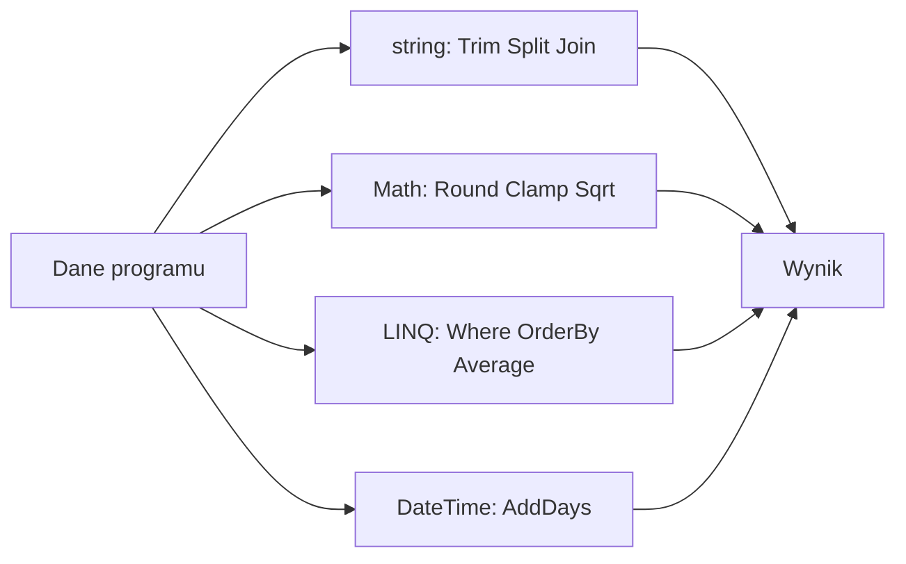

# 6. Metody biblioteczne

## Biblioteka .NET jako gotowy zestaw metod

Biblioteki .NET zawierają sprawdzone metody dla typowych operacji. Zamiast ponownie pisać wyszukiwanie znaku, zaokrąglanie, sortowanie czy filtrowanie, warto najpierw sprawdzić dokumentację typu. Metoda biblioteczna jest nadal zwykłym wywołaniem: ma właściciela, nazwę, parametry, typ wyniku i określony kontrakt.

W C# spotkamy metody:

- **instancyjne**, wywoływane na obiekcie, np. `tekst.ToUpperInvariant()`,
- **statyczne**, wywoływane na typie, np. `Math.Clamp(wartosc, 0, 100)`,
- **rozszerzające**, które wyglądają jak instancyjne, np. `oceny.Average()` dzięki LINQ.

## Cztery codzienne przykłady

### 1. Tekst

```csharp
string opis = "  C# i .NET  ";
string oczyszczony = opis.Trim();
string[] slowa = oczyszczony.Split(' ');
string etykieta = string.Join("/", slowa);
```

`Trim` usuwa białe znaki na początku i końcu, `Split` rozdziela tekst, a `Join` składa elementy z separatorem.

### 2. Liczby

```csharp
double zaokraglona = Math.Round(12.567, 2);
int poziom = Math.Clamp(125, 0, 100);
double pierwiastek = Math.Sqrt(81);
```

`Math.Clamp` ogranicza wartość do przedziału, ale nie informuje, że nastąpiło obcięcie. Gdy ta informacja jest potrzebna, zaprojektuj własną metodę z odpowiednim kontraktem.

### 3. Kolekcje i LINQ

```csharp
int[] oceny = [3, 5, 4, 2, 5];
IEnumerable<int> pozytywne = oceny.Where(ocena => ocena >= 3);
double srednia = pozytywne.Average();
int[] uporzadkowane = oceny.OrderBy(ocena => ocena).ToArray();
```

LINQ pozwala opisać „co” chcemy uzyskać. `Where` i `OrderBy` tworzą sekwencje, a `Average` i `ToArray` wykonują lub materializują obliczenie. Warto pamiętać, że wiele zapytań LINQ jest wykonywanych dopiero podczas enumeracji.

### 4. Data i czas

```csharp
DateTime dzisiaj = DateTime.Today;
DateTime termin = dzisiaj.AddDays(14);
TimeSpan pozostalo = termin - dzisiaj;
```

Metody `AddDays`, `AddHours` i podobne zwracają nową wartość `DateTime`; nie zmieniają istniejącej wartości. To ważny przykład typów wartościowych i niemutowalności.



Źródło: [diagram-metody-biblioteczne.mmd](diagram-metody-biblioteczne.mmd).

## Jak czytać dokumentację?

Przed użyciem sprawdź typ wyniku, parametry, wyjątki, działanie dla `null`, czy metoda zwraca nowy obiekt oraz czy wykonanie jest natychmiastowe. Dokumentacja API jest częścią umiejętności programisty, nie dodatkiem po napisaniu kodu.

## Projekt demonstracyjny

Projekt [Kod/BibliotekaDotNet/Program.cs](Kod/BibliotekaDotNet/Program.cs) uruchamia cztery grupy przykładów i wypisuje wyniki. Każda grupa może być osobno pokazana na wykładzie.

## Zadania

1. Oczyść napis z wielokrotnych spacji i połącz słowa przecinkiem.
2. Dla tablicy cen oblicz minimum, maksimum, średnią i ceny posortowane rosnąco.
3. Oblicz datę oddania projektu siedem dni roboczych po dacie startu. Zdecyduj, jak obsłużyć weekend.
4. Porównaj `Where(...).Average()` z `Average()` na całej tablicy i wyjaśnij różnicę.

### Rozwiązania i wyjaśnienia

```csharp
string[] slowa = "  C#   jest   typowany  "
    .Split(' ', StringSplitOptions.RemoveEmptyEntries);
string wynik = string.Join(", ", slowa);

decimal[] ceny = [12.50m, 4.99m, 17.25m];
decimal minimum = ceny.Min();
decimal maksimum = ceny.Max();
decimal srednia = ceny.Average();
decimal[] rosnaco = ceny.OrderBy(cena => cena).ToArray();
```

Jeśli potrzebujesz użyć wyniku wiele razy, materializuj sekwencję przez `ToArray` lub `ToList`. Dla jednego przejścia nie zawsze jest to konieczne. W zadaniu z dniami roboczymi trzeba jawnie ominąć sobotę i niedzielę, ponieważ `AddDays(7)` liczy również weekend.

## Laboratorium i debugowanie

```powershell
dotnet build
dotnet run
```

W debugerze zatrzymaj się przed `Average`, po `Where` i po `ToArray`. Sprawdź, które wyrażenie jest tylko opisem sekwencji, a które wymusza wykonanie zapytania.

## Źródła

- [Base class library overview](https://learn.microsoft.com/dotnet/standard/base-types/),
- [System.String methods](https://learn.microsoft.com/dotnet/api/system.string),
- [System.Math methods](https://learn.microsoft.com/dotnet/api/system.math),
- [LINQ overview](https://learn.microsoft.com/dotnet/csharp/linq/),
- [Date and time types](https://learn.microsoft.com/dotnet/standard/datetime/).
