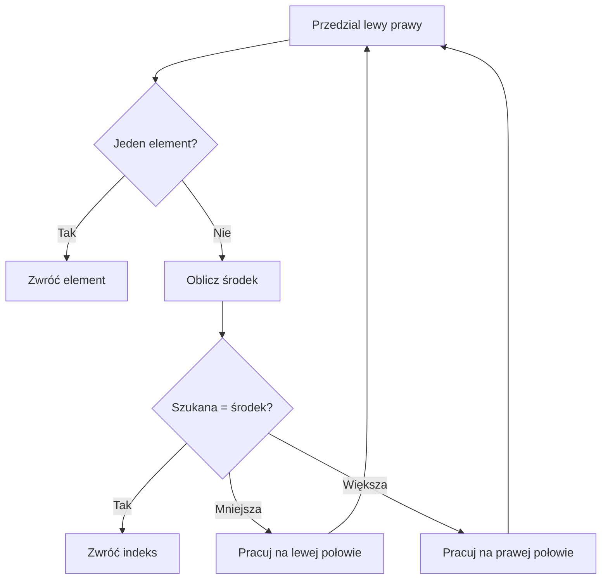

# 7. Definiowanie metod i dziel i zwyciężaj

## Od procedury głównej do współpracujących metod

Metodę definiujemy, gdy fragment programu ma nazwę, własną odpowiedzialność i może być wywołany z kilku miejsc. Projektowanie zaczynamy od kontraktu:

1. co metoda otrzymuje,
2. co oblicza lub zmienia,
3. jaki wynik oddaje,
4. jakie dane odrzuca albo jakie wyjątki zgłasza.

Przykładowy program analizujący oceny można podzielić na `WczytajOceny`, `ObliczSrednia`, `ZnajdzNajlepsza` i `WypiszRaport`. Każda metoda jest prostsza niż cała aplikacja, a `Main` opisuje przepływ danych.

## Trzy sposoby dzielenia problemu

### 1. Dekompozycja funkcjonalna

Problem „oblicz koszt wyjazdu” dzielimy na dystans, litry, koszt oraz prezentację. Podproblemy są różnymi odpowiedzialnościami, ale nie muszą być rekurencyjne.

### 2. Rekurencyjne dzielenie przedziału

Sumę elementów przedziału można podzielić na lewą i prawą połowę:

```csharp
static int SumaPrzedzialu(int[] liczby, int lewy, int prawy)
{
    if (lewy == prawy)
    {
        return liczby[lewy];
    }

    int srodek = (lewy + prawy) / 2;
    return SumaPrzedzialu(liczby, lewy, srodek)
        + SumaPrzedzialu(liczby, srodek + 1, prawy);
}
```

Każde wywołanie zmniejsza przedział. Warunek bazowy zatrzymuje rekurencję. Koszt jest liniowy, bo każdy element trafia do jednego liścia, choć istnieje narzut stosu wywołań.

### 3. Wyszukiwanie binarne

Jeżeli tablica jest posortowana, możemy sprawdzić środek i odrzucić połowę danych. Metoda musi przekazywać granice przedziału i wyraźnie obsługiwać brak wyniku.



Źródło: [diagram-dziel-i-zwyciezaj.mmd](diagram-dziel-i-zwyciezaj.mmd).

## Projekt demonstracyjny

Projekt [Kod/AlgorytmyMetod/Program.cs](Kod/AlgorytmyMetod/Program.cs) pokazuje trzy metody: rekurencyjną sumę przedziału, rekurencyjne wyszukiwanie binarne i algorytm Euklidesa. Wspólnym motywem jest mały kontrakt i postęp do warunku zakończenia.

## Zadania

1. Napisz rekurencyjne `Potega(int podstawa, int wykladnik)` dla nieujemnego wykładnika.
2. Dodaj iteracyjną wersję wyszukiwania binarnego i porównaj liczbę wywołań lub iteracji.
3. Napisz `MinMax(int[] liczby, out int minimum, out int maksimum)`, dzieląc tablicę na połowy.
4. Dodaj testy dla pustego przedziału, jednego elementu, duplikatów i nieobecnej wartości.

### Rozwiązania i wyjaśnienia

```csharp
static int Potega(int podstawa, int wykladnik)
{
    if (wykladnik < 0)
    {
        throw new ArgumentOutOfRangeException(nameof(wykladnik));
    }

    if (wykladnik == 0)
    {
        return 1;
    }

    return podstawa * Potega(podstawa, wykladnik - 1);
}
```

Warunek bazowy `wykladnik == 0` jest konieczny. Bez niego rekurencja nie zmniejszałaby problemu i zakończyłaby się przepełnieniem stosu. W praktycznym kodzie dla dużych wykładników warto użyć szybszego potęgowania przez podnoszenie do kwadratu.

## Laboratorium i debugowanie

```powershell
dotnet build
dotnet run
```

Dla `SumaPrzedzialu` ustaw punkt przerwania na obliczeniu środka i obserwuj `lewy`, `prawy`, `srodek` oraz Call Stack. Dla wyszukiwania binarnego sprawdź niezmiennik: jeśli wartość istnieje, zawsze pozostaje w aktualnym przedziale.

## Źródła

- [Methods - C#](https://learn.microsoft.com/dotnet/csharp/programming-guide/classes-and-structs/methods),
- [Recursion](https://en.wikipedia.org/wiki/Recursion),
- [Divide-and-conquer algorithm](https://en.wikipedia.org/wiki/Divide-and-conquer_algorithm),
- [Binary search algorithm](https://learn.microsoft.com/dotnet/api/system.array.binarysearch).
