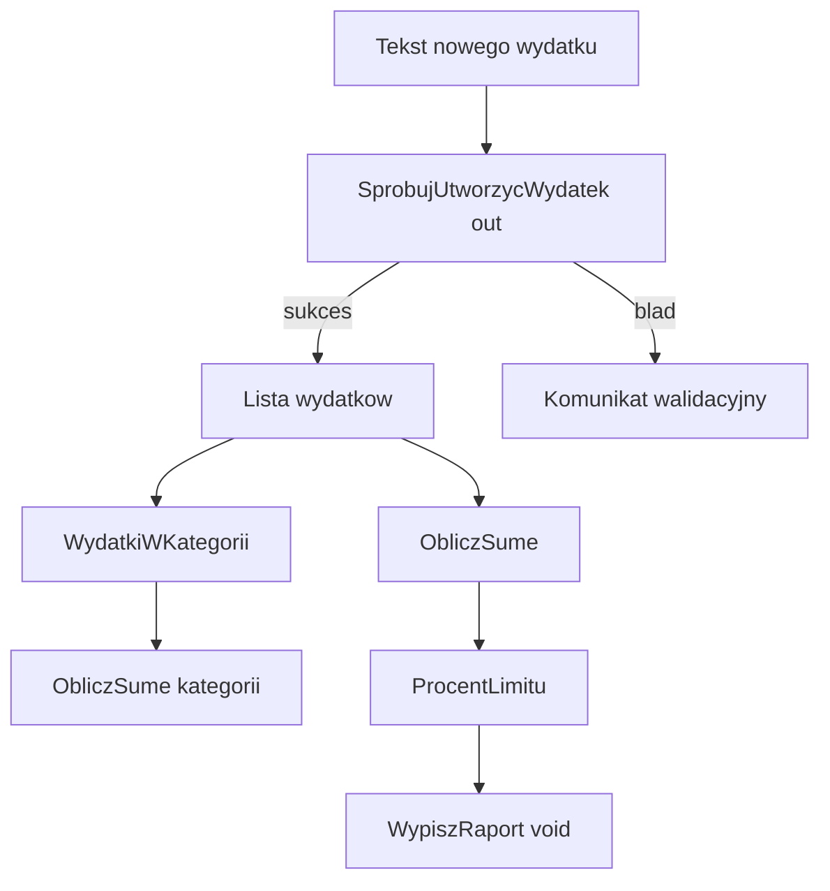

# 8. Aplikacje wykorzystujące metody

## Od problemu do projektu

Metody mają największą wartość wtedy, gdy pomagają zbudować większy program. Przed kodowaniem warto wypisać dane, operacje i wynik, a następnie zaproponować metody o małych kontraktach. `Main` powinien przede wszystkim koordynować kolejność działań.

## Propozycje problemów na wykład i laboratorium

### 1. Analizator budżetu domowego

**Dane:** lista wydatków z opisem, kategorią i kwotą oraz miesięczny limit. **Metody:** suma, suma kategorii, filtr z `yield return`, procent limitu, raport `void`, walidacja nowego wydatku przez `out`. To jest kompletnie rozwiązany przykład w projekcie [Kod/AnalizatorBudzetu/Program.cs](Kod/AnalizatorBudzetu/Program.cs).

### 2. Raport ocen grupy

**Dane:** tablica ocen i nazwiska. Wydziel `CzyPoprawnaOcena`, `ObliczSrednia`, `PoliczZaliczonych`, `ZnajdzNajlepszego` i `WypiszRanking`. Zacznij od czystych metod obliczeniowych, a dopiero później dodaj wczytywanie danych.

### 3. Magazyn małego sklepu

**Dane:** produkty, ceny i stany magazynowe. Zdefiniuj `ZnajdzProdukt`, `ZmienStan`, `ObliczWartoscMagazynu` oraz `WypiszNiskiStan`. Przypadki brzegowe to brak produktu, stan ujemny i pusty magazyn.

### 4. Analizator tekstu

**Dane:** akapit tekstu. Zastosuj metody biblioteczne `Split`, `Trim`, `ToLowerInvariant` i LINQ, a własne metody `PoliczSlowa`, `NajczestszeSlowo`, `WypiszStatystyki`. Oddziel normalizację tekstu od prezentacji.

## Kompletny przykład: analizator budżetu

Program przechowuje dane w rekordzie `Wydatek`, a następnie stosuje różne rodzaje metod:

| Metoda | Rodzaj | Odpowiedzialność |
| --- | --- | --- |
| `ObliczSume` | wynik `decimal`, przeciążenia | suma wszystkich lub wybranej kategorii |
| `WydatkiWKategorii` | iterator | leniwe filtrowanie przez `yield return` |
| `SprobujUtworzycWydatek` | `bool` + `out` | walidacja tekstu i utworzenie rekordu |
| `ProcentLimitu` | wynik `decimal` | obliczenie udziału w limicie |
| `WypiszRaport` | `void` | prezentacja danych na konsoli |

Przepływ programu jest następujący:



Źródło: [diagram-aplikacja-z-metodami.mmd](diagram-aplikacja-z-metodami.mmd).

### Kontrakt krok po kroku

1. `Wydatek` opisuje jeden rekord i nie miesza danych z prezentacją.
2. `ObliczSume` przyjmuje `IEnumerable<Wydatek>`, więc może pracować z listą i sekwencją zwróconą przez iterator.
3. `WydatkiWKategorii` używa `yield return`, dlatego nie musi budować osobnej listy.
4. `SprobujUtworzycWydatek` zwraca `false` dla niepoprawnego tekstu i oddaje gotowy rekord przez `out`.
5. `WypiszRaport` jest `void`, bo jego kontraktem jest efekt na konsoli.

Kod nie pobiera danych z konsoli, aby demonstracja była powtarzalna podczas wykładu i debugowania. Na laboratorium można zamienić listę stałą na wczytywanie z pliku lub konsoli bez zmiany metod obliczeniowych.

## Zadania do samodzielnego wykonania

1. Dodaj kategorię „Zdrowie” i wyświetl jej sumę.
2. Dodaj metodę `NajwiekszyWydatek`, która zwraca `Wydatek` albo `null`, gdy lista jest pusta.
3. Dodaj ostrzeżenie, gdy procent limitu przekroczy `90`, oraz osobny komunikat po przekroczeniu `100`.
4. Rozszerz walidację o zakaz pustej kategorii i zakaz kwoty większej od `100000`.
5. Zapisz raport do pliku tekstowego, wydzielając `ZbudujRaport` zwracającą `string` od `ZapiszRaport` zwracającej `void`.
6. Przygotuj testy dla pustej listy, jednego wydatku, równych kwot, limitu `0` i niepoprawnej kwoty.

### Rozwiązania i wyjaśnienia

```csharp
static Wydatek? NajwiekszyWydatek(IEnumerable<Wydatek> wydatki)
{
    return wydatki.OrderByDescending(wydatek => wydatek.Kwota).FirstOrDefault();
}

static string ZbudujRaport(IEnumerable<Wydatek> wydatki)
{
    return string.Join(Environment.NewLine,
        wydatki.Select(wydatek => $"{wydatek.Kategoria}: {wydatek.Kwota:F2} zł"));
}

static void ZapiszRaport(string sciezka, string raport)
{
    File.WriteAllText(sciezka, raport);
}
```

Dla rekordów referencyjnych `FirstOrDefault` może zwrócić `null`, dlatego typ wyniku powinien to wyrażać przez `Wydatek?`. Przy limicie równym zero nie wolno dzielić przez zero; kod demonstracyjny zwraca `0` procent, a laboratorium może przyjąć inną, jawnie opisaną regułę.

## Laboratorium i debugowanie

```powershell
dotnet build
dotnet run
```

W Visual Studio Code ustaw punkty przerwania w `SprobujUtworzycWydatek`, `WydatkiWKategorii` oraz `WypiszRaport`. Przejdź przez `foreach` krokami i obserwuj, kiedy iterator wznowi wykonanie. W Call Stack zobacz różnicę między `Main`, metodą raportu i metodami obliczeniowymi.

Kolejność pracy studenta:

1. uruchom gotowy przykład i zapisz wynik,
2. dodaj jedno zadanie bez zmieniania istniejących kontraktów,
3. zbuduj projekt i popraw błędy kompilatora,
4. sprawdź przypadek typowy i brzegowy,
5. wprowadź kontrolowany błąd w procencie limitu i znajdź go debugerem,
6. opisz, która metoda powinna zostać zmieniona, gdy zmienia się wymaganie.

## Źródła

- [Methods - C#](https://learn.microsoft.com/dotnet/csharp/programming-guide/classes-and-structs/methods),
- [Method parameters and modifiers](https://learn.microsoft.com/dotnet/csharp/language-reference/keywords/method-parameters),
- [`yield` statement](https://learn.microsoft.com/dotnet/csharp/language-reference/statements/yield),
- [Records - C#](https://learn.microsoft.com/dotnet/csharp/language-reference/builtin-types/record),
- [File.WriteAllText](https://learn.microsoft.com/dotnet/api/system.io.file.writealltext).
