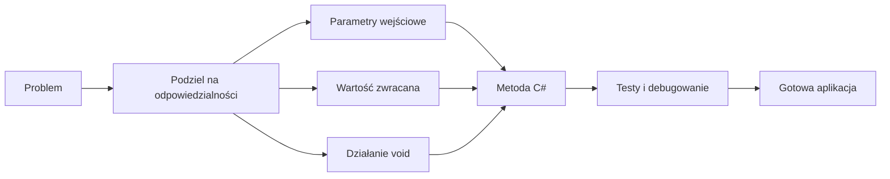

# 06. Funkcje i metody

Moduł wprowadza studentów w projektowanie metod w C#. Pokazuje, jak podzielić problem na mniejsze odpowiedzialności, jak dane przepływają przez parametry i wartości zwracane oraz kiedy metoda wykonuje działanie bez oddawania wyniku. Wszystkie przykłady są zapisane w C# i przygotowane jako niezależne aplikacje konsolowe `net9.0`.

## Mapa tematów

1. [Metody, funkcje i procedury](01-metody-funkcje-procedury/README.md) - historia pojęć, anatomia metody i idea dziel i zwyciężaj.
2. [Przekazywanie parametrów](02-przekazywanie-parametrow/README.md) - przekazywanie przez wartość, `ref`, `out`, `in` oraz typy referencyjne.
3. [Zwracanie wartości](03-zwracanie-wartosci/README.md) - `return`, wyniki złożone, `out` i leniwe `yield return`.
4. [Metody zwracające `void`](04-metody-void/README.md) - działania uboczne, komunikaty, modyfikowanie danych i wcześniejsze `return`.
5. [Przeciążanie metod](05-przeciazanie-metod/README.md) - dobór przeciążenia, sygnatura i sensowne warianty tego samego działania.
6. [Metody biblioteczne](06-metody-biblioteczne/README.md) - codzienne użycie metod .NET dla tekstu, liczb, kolekcji i czasu.
7. [Definiowanie metod i dziel i zwyciężaj](07-dziel-i-zwyciezaj/README.md) - rozkładanie problemu na kroki i łączenie wyników pomocniczych.
8. [Aplikacje wykorzystujące metody](08-aplikacje-z-metodami/README.md) - propozycje problemów, kompletny analizator budżetu i laboratorium projektowe.



Źródło: [diagram-mapa-funkcje.mmd](diagram-mapa-funkcje.mmd).

## Cele modułu

Po zakończeniu modułu student potrafi:

- zdefiniować metodę z właściwą nazwą, parametrami i typem wyniku,
- odróżnić parametr od argumentu oraz przekazywanie przez wartość od `ref`,
- użyć `out` do zwrócenia dodatkowego wyniku, a `yield return` do budowania iteratora,
- wyjaśnić, dlaczego `void` opisuje brak wartości zwracanej, ale nie brak działania,
- zaprojektować przeciążenia bez ukrywania niejasności w interfejsie,
- korzystać z metod bibliotecznych zamiast ponownie implementować typowe operacje,
- rozłożyć program na metody zgodnie z zasadą jednej odpowiedzialności,
- skompilować, uruchomić, przetestować i debugować aplikację złożoną z metod.

## Proponowany wykład

1. Zacznij od codziennego przepisu: wejście, kroki i rezultat są naturalnym modelem metody.
2. Pokaż, że nazwa metody i parametry tworzą mały kontrakt między wywołującym a metodą.
3. Na jednym przykładzie porównaj kopię wartości, referencję do obiektu i `ref`.
4. Prześledź `return`, `out` i `yield return`, zwracając uwagę na moment wykonania kodu.
5. Zestaw metodę zwracającą wynik z metodą `void`, która wykonuje obserwowalne działanie.
6. Pokaż przeciążanie na przykładzie formatowania lub obliczania pola, a następnie omów granice tej techniki.
7. Zakończ aplikacją, w której `Main` tylko koordynuje wywołania mniejszych metod.

## Proponowane laboratorium

Laboratorium można przeprowadzić w dwóch częściach:

- **Część 1:** ćwiczenia 1-5: deklaracje metod, parametry, wyniki, `void` i przeciążanie.
- **Część 2:** ćwiczenia 6-8: metody .NET, dziel i zwyciężaj oraz aplikacja końcowa.

Przed napisaniem metody student powinien zapisać: jej odpowiedzialność, dane wejściowe, wynik lub działanie uboczne, przypadki brzegowe oraz przykładowe wywołanie.

## Wspólna instrukcja uruchamiania

W katalogu konkretnego projektu `Kod/<NazwaProjektu>`:

```powershell
dotnet build
dotnet run
```

Można również uruchomić projekt z katalogu repozytorium:

```powershell
dotnet run --project src/06-funkcje/08-aplikacje-z-metodami/Kod/AnalizatorBudzetu/AnalizatorBudzetu.csproj
```

W Visual Studio Code otwórz katalog z plikiem `.csproj`, ustaw punkt przerwania i użyj `F5`. `F11` pozwala wejść do wywoływanej metody, `F10` wykonać ją bez wchodzenia do środka, a panel Call Stack pokazuje zagnieżdżenie wywołań. W terminalu `dotnet build` wykrywa błędy typów, brakujące `return` i niezgodne argumenty.

## Zasady testowania metod

Każda metoda powinna mieć test dla:

- typowych danych,
- najmniejszego poprawnego wejścia,
- wartości granicznej lub pustego zbioru,
- danych niepoprawnych, jeżeli kontrakt je dopuszcza,
- kilku wywołań następujących po sobie, gdy metoda zmienia stan.

Warto rozdzielić obliczenia od `Console.WriteLine`. Metoda obliczeniowa jest wtedy łatwiejsza do sprawdzenia, a metoda `void` może odpowiadać wyłącznie za prezentację lub zmianę jawnie przekazanego stanu.

## Zadania przekrojowe z rozwiązaniami

1. Napisz `CzyPelnoletni(int wiek)`, która zwraca `true` dla wieku co najmniej 18. Rozwiązanie powinno użyć typu `bool` i nie wypisywać tekstu z metody.
2. Napisz `Podziel(int a, int b, out int iloraz, out int reszta)`. Zabezpiecz dzielenie przez zero przez zwrócenie `false` albo zgłoszenie wyjątku zgodnie z opisanym kontraktem.
3. Napisz `IEnumerable<int> NieparzysteDo(int maksimum)` z `yield return`. Dla wartości ujemnej iterator powinien zakończyć się bez elementów.
4. Zaimplementuj dwa przeciążenia `Maksimum`: dla dwóch liczb oraz dla tablicy liczb. Zdecyduj, co ma się stać dla pustej tablicy.

Minimalne rozwiązania:

```csharp
static bool CzyPelnoletni(int wiek) => wiek >= 18;

static bool Podziel(int a, int b, out int iloraz, out int reszta)
{
    if (b == 0)
    {
        iloraz = 0;
        reszta = 0;
        return false;
    }

    iloraz = a / b;
    reszta = a % b;
    return true;
}

static IEnumerable<int> NieparzysteDo(int maksimum)
{
    for (int liczba = 1; liczba <= maksimum; liczba += 2)
    {
        yield return liczba;
    }
}
```

W zadaniu 2 `out` pozwala oddać dwa wyniki obok wartości `bool`, a w zadaniu 3 metoda nie tworzy całej tablicy z góry. Dla pustej tablicy w zadaniu 4 można użyć `InvalidOperationException`; nie wolno po cichu zwracać `0`, bo `0` może być poprawnym maksimum.

## Literatura i źródła

- [Methods - C#](https://learn.microsoft.com/dotnet/csharp/programming-guide/classes-and-structs/methods),
- [Method parameters and modifiers](https://learn.microsoft.com/dotnet/csharp/language-reference/keywords/method-parameters),
- [The `return` statement](https://learn.microsoft.com/dotnet/csharp/language-reference/statements/jump-statements#the-return-statement),
- [`yield` statement](https://learn.microsoft.com/dotnet/csharp/language-reference/statements/yield),
- [Method overloading](https://learn.microsoft.com/dotnet/csharp/programming-guide/classes-and-structs/methods#method-signatures),
- [Base class library overview](https://learn.microsoft.com/dotnet/standard/base-types/),
- [Wzorzec numerowanych katalogów kursu Java](https://github.com/tborzyszkowski/oop-concepts-java/tree/main/02_OOP/src).

Linki do dokumentacji Microsoft Learn i repozytorium wzorcowego zostały sprawdzone podczas przygotowywania modułu 27 września 2026 r.
