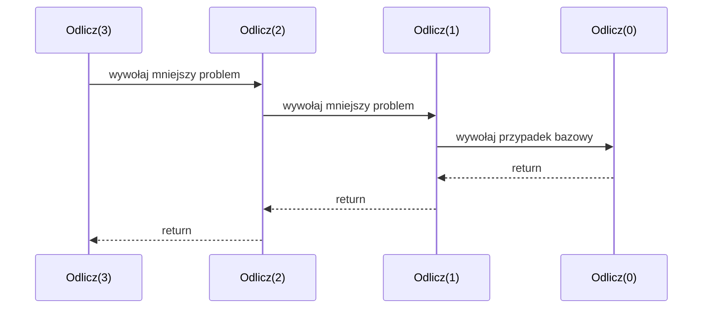

# 1. Intuicja i definicja rekurencji

## Intuicja

Rekurencja występuje wtedy, gdy rozwiązanie problemu korzysta z rozwiązania mniejszego problemu tego samego rodzaju. Można wyobrazić sobie stos pudełek: aby otworzyć duże pudełko, otwieramy mniejsze, a w najmniejszym znamy odpowiedź bez dalszego otwierania. Po znalezieniu przypadku bazowego wracamy przez wszystkie wcześniejsze warstwy.

W programie rekurencja oznacza, że metoda wywołuje samą siebie. Samo wywołanie siebie nie wystarcza. Poprawna metoda musi mieć:

1. **przypadek bazowy** - sytuację rozwiązaną bez kolejnego wywołania,
2. **krok rekurencyjny** - wywołanie dla mniejszego lub prostszego problemu,
3. **postęp** - każde wywołanie musi przybliżać program do przypadku bazowego.

```csharp
static void Odlicz(int liczba)
{
    if (liczba == 0)
    {
        Console.WriteLine("Start");
        return;
    }

    Console.WriteLine(liczba);
    Odlicz(liczba - 1);
}
```

Dla `Odlicz(3)` metoda wywoła `Odlicz(2)`, potem `Odlicz(1)`, potem `Odlicz(0)`. Gdy `Odlicz(0)` zakończy się przez `return`, wywołania wracają w odwrotnej kolejności.



Źródło: [diagram-stos-rekurencji.mmd](diagram-stos-rekurencji.mmd).

## Definicja

Formalnie metoda rekurencyjna definiuje rozwiązanie przez:

```text
wynik(problem) = rozwiązanie bezpośrednie, gdy problem jest najmniejszy
wynik(problem) = połączenie wyniku(mniejszy problem), gdy problem jest większy
```

Przykład silni:

$$
n! = \begin{cases}
1 & \text{dla } n = 0,\\
n \cdot (n-1)! & \text{dla } n > 0.
\end{cases}
$$

W C#:

```csharp
static long Silnia(int n)
{
    if (n < 0)
    {
        throw new ArgumentOutOfRangeException(nameof(n));
    }

    if (n == 0)
    {
        return 1;
    }

    return n * Silnia(n - 1);
}
```

Dla `Silnia(4)` stos zapamiętuje `4 *`, `3 *`, `2 *`, `1 *`, a następnie zwija obliczenie: `1`, `2`, `6`, `24`. To jest kluczowa różnica względem pętli: oprócz zmiennej `n` istnieją zawieszone ramki wywołań.

## Projekt demonstracyjny

Projekt [Kod/Intuicja/Program.cs](Kod/Intuicja/Program.cs) uruchamia odliczanie, silnię oraz sumę elementów tablicy. Każda metoda ma jawny przypadek bazowy.

## Zadania

1. Napisz `OdliczWstecz(int n)`, która wypisuje liczby od `n` do `0`.
2. Napisz `SumaDo(int n)` dla `n >= 0`.
3. Napisz rekurencyjne `Potega(int podstawa, int wykladnik)` dla nieujemnego wykładnika.
4. Dodaj komunikaty „wejście” i „powrót” do `Silnia`, aby zobaczyć kolejność zdarzeń.

### Rozwiązania i wyjaśnienia

```csharp
static int SumaDo(int n)
{
    if (n < 0)
    {
        throw new ArgumentOutOfRangeException(nameof(n));
    }

    return n == 0 ? 0 : n + SumaDo(n - 1);
}

static int Potega(int podstawa, int wykladnik)
{
    if (wykladnik < 0)
    {
        throw new ArgumentOutOfRangeException(nameof(wykladnik));
    }

    return wykladnik == 0
        ? 1
        : podstawa * Potega(podstawa, wykladnik - 1);
}
```

Dla obu metod argument zmniejsza się o `1`, więc po skończonej liczbie kroków osiąga `0`. Sam warunek `if` nie jest ozdobą: bez niego metoda wywoływałaby siebie bez końca.

## Laboratorium i debugowanie

```powershell
dotnet build
dotnet run
```

Uruchom program dla `0`, `1` i `4`. Ustaw punkt przerwania w warunku bazowym i obserwuj **Call Stack**. Wykonaj kilka kroków `F11`, a potem wracaj instrukcją `F10`.

## Źródła

- [Methods - C#](https://learn.microsoft.com/dotnet/csharp/programming-guide/classes-and-structs/methods),
- [Recursion](https://en.wikipedia.org/wiki/Recursion),
- [Return statement](https://learn.microsoft.com/dotnet/csharp/language-reference/statements/jump-statements#the-return-statement).
