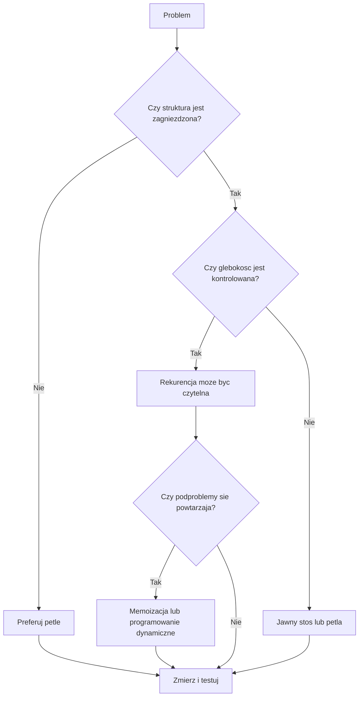

# 2. Zalety, wady i wybór iteracji

## Rekurencja nie jest automatycznie lepsza

Rekurencja jest sposobem organizowania rozwiązania, a nie gwarancją szybkości. Wersja rekurencyjna bywa najbardziej czytelna, gdy dane mają strukturę zagnieżdżoną: drzewo katalogów, wyrażenie matematyczne, węzły drzewa lub problem dziel i zwyciężaj. Wersja iteracyjna często wygrywa, gdy problem jest liniowy, a liczba kroków może być duża.

### Zalety

- kod dobrze odwzorowuje definicję matematyczną,
- naturalnie obsługuje drzewa, grafy i zagnieżdżone struktury,
- ułatwia opis algorytmów dziel i zwyciężaj,
- często upraszcza prototyp i dowód poprawności przez indukcję.

### Wady

- każde wywołanie zajmuje ramkę na stosie wywołań,
- zbyt głęboka rekurencja może zakończyć się `StackOverflowException`,
- powtarzane podproblemy mogą dać wykładniczy czas działania,
- debugowanie i śledzenie wielu ramek jest trudniejsze,
- wywołanie metody ma narzut większy niż pojedynczy krok pętli,
- C# i środowisko .NET nie dają kontraktu, na którym można polegać, że rekurencja ogonowa zostanie zoptymalizowana.

## Prototyp a kod produkcyjny

W prototypie warto wybrać rekurencję, gdy skraca opis i pomaga szybko sprawdzić pomysł. Przed wdrożeniem sprawdź jednak rozmiar danych, maksymalną głębokość, koszt pamięci, powtarzanie obliczeń i możliwość obsługi błędnych danych.

Do kodu produkcyjnego wybierz rekurencję, gdy:

- wejście ma naturalną strukturę rekurencyjną,
- maksymalna głębokość jest znana albo kontrolowana,
- kod jest prostszy i przetestowany,
- koszt stosu jest akceptowalny,
- istnieją testy dla danych pustych, głębokich i dużych.

Wybierz pętlę lub jawny stos, gdy:

- problem jest liniowy,
- głębokość zależy od danych użytkownika,
- wymagane są bardzo duże wejścia,
- krytyczna jest przewidywalna pamięć,
- każda operacja ma znaczenie wydajnościowe.



Źródło: [diagram-decyzja-rekurencja.mmd](diagram-decyzja-rekurencja.mmd).

## Jak radzić sobie z problemami?

1. **Przepełnienie stosu:** zamień rekurencję na pętlę albo jawny `Stack<T>`; ogranicz głębokość i waliduj wejście.
2. **Powtarzane obliczenia:** użyj słownika memoizacji, tablicy wyników albo wersji iteracyjnej od najmniejszego podproblemu.
3. **Nieczytelny debug:** dodaj parametr `glebokosc` tylko w wersji demonstracyjnej, loguj wejście i wynik, obserwuj Call Stack.
4. **Błąd braku postępu:** zapisuj niezmiennik i sprawdzaj, czy argument w kolejnym wywołaniu jest bliżej przypadku bazowego.
5. **Nieprzewidywalny koszt:** zmierz liczbę wywołań, czas i pamięć dla rosnącego wejścia.

## Projekt demonstracyjny

Projekt [Kod/Porownanie/Program.cs](Kod/Porownanie/Program.cs) porównuje silnię rekurencyjną i iteracyjną oraz trzy wersje Fibonacciego: naiwną, z memoizacją i iteracyjną. Naiwną wersję uruchamiamy tylko dla małych argumentów.

```csharp
static long FibonacciIteracyjnie(int n)
{
    long poprzedni = 0;
    long nastepny = 1;

    for (int indeks = 0; indeks < n; indeks++)
    {
        (poprzedni, nastepny) = (nastepny, poprzedni + nastepny);
    }

    return poprzedni;
}
```

## Zadania

1. Zmierz liczbę wywołań naiwnych `Fibonacci(35)` i porównaj ją z memoizacją.
2. Zastąp rekurencyjną silnię pętlą i dodaj ochronę przed przepełnieniem `long`.
3. Napisz rekurencyjne przejście po tablicy, a następnie wersję z `Stack<int>`.
4. Wyjaśnij, dlaczego brak warunku bazowego nie jest „wolną” wersją algorytmu, tylko błędem zakończonym przepełnieniem stosu.

### Rozwiązania i wyjaśnienia

Memoizacja przechowuje wyniki już policzonych podproblemów:

```csharp
static long FibonacciMemo(int n, Dictionary<int, long> pamiec)
{
    if (n <= 1)
    {
        return n;
    }

    if (pamiec.TryGetValue(n, out long zapamietany))
    {
        return zapamietany;
    }

    long wynik = FibonacciMemo(n - 1, pamiec)
        + FibonacciMemo(n - 2, pamiec);
    pamiec[n] = wynik;
    return wynik;
}
```

Wersja naiwna ma wykładniczo wiele wywołań, ponieważ wielokrotnie liczy te same wartości. Memoizacja zmniejsza liczbę podproblemów do około `n`, ale nadal używa stosu o głębokości `n`. Wersja iteracyjna ogranicza również ryzyko przepełnienia stosu.

## Laboratorium i debugowanie

```powershell
dotnet build
dotnet run
```

Uruchom program dla małych wartości, ustaw punkt przerwania w obu wersjach silni i porównaj **Call Stack**. Nie uruchamiaj naiwnego Fibonacciego dla dużego `n` bez ograniczenia eksperymentu.

## Źródła

- [Methods and recursion - C#](https://learn.microsoft.com/dotnet/csharp/programming-guide/classes-and-structs/methods),
- [`Stack<T>`](https://learn.microsoft.com/dotnet/api/system.collections.generic.stack-1),
- [Memoization](https://en.wikipedia.org/wiki/Memoization),
- [Stack overflow](https://learn.microsoft.com/dotnet/api/system.stackoverflowexception),
- [Divide-and-conquer algorithm](https://en.wikipedia.org/wiki/Divide-and-conquer_algorithm).
