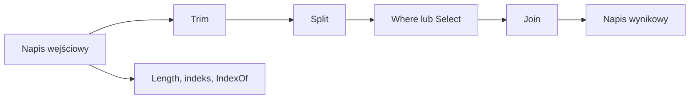

# 3. Klasa `string` i jej metody

## Gdzie temat pojawił się wcześniej?

Metody klasy `string` zostały już wprowadzone praktycznie w [module 06, temat 6: Metody biblioteczne](../../06-funkcje/06-metody-biblioteczne/README.md). Ten temat nie powtarza wyłącznie listy metod, lecz porządkuje je przed użyciem rekurencji i pokazuje właściwości typu `string` ważne dla algorytmów.

## Najważniejsze właściwości

`string` jest aliasem typu `System.String`. Jest to niemutowalny typ referencyjny reprezentujący sekwencję jednostek UTF-16. Po utworzeniu napisu nie zmieniamy jego zawartości. Metody pozornie modyfikujące tekst, na przykład `Trim`, `Replace` albo `ToUpperInvariant`, zwracają nowy napis.

```csharp
string oryginal = "  C#  ";
string oczyszczony = oryginal.Trim();

Console.WriteLine(oryginal == "  C#  "); // True
Console.WriteLine(oczyszczony);           // C#
```

Najczęściej używane elementy:

| Element | Znaczenie | Przykład |
| --- | --- | --- |
| `Length` | liczba jednostek UTF-16 | `tekst.Length` |
| indeksator | znak na pozycji | `tekst[0]` |
| `Trim` | usuwa białe znaki z brzegów | `tekst.Trim()` |
| `Split` | dzieli tekst na tablicę | `tekst.Split(' ')` |
| `Contains` | sprawdza obecność | `tekst.Contains("C#")` |
| `IndexOf` | zwraca indeks albo `-1` | `tekst.IndexOf(':')` |
| `Substring` | wycina fragment | `tekst.Substring(0, 3)` |
| `Replace` | zwraca tekst z zamianą | `tekst.Replace('-', '_')` |
| `string.Join` | łączy sekwencję | `string.Join(", ", slowa)` |

Dla wielu zmian w pętli użyj `StringBuilder`, a nie wielokrotnej konkatenacji `+`. `StringBuilder` jest mutowalnym buforem i został opisany w dokumentacji .NET.

## Kultura i Unicode

Do normalizacji identyfikatorów technicznych używaj zwykle `StringComparison.Ordinal` albo `OrdinalIgnoreCase`, a nie porównania zależnego od bieżącej kultury. Jeden znak użytkownika może zajmować więcej niż jedną jednostkę `char`, dlatego `Length` nie zawsze oznacza liczbę znaków widocznych na ekranie. Przy zaawansowanej pracy z Unicode rozważ `System.Text.Rune`.

```csharp
bool takiSamId = string.Equals(
    "ABC-17",
    "abc-17",
    StringComparison.OrdinalIgnoreCase);
```



Źródło: [diagram-string-metody.mmd](diagram-string-metody.mmd).

## Projekt demonstracyjny

Projekt [Kod/StringBiblioteka/Program.cs](Kod/StringBiblioteka/Program.cs) pokazuje oczyszczanie tekstu, bezpieczne porównanie identyfikatora, `Split`, `Join`, `Replace` i `StringBuilder`.

## Zadania

1. Znormalizuj zdanie: usuń spacje brzegowe, zamień wielokrotne spacje na jedną i policz słowa.
2. Napisz metodę, która zwraca indeks pierwszego wystąpienia cyfry w napisie.
3. Porównaj dwa identyfikatory bez rozróżniania wielkości liter i niezależnie od kultury.
4. Zbuduj raport z 10 elementów przy pomocy `StringBuilder`.

### Rozwiązania i wyjaśnienia

```csharp
static string NormalizujZdanie(string tekst)
{
    string[] slowa = tekst
        .Trim()
        .Split(' ', StringSplitOptions.RemoveEmptyEntries);

    return string.Join(' ', slowa);
}

static int IndeksPierwszejCyfry(string tekst)
{
    for (int indeks = 0; indeks < tekst.Length; indeks++)
    {
        if (char.IsDigit(tekst[indeks]))
        {
            return indeks;
        }
    }

    return -1;
}
```

Nie zmieniamy `tekst` w `NormalizujZdanie`; powstają pośrednie tablice i końcowy napis. W praktycznym kodzie warto ustalić limit długości wejścia i zachowanie dla `null`, zgodnie z kontraktem metody.

## Laboratorium i debugowanie

```powershell
dotnet build
dotnet run
```

Ustaw punkt przerwania w pętli po `Split`. Obserwuj `indeks`, `slowa` oraz wynik `Join`. Sprawdź napis pusty, tekst bez spacji i tekst zawierający polskie znaki.

## Źródła

- [String Class](https://learn.microsoft.com/dotnet/api/system.string),
- [StringBuilder Class](https://learn.microsoft.com/dotnet/api/system.text.stringbuilder),
- [String best practices](https://learn.microsoft.com/dotnet/standard/base-types/best-practices-strings),
- [Char.IsDigit](https://learn.microsoft.com/dotnet/api/system.char.isdigit),
- [Rune and Unicode](https://learn.microsoft.com/dotnet/standard/base-types/character-encoding-introduction),
- [Metody biblioteczne w module 06](../../06-funkcje/06-metody-biblioteczne/README.md).
