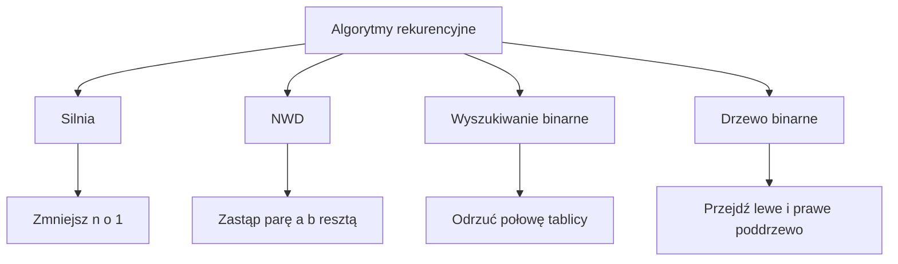

# 4. Kompletne programy z rekurencją

Poniższy projekt zawiera cztery kompletne przykłady. Każdy pokazuje inny kształt problemu i może być osobno omówiony na wykładzie.

## Program 1: silnia

`Silnia(n)` ma jeden przypadek bazowy `n == 0` i jeden krok `n * Silnia(n - 1)`. Dla typów całkowitych trzeba pilnować przepełnienia. Kod demonstracyjny używa `checked`, dzięki czemu błąd nie zostanie ukryty przez zawinięcie wartości.

## Program 2: algorytm Euklidesa

`Nwd(a, b)` wykorzystuje równoważność:

$$
\operatorname{NWD}(a,b) = \operatorname{NWD}(b, a \bmod b).
$$

Przypadkiem bazowym jest `b == 0`. W porównaniu z naiwnym odejmowaniem problem szybko się zmniejsza.

## Program 3: wyszukiwanie binarne

Dla posortowanej tablicy sprawdzamy środek. Jeżeli szukana wartość jest mniejsza, rekurencja pracuje tylko na lewej połowie; w przeciwnym razie na prawej. Koszt to $O(\log n)$ wywołań, ale warunkiem jest uporządkowanie tablicy według tego samego komparatora.

## Program 4: przejście drzewa binarnego

Drzewo ma naturalną strukturę rekurencyjną: węzeł składa się z wartości i dwóch mniejszych drzew. Przejście preorder odwiedza: korzeń, lewe poddrzewo, prawe poddrzewo. Metoda iteratora może łączyć `yield return` z rekurencją.



Źródło: [diagram-programy-rekurencyjne.mmd](diagram-programy-rekurencyjne.mmd).

## Projekt demonstracyjny

Kod znajduje się w [Kod/ProgramyRekurencyjne/Program.cs](Kod/ProgramyRekurencyjne/Program.cs). Program wypisuje wynik każdego algorytmu oraz preorder drzewa.

| Przykład | Przypadek bazowy | Postęp | Koszt |
| --- | --- | --- | --- |
| Silnia | `n == 0` | `n - 1` | $O(n)$ czasu i stosu |
| NWD | `b == 0` | `a % b` | $O(\log \min(a,b))$ |
| Binarne | pusty przedział | połowa przedziału | $O(\log n)$ |
| Drzewo | `null` | niższe poddrzewo | $O(n)$ |

## Zadania

1. Dodaj rekurencyjne potęgowanie przez kwadratowanie.
2. Dodaj wyszukiwanie pierwszego wystąpienia wartości w tablicy z duplikatami.
3. Dodaj przejście inorder i postorder drzewa.
4. Zlicz liczbę liści drzewa.
5. Dodaj test dla pustej tablicy, wartości nieobecnej, drzewa pustego i ujemnych argumentów.

### Rozwiązania i wyjaśnienia

```csharp
static long PotegaSzybka(long podstawa, int wykladnik)
{
    if (wykladnik < 0)
    {
        throw new ArgumentOutOfRangeException(nameof(wykladnik));
    }

    if (wykladnik == 0)
    {
        return 1;
    }

    long polowa = PotegaSzybka(podstawa, wykladnik / 2);
    long kwadrat = checked(polowa * polowa);
    return wykladnik % 2 == 0
        ? kwadrat
        : checked(podstawa * kwadrat);
}

static int LiczbaLisci(Node? wezel)
{
    if (wezel is null)
    {
        return 0;
    }

    if (wezel.Lewe is null && wezel.Prawe is null)
    {
        return 1;
    }

    return LiczbaLisci(wezel.Lewe) + LiczbaLisci(wezel.Prawe);
}
```

Potęgowanie przez kwadratowanie zmniejsza wykładnik mniej więcej o połowę, więc wymaga $O(\log n)$ wywołań. Liczba liści drzewa jest sumą wyników dla obu poddrzew; `null` oznacza brak liścia.

## Laboratorium i debugowanie

```powershell
dotnet build
dotnet run
```

Dla wyszukiwania binarnego obserwuj `lewy`, `prawy` i `srodek`. Dla drzewa obserwuj `wezel` i Call Stack. Sprawdź, czy kolejność preorder jest zgodna z diagramem.

## Źródła

- [Array.BinarySearch](https://learn.microsoft.com/dotnet/api/system.array.binarysearch),
- [Recursion](https://en.wikipedia.org/wiki/Recursion),
- [Euclidean algorithm](https://en.wikipedia.org/wiki/Euclidean_algorithm),
- [Binary search algorithm](https://en.wikipedia.org/wiki/Binary_search_algorithm),
- [Tree traversal](https://en.wikipedia.org/wiki/Tree_traversal).
