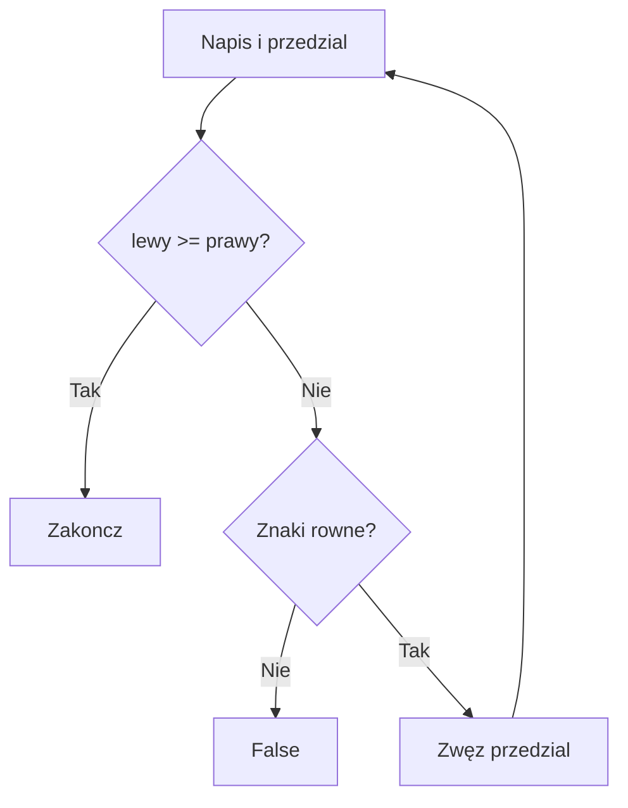

# 5. Rekurencja w operacjach na napisach

## Czy rekurencja ma tu miejsce?

Tak, ale nie zawsze jest najlepszym wyborem. Napis jest sekwencją znaków, więc prostą operację liniową, na przykład zliczanie znaków, zwykle łatwiej i taniej wykonać pętlą. Rekurencja dobrze ilustruje jednak operacje „od zewnątrz do środka” oraz dzielenie napisu na mniejszy fragment.

W tym temacie porównujemy trzy przykłady:

1. odwracanie napisu,
2. sprawdzanie palindromu,
3. rekurencyjne zliczanie wybranego znaku.

## 1. Odwracanie napisu

Wersja dydaktyczna może odwracać pierwszy znak i rekurencyjnie resztę:

```csharp
static string OdwrocDydaktycznie(string tekst)
{
    if (tekst.Length <= 1)
    {
        return tekst;
    }

    return OdwrocDydaktycznie(tekst[1..]) + tekst[0];
}
```

Jest czytelna, ale tworzy wiele pośrednich napisów. Wersja z tablicą znaków ma mniej alokacji:

```csharp
static string OdwrocZBuforem(string tekst)
{
    char[] znaki = tekst.ToCharArray();
    OdwrocWTablicy(znaki, 0, znaki.Length - 1);
    return new string(znaki);
}

static void OdwrocWTablicy(char[] znaki, int lewy, int prawy)
{
    if (lewy >= prawy)
    {
        return;
    }

    (znaki[lewy], znaki[prawy]) = (znaki[prawy], znaki[lewy]);
    OdwrocWTablicy(znaki, lewy + 1, prawy - 1);
}
```

## 2. Palindrom

Palindrom czyta się tak samo od lewej i od prawej strony. W każdym kroku porównujemy dwa skrajne znaki i zwężamy przedział. To naturalny przykład rekurencji, ale `string.Equals` i pętla mogą być lepsze w kodzie produkcyjnym zależnie od kontraktu.

```csharp
static bool CzyPalindrom(string tekst, int lewy, int prawy)
{
    if (lewy >= prawy)
    {
        return true;
    }

    return tekst[lewy] == tekst[prawy]
        && CzyPalindrom(tekst, lewy + 1, prawy - 1);
}
```

## 3. Zliczanie znaku

Tutaj rekurencja jest dydaktyczna, lecz pętla jest prostsza i nie zużywa stosu proporcjonalnie do długości napisu:

```csharp
static int PoliczZnak(string tekst, char szukany, int indeks)
{
    if (indeks == tekst.Length)
    {
        return 0;
    }

    int znaleziony = tekst[indeks] == szukany ? 1 : 0;
    return znaleziony + PoliczZnak(tekst, szukany, indeks + 1);
}
```



Źródło: [diagram-rekurencja-string.mmd](diagram-rekurencja-string.mmd).

## Projekt demonstracyjny

Projekt [Kod/RekurencjaTekst/Program.cs](Kod/RekurencjaTekst/Program.cs) uruchamia wszystkie trzy operacje oraz pokazuje wersję z buforem dla odwracania.

## Zadania

1. Napisz rekurencyjne `UsunSpacje(string tekst, int indeks, StringBuilder wynik)`.
2. Sprawdź palindrom po normalizacji: ignoruj spacje, znaki interpunkcyjne i wielkość liter.
3. Napisz rekurencyjne wyszukiwanie pierwszego indeksu podnapisu, ale opisz przypadki, w których lepiej użyć `IndexOf`.
4. Porównaj czas i liczbę alokacji wersji `OdwrocDydaktycznie` oraz `OdwrocZBuforem` dla długiego tekstu.

### Rozwiązania i wyjaśnienia

```csharp
static bool CzyPalindromPoNormalizacji(string tekst)
{
    string oczyszczony = new string(
        tekst
            .Where(char.IsLetterOrDigit)
            .Select(char.ToUpperInvariant)
            .ToArray());

    return CzyPalindrom(oczyszczony, 0, oczyszczony.Length - 1);
}
```

Normalizacja jest osobną operacją, dzięki czemu metoda rekurencyjna ma prosty kontrakt. W realnej aplikacji `IndexOf`, `Contains` i metody biblioteczne są zwykle bardziej wydajne i lepiej przetestowane niż własna rekurencja po napisie.

## Laboratorium i debugowanie

```powershell
dotnet build
dotnet run
```

Uruchom dla `kajak`, `kobyla ma maly bok`, pustego napisu i tekstu z polskimi znakami. Ustaw punkt przerwania w `CzyPalindrom` i obserwuj, jak zmieniają się `lewy` i `prawy`.

## Źródła

- [String Class](https://learn.microsoft.com/dotnet/api/system.string),
- [StringBuilder Class](https://learn.microsoft.com/dotnet/api/system.text.stringbuilder),
- [Enumerable.Where](https://learn.microsoft.com/dotnet/api/system.linq.enumerable.where),
- [Best practices for strings](https://learn.microsoft.com/dotnet/standard/base-types/best-practices-strings),
- [Recursion](https://en.wikipedia.org/wiki/Recursion).
