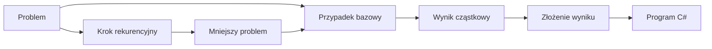

# 07. Rekurencja

Moduł pokazuje rekurencję jako sposób definiowania rozwiązania przez mniejsze przypadki tego samego problemu. Student zaczyna od intuicji i warunku bazowego, a następnie porównuje wersję rekurencyjną z iteracyjną, poznaje koszty stosu wywołań i wykorzystuje rekurencję do algorytmów oraz operacji na napisach.

Wszystkie przykłady są napisane w C# i przygotowane jako niezależne projekty konsolowe `net9.0`.

## Mapa tematów

1. [Intuicja i definicja rekurencji](01-intuicja-i-definicja/README.md) - przypadek bazowy, krok rekurencyjny i ślad wywołań.
2. [Zalety, wady i wybór iteracji](02-zalety-wady-i-iteracja/README.md) - stos wywołań, koszt, bezpieczeństwo i decyzja produkcyjna.
3. [Klasa `string` i metody](03-klasa-string-i-metody/README.md) - niemutowalność, metody .NET i uzupełnienie materiałów z modułu 06.
4. [Kompletne programy rekurencyjne](04-programy-z-rekurencja/README.md) - silnia, NWD, wyszukiwanie binarne i przejście drzewa.
5. [Rekurencja w operacjach na napisach](05-rekurencja-na-stringach/README.md) - odwracanie, palindrom i zliczanie znaków.
6. [Laboratorium i zadania z rozwiązaniami](06-laboratorium-i-zadania/README.md) - ćwiczenia, przypadki testowe, rozwiązania i kryteria oceny.



Źródło: [diagram-mapa-rekurencja.mmd](diagram-mapa-rekurencja.mmd).

## Cele modułu

Po module student potrafi:

- zdefiniować rekurencję przez przypadek bazowy i krok rekurencyjny,
- prześledzić stos wywołań dla małego argumentu,
- rozpoznać brak postępu i ryzyko `StackOverflowException`,
- porównać koszt pamięciowy i czasowy rekurencji oraz iteracji,
- wybrać rekurencję wtedy, gdy naturalnie opisuje strukturę problemu,
- korzystać z kluczowych metod klasy `string` i rozumieć jej niemutowalność,
- napisać i przetestować rekurencyjne algorytmy dla liczb, tablic, drzew i napisów,
- zastąpić prostą rekurencję pętlą, stosem jawnym albo memoizacją, gdy wymaga tego kod produkcyjny.

## Proponowany wykład

1. Zacznij od otwierania zagnieżdżonych pudełek: każda warstwa zawiera mniejszy problem tego samego rodzaju.
2. Zapisz formalny schemat: warunek bazowy, zmniejszenie problemu, złożenie wyniku.
3. Narysuj stos wywołań dla `Silnia(4)` i pokaż momenty wejścia oraz powrotu.
4. Porównaj rekurencyjną i iteracyjną wersję tego samego algorytmu.
5. Omów `string` jako niemutowalny typ referencyjny i odróżnij operacje biblioteczne od własnej rekurencji.
6. Przeprowadź wyszukiwanie binarne oraz przejście drzewa krok po kroku.
7. Zakończ decyzją projektową: czy rekurencja poprawia czytelność, czy tylko zwiększa koszt i ryzyko.

## Proponowane laboratorium

- **Laboratorium 1:** intuicja, ślad stosu, silnia, NWD, porównanie z pętlą i przypadki błędne.
- **Laboratorium 2:** `string`, rekurencyjne operacje na napisach, wyszukiwanie binarne i drzewo.
- **Laboratorium 3:** zadanie projektowe, pomiar lub analiza kosztu, refaktoryzacja do wersji produkcyjnej.

## Wspólna instrukcja uruchamiania

W katalogu konkretnego projektu `Kod/<NazwaProjektu>`:

```powershell
dotnet build
dotnet run
```

Z katalogu repozytorium można użyć:

```powershell
dotnet run --project src/07-rekurencja/04-programy-z-rekurencja/Kod/ProgramyRekurencyjne/ProgramyRekurencyjne.csproj
```

W Visual Studio Code ustaw punkt przerwania w metodzie rekurencyjnej, uruchom `F5`, a następnie obserwuj panel **Call Stack**. `F11` wchodzi do kolejnego wywołania, a `F10` wykonuje bieżącą instrukcję. Dla dużych danych nie uruchamiaj bez ograniczenia eksperymentów, które mogą przepełnić stos.

## Zasady testowania

Każda funkcja rekurencyjna powinna mieć testy dla:

- najmniejszego przypadku bazowego,
- argumentu `1` lub pojedynczego elementu,
- typowego przypadku,
- pustej tablicy albo pustego napisu, jeśli kontrakt je dopuszcza,
- danych niepoprawnych,
- wartości, która nie występuje.

W dokumentacji rozwiązania zapisz, co zmniejsza się w każdym wywołaniu i dlaczego rekurencja musi zakończyć się po skończonej liczbie kroków.

## Zadania przekrojowe z rozwiązaniami

1. Napisz `SumaCyfr(int liczba)` dla nieujemnej liczby całkowitej.
2. Napisz `CzyPalindrom(string tekst)` bez używania `Reverse`.
3. Zaimplementuj iteracyjną wersję rekurencyjnego wyszukiwania binarnego.
4. Dodaj memoizację do rekurencyjnego obliczania ciągu Fibonacciego.

Przykładowe rozwiązania:

```csharp
static int SumaCyfr(int liczba)
{
    if (liczba < 10)
    {
        return liczba;
    }

    return liczba % 10 + SumaCyfr(liczba / 10);
}

static bool CzyPalindrom(string tekst, int lewy, int prawy)
{
    if (lewy >= prawy)
    {
        return true;
    }

    return tekst[lewy] == tekst[prawy]
        && CzyPalindrom(tekst, lewy + 1, prawy - 1);
}
```

W `SumaCyfr` problem zmniejsza się przez dzielenie całkowite przez `10`. W palindromie porównujemy pary znaków od zewnątrz do środka. W rozwiązaniu produkcyjnym trzeba jeszcze jawnie opisać, czy spacje, wielkość liter i znaki diakrytyczne są ignorowane.

## Źródła i literatura

- [Methods - C#](https://learn.microsoft.com/dotnet/csharp/programming-guide/classes-and-structs/methods),
- [Jump statements: `return`](https://learn.microsoft.com/dotnet/csharp/language-reference/statements/jump-statements#the-return-statement),
- [String class](https://learn.microsoft.com/dotnet/api/system.string),
- [StringBuilder class](https://learn.microsoft.com/dotnet/api/system.text.stringbuilder),
- [String best practices](https://learn.microsoft.com/dotnet/standard/base-types/best-practices-strings),
- [Recursion](https://en.wikipedia.org/wiki/Recursion),
- [Divide-and-conquer algorithm](https://en.wikipedia.org/wiki/Divide-and-conquer_algorithm),
- [Materiały poprzednie: metody biblioteczne](../06-funkcje/06-metody-biblioteczne/README.md),
- [Wzorzec numerowanych katalogów kursu Java](https://github.com/tborzyszkowski/oop-concepts-java/tree/main/02_OOP/src).

Linki zostały przeznaczone do sprawdzenia przed publikacją modułu 28 września 2026 r.
