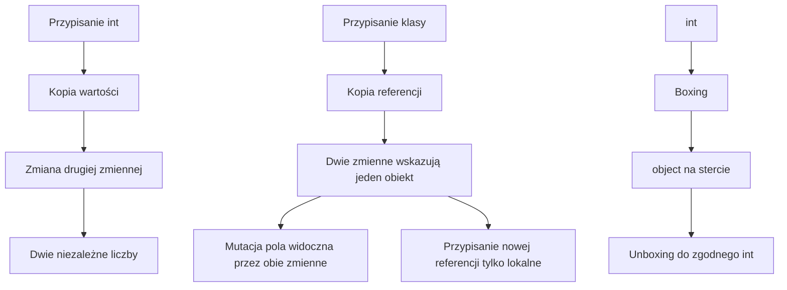

# 1. Typy wartościowe i referencyjne

## Dwie intuicje

Typ wartościowy przechowuje własną wartość. Przypisanie zwykle tworzy niezależną kopię tej wartości. Typ referencyjny przechowuje odwołanie do obiektu. Przypisanie kopiuje odwołanie, więc dwie zmienne mogą wskazywać na ten sam obiekt.

To model dydaktyczny, nie obietnica, że każda wartość znajduje się na stosie, a każdy obiekt wyłącznie na stercie. W praktyce C# i CLR mogą optymalizować rozmieszczenie danych. Najważniejszy dla programisty jest kontrakt kopiowania i mutowania.

```csharp
int pierwsza = 10;
int druga = pierwsza;
druga = 20;
// pierwsza == 10, druga == 20

Punkt lewy = new(1, 2);
Punkt prawy = lewy;
prawy.X = 99;
// lewy.X == 99, ponieważ obie zmienne wskazują ten sam obiekt

struct Wspolrzedne
{
    public int X;
    public int Y;
}

class Punkt
{
    public int X;
    public int Y;
}
```

## Typ wartościowy nie oznacza zawsze „mały”

Do typów wartościowych należą między innymi `int`, `double`, `bool`, `char`, `struct`, `enum` i `decimal`. Do typów referencyjnych należą klasy, rekordy klasowe, tablice, delegaty, interfejsy i `string`.

`struct` jest typem wartościowym, więc kopiowanie instancji kopiuje jej pola. Klasa jest typem referencyjnym, więc kopiowanie zmiennej nie tworzy automatycznie nowego obiektu. Aby otrzymać niezależny obiekt, trzeba jawnie wykonać kopię, na przykład przez konstruktor kopiujący albo metodę `Clone` zaprojektowaną dla konkretnego typu.

## Przekazywanie do metody

Parametry są domyślnie przekazywane przez wartość. Dla typu wartościowego metoda otrzymuje kopię liczby lub struktury. Dla typu referencyjnego metoda otrzymuje kopię referencji, ale ta kopia nadal prowadzi do tego samego obiektu. Dlatego metoda może zmienić pola obiektu, lecz przypisanie parametrowi nowego obiektu nie zmienia zmiennej wywołującego.

```csharp
static void ZmienLiczbe(int liczba)
{
    liczba = 99;
}

static void ZmienObiekt(Punkt punkt)
{
    punkt.X = 99;
    punkt = new Punkt { X = -1, Y = -1 };
}
```

Po wywołaniu `ZmienLiczbe` liczba wywołującego pozostaje bez zmian. Po wywołaniu `ZmienObiekt` pole `X` istniejącego obiektu zmienia się na `99`, ale zmienna wywołującego nadal wskazuje na pierwotny obiekt, a nie na nowy punkt `(-1, -1)`.

## `null`, boxing i mutowalność

`null` oznacza brak referencji do obiektu. Odwołanie do pola lub metody przez `null` kończy się `NullReferenceException`, dlatego dane opcjonalne powinny być sprawdzane i opisywane typem nullable, na przykład `Punkt?`.

Boxing opakowuje wartość typu wartościowego w obiekt typu `object` lub interfejs. Unboxing wymaga zgodnego typu:

```csharp
int liczba = 42;
object pudelko = liczba;
int odzyskana = (int)pudelko;
```

Boxing tworzy obiekt i może zwiększać koszt w pętlach. Kolekcje generyczne, takie jak `List<int>`, przechowują `int` bez konieczności konwersji każdego elementu do `object`.



Źródło: [diagram-kopiowanie-wartosci-i-referencji.mmd](diagram-kopiowanie-wartosci-i-referencji.mmd).

## Projekt demonstracyjny

Projekt [Kod/PamiecWartosciReferencji/Program.cs](Kod/PamiecWartosciReferencji/Program.cs) pokazuje kopiowanie `int`, kopiowanie struktury, wspólny obiekt klasy, wpływ metody na pole, ponowne przypisanie referencji oraz boxing. Program nie korzysta z wejścia z konsoli, dzięki czemu wynik można powtarzać podczas wykładu.

Najważniejszy fragment:

```csharp
Punkt pierwszy = new(1, 2);
Punkt drugi = pierwszy;
drugi.X = 10;

Console.WriteLine(pierwszy.X); // 10
Console.WriteLine(ReferenceEquals(pierwszy, drugi)); // True
```

## Zadania

1. Zdefiniuj `struct Temperatura` z polem `Celsjusze` i pokaż, że przypisanie kopiuje wartość.
2. Zdefiniuj klasę `Koszyk` z `List<string> Produkty`. Skopiuj dwie zmienne i wyjaśnij, dlaczego dodanie produktu jest widoczne przez obie.
3. Napisz metodę `Zamien(Punkt pierwszy, Punkt drugi)`, która zmienia pola istniejących punktów. Wyjaśnij, dlaczego przypisanie parametrów nie zamienia referencji u wywołującego.
4. Pokaż boxing dla `int`, a następnie porównaj pętlę pracującą na `ArrayList` z pętlą pracującą na `List<int>`.
5. Dodaj przypadek `Punkt?` równy `null` i obsłuż go bez `NullReferenceException`.

### Rozwiązania i wyjaśnienia

```csharp
static void UstawX(Punkt punkt, int x)
{
    punkt.X = x;
}

static Punkt? BezpiecznyPunkt(Punkt? punkt)
{
    return punkt is null ? null : new Punkt(punkt.X, punkt.Y);
}
```

`UstawX` mutuje obiekt, bo parametr jest kopią referencji do tego samego obiektu. `BezpiecznyPunkt` tworzy nowy obiekt, więc zwracana wartość nie współdzieli stanu z oryginałem. W zadaniu z `ArrayList` trzeba pamiętać o rzutowaniu każdego elementu na `int`; `List<int>` sprawdza typ już podczas kompilacji.

## Instrukcja kompilacji i debugowania

```powershell
dotnet build
dotnet run
```

Ustaw breakpoint po przypisaniu `drugi = pierwszy`, po `drugi.X = 99` oraz wewnątrz `ZmienObiekt`. W **Locals** porównaj wartości pól i użyj `ReferenceEquals`. W oknie **Call Stack** zobacz, że parametr metody jest lokalną zmienną, nawet gdy wskazuje na obiekt należący do wywołującego.

## Źródła

- [Value types - C# reference](https://learn.microsoft.com/dotnet/csharp/language-reference/builtin-types/value-types),
- [Reference types - C# reference](https://learn.microsoft.com/dotnet/csharp/language-reference/keywords/reference-types),
- [Passing parameters - C#](https://learn.microsoft.com/dotnet/csharp/language-reference/keywords/method-parameters),
- [Boxing and unboxing](https://learn.microsoft.com/dotnet/csharp/programming-guide/types/boxing-and-unboxing),
- [Types in C#](https://learn.microsoft.com/dotnet/csharp/fundamentals/types).
