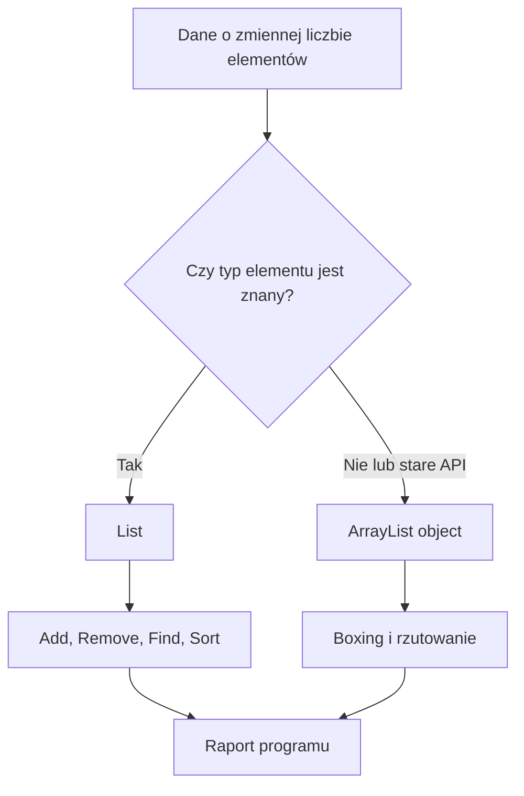

# 2. Wprowadzenie do kolekcji

## Po co kolekcje?

Tablica `T[]` ma stały rozmiar. Jest dobrym wyborem, gdy liczba elementów jest znana i potrzebny jest szybki dostęp przez indeks. Kolekcja pozwala dopasować reprezentację do operacji: `List<T>` rośnie dynamicznie, `HashSet<T>` pilnuje unikalności, `Dictionary<TKey, TValue>` mapuje klucz na wartość, a `Queue<T>` i `Stack<T>` opisują kolejność obsługi.

Najczęściej używaną kolekcją ogólnego przeznaczenia jest `List<T>`:

```csharp
List<string> zadania = ["przeczytaj README", "zbuduj projekt"];
zadania.Add("uruchom debugowanie");
zadania.Remove("przeczytaj README");

foreach (string zadanie in zadania)
{
    Console.WriteLine(zadanie);
}
```

`List<T>` przechowuje elementy w wewnętrznej tablicy. Gdy zabraknie miejsca, alokuje większy bufor i kopiuje elementy. Dzięki temu `Add` jest średnio operacją stałoczasową, ale pojedyncze powiększenie może kosztować `O(n)`. `Count` oznacza liczbę elementów, a `Capacity` rozmiar aktualnie zarezerwowanego bufora.

## `List<T>` a `ArrayList`

`ArrayList` jest starszą, niegeneryczną kolekcją przechowującą elementy jako `object`. Dla typów wartościowych oznacza to boxing przy dodawaniu i unboxing przy odczycie. Nowy kod powinien używać `List<T>`, bo typ elementów jest sprawdzany przez kompilator, kod nie wymaga rzutowań, a praca z wartościami jest wydajniejsza.

```csharp
ArrayList staraLista = [1, 2, 3];
int liczba = (int)staraLista[0];

List<int> nowaLista = [1, 2, 3];
int taSamaOperacja = nowaLista[0];
```

`ArrayList` warto pokazać historycznie, aby student rozumiał starsze API i koszt `object`, ale nie należy projektować nowych publicznych metod z jego użyciem.

## Wspólne operacje `List<T>`

| Operacja | Znaczenie | Typowy koszt |
| --- | --- | ---: |
| `Add` | dodaje na końcu | średnio `O(1)` |
| `Insert` | wstawia pod indeksem | `O(n)` |
| `Remove` | usuwa pierwsze dopasowanie | `O(n)` |
| `RemoveAt` | usuwa element pod indeksem | `O(n)` |
| `Contains` | sprawdza obecność | `O(n)` |
| `Find` | zwraca pierwsze dopasowanie | `O(n)` |
| `Sort` | porządkuje elementy | zwykle `O(n log n)` |
| `Count` | liczba elementów | `O(1)` |
| `Clear` | usuwa wszystkie elementy | `O(n)` dla referencji wymagających wyzerowania |

Przy większej liczbie elementów warto ustawić przewidywaną pojemność konstruktorem `new List<T>(pojemnosc)`. Nie należy mylić `Count` z `Capacity`: pierwsze opisuje dane, drugie zarezerwowaną przestrzeń.

## Program 1: lista zadań

Projekt [Kod/ListaZadan/Program.cs](Kod/ListaZadan/Program.cs) przechowuje rekordy `Zadanie`, dodaje element, oznacza zadanie jako wykonane, filtruje i usuwa wykonane elementy. Pokazuje, że kolekcja może przechowywać własne typy, a nie tylko liczby.

Najważniejszy fragment:

```csharp
zadania.Add(new Zadanie("uruchom testy", false));
zadania[0] = zadania[0] with { Wykonane = true };
zadania.RemoveAll(zadanie => zadanie.Wykonane);
```

## Program 2: rejestr ocen

Projekt [Kod/RejestrOcen/Program.cs](Kod/RejestrOcen/Program.cs) sortuje rekordy studentów według punktów, filtruje osoby zaliczone i wylicza średnią. Jest przykładem kolekcji danych domenowych oraz połączenia `List<T>` z LINQ.

```csharp
List<Student> studenci = [...];
studenci.Sort((lewy, prawy) => prawy.Punkty.CompareTo(lewy.Punkty));
IEnumerable<Student> zaliczeni = studenci.Where(student => student.Punkty >= 50);
```

Sortowanie zmienia listę, natomiast `Where` opisuje sekwencję wynikową. Jeżeli wynik ma być używany wielokrotnie, można go zmaterializować przez `ToList()`.

## Program 3: katalog kontaktów i różnica typów

Projekt [Kod/KatalogKontaktow/Program.cs](Kod/KatalogKontaktow/Program.cs) pokazuje wyszukiwanie, aktualizację, usuwanie oraz wybór `List<Kontakt>` zamiast `ArrayList`. W programie znajduje się również świadomy przykład starego API, aby można było obserwować boxing.



Źródło: [diagram-kolekcje-podstawy.mmd](diagram-kolekcje-podstawy.mmd).

## Zadania

1. Dodaj priorytet do `Zadanie` i sortuj najpierw po priorytecie, potem po tytule.
2. Dodaj do rejestru ocen grupowanie według przedziałów `0-49`, `50-69`, `70-89`, `90-100`.
3. Zmień katalog kontaktów tak, aby nie pozwalał dodać dwóch kontaktów z tym samym adresem e-mail.
4. Porównaj `Count` i `Capacity` listy po dodaniu 100 elementów. Wyjaśnij, dlaczego ich wartości mogą być różne.
5. Zastąp `ArrayList` przez `List<int>` i usuń wszystkie rzutowania. Zapisz, jakie błędy wykrywa kompilator.

### Rozwiązania i wyjaśnienia

```csharp
static void DodajJesliNowy(List<Kontakt> kontakty, Kontakt nowy)
{
    bool istnieje = kontakty.Any(
        kontakt => string.Equals(
            kontakt.Email,
            nowy.Email,
            StringComparison.OrdinalIgnoreCase));

    if (!istnieje)
    {
        kontakty.Add(nowy);
    }
}
```

W zadaniu 3 sprawdzenie wykonujemy przed `Add`, bo kolekcja nie zna znaczenia biznesowego adresu e-mail. W zadaniu 4 pojemność jest technicznym buforem i może być większa od liczby danych, aby ograniczyć częstotliwość realokacji.

## Instrukcja kompilacji i debugowania

Każdy z trzech projektów uruchamiaj osobno:

```powershell
dotnet build
dotnet run
```

Ustaw breakpointy przy `Add`, `RemoveAll`, `Sort` i `Where`. W **Locals** obserwuj `Count`, `Capacity`, zawartość listy oraz rekord przekazywany do predykatu. W przykładzie `ArrayList` zatrzymaj program na rzutowaniu `(int)`, aby pokazać moment unboxingu.

## Źródła

- [`List<T>` Class](https://learn.microsoft.com/dotnet/api/system.collections.generic.list-1),
- [ArrayList Class](https://learn.microsoft.com/dotnet/api/system.collections.arraylist),
- [Collections in C#](https://learn.microsoft.com/dotnet/standard/collections/),
- [`List<T>` performance](https://learn.microsoft.com/dotnet/api/system.collections.generic.list-1#remarks),
- [LINQ overview](https://learn.microsoft.com/dotnet/csharp/linq/).
