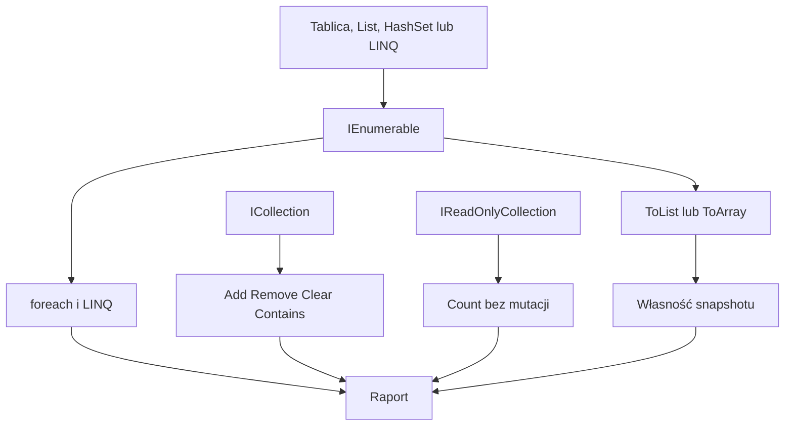

# 3. Wspólne API kolekcji

## Kolekcja jako kontrakt

Kod metody nie zawsze powinien znać konkretną implementację kolekcji. Jeżeli metoda tylko odczytuje elementy, najwęższym użytecznym kontraktem jest często `IEnumerable<T>`. Jeżeli dodaje i usuwa elementy, potrzebuje `ICollection<T>`. Jeżeli ma tylko udostępniać odczyt liczby elementów, można użyć `IReadOnlyCollection<T>`.

```csharp
static int PoliczNiepuste(IEnumerable<string> elementy)
{
    return elementy.Count(element => !string.IsNullOrWhiteSpace(element));
}

static void DodajDomyslna(ICollection<string> elementy)
{
    elementy.Add("domyślna");
}
```

Ta sama metoda odczytująca może pracować z tablicą, `List<T>`, `HashSet<T>`, wynikiem LINQ albo własnym iteratorem. Węższy interfejs ogranicza zależność i utrudnia przypadkową zmianę kolekcji wewnątrz metody.

## Najczęściej używane członkowie

| Kontrakt | Dostępne możliwości |
| --- | --- |
| `IEnumerable<T>` | `foreach`, LINQ, jednokierunkowa enumeracja |
| `IReadOnlyCollection<T>` | `IEnumerable<T>` oraz `Count` |
| `ICollection<T>` | `Count`, `Add`, `Remove`, `Clear`, `Contains`, `CopyTo` |
| `IReadOnlyList<T>` | odczyt `Count` i indeksatora |
| `IList<T>` | odczyt i zapis przez indeks, `Insert`, `RemoveAt` |

`foreach` korzysta z enumeratora. Podczas modyfikowania kolekcji w tej samej enumeracji zwykle dostaniemy `InvalidOperationException`, dlatego usuwanie można wykonać przez `RemoveAll`, kopię danych albo zebranie elementów do usunięcia.

## Materializacja i opóźnione wykonanie

Wiele operacji LINQ zwraca `IEnumerable<T>` i nie wykonuje całego zapytania natychmiast. `ToList()` albo `ToArray()` tworzy konkretną kolekcję w danym momencie. To ważne, gdy źródło później się zmienia albo wynik ma być enumerowany kilka razy.

```csharp
List<int> liczby = [1, 2, 3, 4];
IEnumerable<int> parzyste = liczby.Where(liczba => liczba % 2 == 0);
liczby.Add(6);

List<int> kopiaParzystych = parzyste.ToList();
// kopiaParzystych zawiera również 6
```

## Projekt demonstracyjny

Projekt [Kod/KolekcjeApi/Program.cs](Kod/KolekcjeApi/Program.cs) buduje raport z `List<T>`, przekazuje kolekcję do metod o różnych kontraktach, pokazuje opóźnione `Where` i materializację `ToList`, a także bezpieczne usuwanie elementów przez `RemoveAll`.



Źródło: [diagram-wspolne-api-kolekcji.mmd](diagram-wspolne-api-kolekcji.mmd).

## Zadania

1. Zmień `ZbudujRaport`, aby przyjmowała `IEnumerable<Produkt>`, a nie `List<Produkt>`.
2. Dodaj metodę `DodajJesliBrak(ICollection<string>, string)`, która nie dodaje duplikatu.
3. Pokaż na dwóch `foreach`, że zapytanie LINQ jest wykonywane podczas enumeracji, a nie w chwili przypisania.
4. Dodaj metodę zwracającą `IReadOnlyList<string>` i zwróć kopię `ToArray()` albo `ToList()`.
5. Usuń wszystkie liczby większe od `10` bez modyfikowania kolekcji wewnątrz `foreach`.

### Rozwiązania i wyjaśnienia

```csharp
static void DodajJesliBrak(ICollection<string> elementy, string nowy)
{
    if (!elementy.Contains(nowy))
    {
        elementy.Add(nowy);
    }
}

static IReadOnlyList<string> Snapshot(IEnumerable<string> elementy)
{
    return elementy.ToList();
}
```

`ICollection<T>` umożliwia modyfikację, ale nie obiecuje indeksatora. `IReadOnlyList<T>` pozwala czytać przez indeks, ale nie powinien umożliwiać zmian. W zadaniu 5 najprościej użyć `RemoveAll`, bo operacja jest częścią `List<T>` i nie otwiera enumeratora podczas usuwania.

## Instrukcja kompilacji i debugowania

```powershell
dotnet build
dotnet run
```

Ustaw breakpoint w `PoliczNiepuste`, `DodajDomyslna` i przed `ToList()`. Zmień źródłową listę pomiędzy zbudowaniem `IEnumerable<T>` a jego enumeracją i zobacz różnicę między zapytaniem opóźnionym a snapshotem.

## Źródła

- [`IEnumerable<T>` Interface](https://learn.microsoft.com/dotnet/api/system.collections.generic.ienumerable-1),
- [`ICollection<T>` Interface](https://learn.microsoft.com/dotnet/api/system.collections.generic.icollection-1),
- [`IReadOnlyCollection<T>` Interface](https://learn.microsoft.com/dotnet/api/system.collections.generic.ireadonlycollection-1),
- [`IReadOnlyList<T>` Interface](https://learn.microsoft.com/dotnet/api/system.collections.generic.ireadonlylist-1),
- [LINQ deferred execution](https://learn.microsoft.com/dotnet/standard/linq/deferred-execution-lazy-evaluation).
