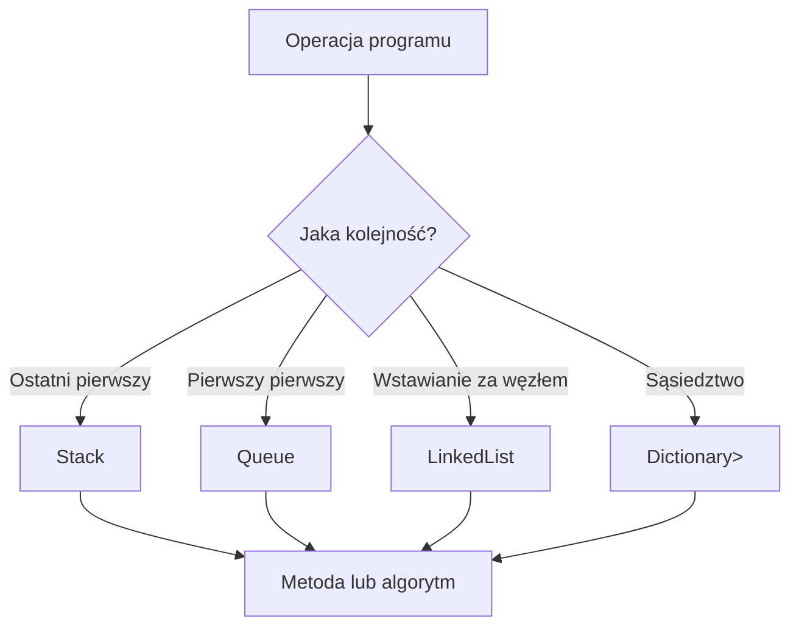

# 4. Dynamiczne struktury danych

## Dobór struktury do operacji

„Dynamiczna” struktura nie oznacza jednego konkretnego typu. Chodzi o strukturę, która zmienia rozmiar lub przechowuje połączenia między elementami w trakcie działania programu. W .NET gotowe kolekcje są zwykle lepszym punktem startowym niż własna implementacja tablicy lub listy.

| Problem | Kolekcja | Zasada |
| --- | --- | --- |
| cofanie ostatniej operacji | `Stack<T>` | LIFO: ostatni element wychodzi pierwszy |
| obsługa zgłoszeń | `Queue<T>` | FIFO: pierwszy element wychodzi pierwszy |
| częste wstawianie między znanymi węzłami | `LinkedList<T>` | elementy mają sąsiadów, nie indeks |
| połączenia i przejście grafu | `Dictionary<TKey, List<T>>` | klucz wskazuje listę sąsiadów |

Nie wybieraj `LinkedList<T>` tylko dlatego, że „jest dynamiczna”. Jeżeli potrzebujesz indeksowania i przejścia po wszystkich elementach, `List<T>` zwykle będzie prostsza i bardziej przyjazna dla pamięci podręcznej procesora.

## Program 1: stos historii

`Stack<string>` przechowuje operacje edytora. `Push` zapisuje nową operację, a `Pop` cofa ostatnią. `Peek` pozwala sprawdzić szczyt bez usuwania.

```csharp
Stack<string> historia = new();
historia.Push("wstaw nagłówek");
historia.Push("zmień kolor");
Console.WriteLine(historia.Pop());
```

## Program 2: kolejka zgłoszeń

`Queue<string>` odwzorowuje kolejkę klientów lub zadań. `Enqueue` dodaje na końcu, `Dequeue` pobiera najstarsze zgłoszenie, a `Peek` tylko je podgląda. Przed `Dequeue` trzeba sprawdzić `Count`, jeśli pusta kolejka jest możliwym stanem.

## Program 3: lista odtwarzania

`LinkedList<string>` ma węzły i referencje do poprzednika oraz następnika. Wstawienie za znanym węzłem wykonuje się bez przesuwania całego ogona listy. Ceną jest brak szybkiego indeksowania i dodatkowa pamięć na linki.

## Program 4: graf jako lista sąsiedztwa

Graf można reprezentować jako `Dictionary<string, List<string>>`. Klucz jest nazwą węzła, a lista zawiera jego sąsiadów. Przejście BFS korzysta z `Queue<string>` i `HashSet<string>` odwiedzonych węzłów.



Źródło: [diagram-struktury-dynamiczne.mmd](diagram-struktury-dynamiczne.mmd).

## Projekt demonstracyjny

Projekt [Kod/StrukturyDynamiczne/Program.cs](Kod/StrukturyDynamiczne/Program.cs) uruchamia wszystkie cztery przykłady. Każdy fragment jest mały, ale pokazuje inną regułę kolejności albo sposób przechowywania relacji.

## Zadania

1. Dodaj do historii operację `Redo` przez drugi stos.
2. Dodaj do kolejki priorytetowej dwa typy zgłoszeń i uzasadnij, dlaczego zwykła `Queue<T>` nie wystarcza.
3. Napisz metodę usuwającą bieżący węzeł playlisty przez `LinkedListNode<T>`.
4. Dodaj do grafu wyszukiwanie DFS z użyciem `Stack<string>`.
5. Zabezpiecz BFS przed grafem zawierającym krawędzie zwrotne i brakujący klucz sąsiada.

### Rozwiązania i wyjaśnienia

```csharp
static IEnumerable<string> PrzejdzBfs(
    Dictionary<string, List<string>> graf,
    string start)
{
    if (!graf.ContainsKey(start))
    {
        yield break;
    }

    Queue<string> kolejka = new();
    HashSet<string> odwiedzone = [start];
    kolejka.Enqueue(start);

    while (kolejka.Count > 0)
    {
        string aktualny = kolejka.Dequeue();
        yield return aktualny;

        foreach (string sasiad in graf[aktualny])
        {
            if (odwiedzone.Add(sasiad) && graf.ContainsKey(sasiad))
            {
                kolejka.Enqueue(sasiad);
            }
        }
    }
}
```

Zbiór `HashSet<string>` jest potrzebny, ponieważ graf może zawierać cykl. Bez niego BFS mógłby wielokrotnie dodawać te same węzły do kolejki. W praktycznej wersji warto najpierw walidować, czy każdy sąsiad ma wpis w grafie; pokazany kod ilustruje ideę, a laboratorium powinno doprecyzować kontrakt danych.

## Instrukcja kompilacji i debugowania

```powershell
dotnet build
dotnet run
```

Ustaw breakpointy w `Push`/`Pop`, `Enqueue`/`Dequeue` oraz w pętli BFS. Obserwuj rozmiar stosu, kolejki i zbioru `odwiedzone`. W playlistie zatrzymaj się przed `AddAfter` i po nim, aby zobaczyć, że zmieniają się sąsiedztwa, a nie indeksy.

## Źródła

- [`Stack<T>` Class](https://learn.microsoft.com/dotnet/api/system.collections.generic.stack-1),
- [`Queue<T>` Class](https://learn.microsoft.com/dotnet/api/system.collections.generic.queue-1),
- [`LinkedList<T>` Class](https://learn.microsoft.com/dotnet/api/system.collections.generic.linkedlist-1),
- [`Dictionary<TKey,TValue>` Class](https://learn.microsoft.com/dotnet/api/system.collections.generic.dictionary-2),
- [Breadth-first search](https://en.wikipedia.org/wiki/Breadth-first_search),
- [Tree traversal](https://en.wikipedia.org/wiki/Tree_traversal).
