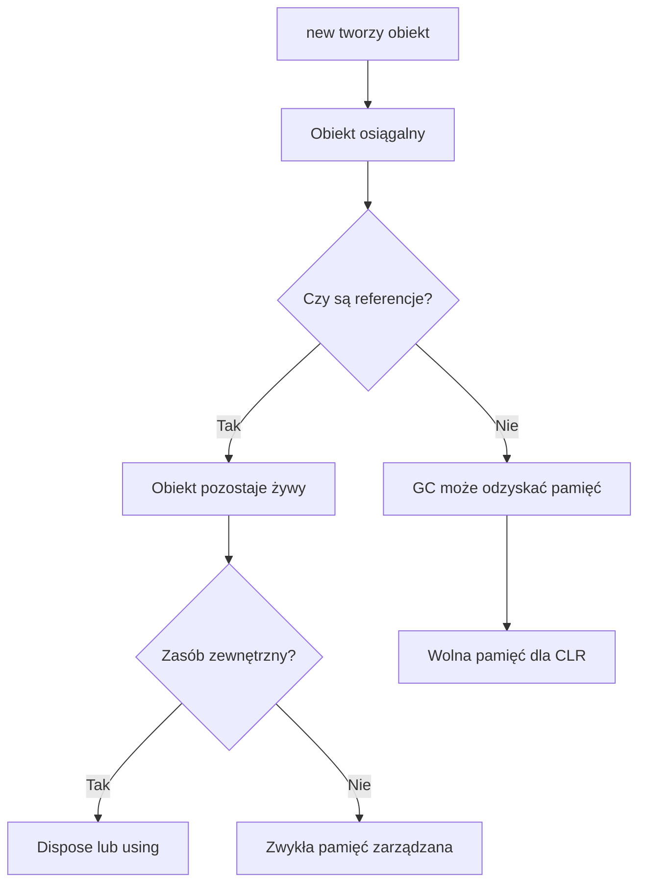

# 5. Zarządzanie pamięcią i Garbage Collector

## Idea pamięci zarządzanej

W .NET obiekty tworzone przez `new` trafiają do zarządzanej pamięci. CLR śledzi, które obiekty są jeszcze osiągalne z korzeni, na przykład zmiennych aktywnych ramek, pól statycznych i uchwytów środowiska. Obiekt, do którego nie prowadzi już żadna osiągalna referencja, może zostać odzyskany przez Garbage Collector.

Programista nie wywołuje `free` dla zwykłych obiektów C#. Zamiast tego powinien:

- ograniczać niepotrzebne alokacje,
- usuwać referencje do danych, które nie są już potrzebne,
- nie przechowywać bez końca obiektów w statycznych kolekcjach,
- używać `using` i `Dispose` dla zasobów zewnętrznych,
- mierzyć alokacje zamiast zgadywać ich koszt,
- nie traktować `GC.Collect()` jako zwykłej optymalizacji.

## Generacje

GC grupuje obiekty według wieku. Nowe obiekty zaczynają w generacji 0. Te, które przeżyją kolekcję, mogą zostać promowane do generacji 1, a potem 2. Krótkotrwałe obiekty są zwykle tanie do odzyskania, natomiast długowieczne obiekty i duże alokacje wymagają ostrożniejszej analizy.

Generacje są szczegółem implementacji CLR, ale ich idea pomaga wyjaśnić, dlaczego krótkie obiekty tymczasowe i stale rosnąca lista mają różny wpływ na program.

```csharp
byte[] bufor = new byte[100_000];
Console.WriteLine(GC.GetGeneration(bufor));
Console.WriteLine(GC.GetTotalMemory(forceFullCollection: false));
```

## GC nie zamyka pliku

Zarządzanie pamięcią i zwalnianie zasobów to różne problemy. `FileStream`, połączenie sieciowe, uchwyt systemowy albo transakcja powinny mieć jawny cykl życia. Implementacja `IDisposable` i konstrukcja `using` określają moment zwolnienia takiego zasobu.

```csharp
using (MemoryStream strumien = new())
{
    strumien.WriteByte(42);
}
```

Finalizer nie jest zamiennikiem `Dispose`: działa niedeterministycznie i zwiększa koszt przeżycia obiektu. W kodzie aplikacyjnym preferuj jawne `Dispose`, a finalizację stosuj tylko wtedy, gdy typ naprawdę posiada zasób wymagający takiego zabezpieczenia.

## Konsekwencje dla programisty

GC nie oznacza, że pamięć jest darmowa. Duże kolekcje, nieograniczone cache, zamknięcia przechowujące obiekty oraz niepotrzebne kopie mogą utrzymywać dane przy życiu. GC może wstrzymać część pracy aplikacji, a częste alokacje utrudniają przewidywanie opóźnień.

Warto odróżnić:

1. **osiągalność** - czy z korzeni można dojść do obiektu,
2. **żywotność** - jak długo obiekt pozostaje potrzebny,
3. **zasób zewnętrzny** - czy trzeba zamknąć coś poza pamięcią zarządzaną,
4. **pomiar** - ile bajtów i obiektów faktycznie alokuje kod.



Źródło: [diagram-cykl-gc.mmd](diagram-cykl-gc.mmd).

## Projekt demonstracyjny

Projekt [Kod/GarbageCollector/Program.cs](Kod/GarbageCollector/Program.cs) pokazuje generację nowego obiektu, pomiar pamięci, dużą serię krótkotrwałych buforów, `WeakReference`, świadome wywołanie GC w kontrolowanym eksperymencie oraz `using` dla `MemoryStream`.

Wywołanie `GC.Collect()` znajduje się wyłącznie po to, aby wykład mógł pokazać różnicę przed i po pełnej kolekcji. W kodzie produkcyjnym wymuszanie kolekcji zwykle pogarsza płynność i powinno być poprzedzone pomiarem.

## Zadania

1. Zmierz `GC.GetAllocatedBytesForCurrentThread()` przed i po utworzeniu 10 000 małych obiektów.
2. Porównaj listę, która rośnie od pojemności domyślnej, z listą utworzoną z przewidywaną pojemnością.
3. Napisz klasę `BuforPliku : IDisposable`, która ma flagę `CzyZamkniety` i nie pozwala pisać po `Dispose`.
4. Utwórz statyczny cache i pokaż, dlaczego nieosiągalność obiektu nie wystąpi, dopóki cache przechowuje referencję.
5. Wyjaśnij, dlaczego `WeakReference` nie nadaje się jako jedyne miejsce przechowywania ważnych danych.

### Rozwiązania i wyjaśnienia

```csharp
static long ZmierzAlokacje()
{
    long przed = GC.GetAllocatedBytesForCurrentThread();
    List<byte[]> bufory = [];

    for (int indeks = 0; indeks < 10_000; indeks++)
    {
        bufory.Add(new byte[32]);
    }

    return GC.GetAllocatedBytesForCurrentThread() - przed;
}
```

Pomiar jest zależny od kodu uruchomionego wcześniej, środowiska i optymalizacji, dlatego traktuj go jako eksperyment, a nie stałą obietnicę. W zadaniu z `IDisposable` stan zasobu powinien być zamknięty deterministycznie; GC może później odzyskać obiekt, ale nie powinien decydować o momencie zamknięcia pliku lub połączenia.

## Instrukcja kompilacji i debugowania

```powershell
dotnet build
dotnet run
```

Uruchom program kilka razy i porównaj wartości pamięci, zamiast oczekiwać identycznych liczb. Ustaw breakpoint przed i po `bufory.Clear()`, przed `GC.Collect()` oraz wewnątrz bloku `using`. W **Diagnostic Tools** obserwuj alokacje i kolekcje, ale nie wyciągaj wniosków z pojedynczego uruchomienia.

## Źródła

- [Garbage collection](https://learn.microsoft.com/dotnet/standard/garbage-collection/),
- [Fundamentals of garbage collection](https://learn.microsoft.com/dotnet/standard/garbage-collection/fundamentals),
- [Garbage collection modes](https://learn.microsoft.com/dotnet/standard/garbage-collection/workstation-server-gc),
- [Implement a Dispose method](https://learn.microsoft.com/dotnet/standard/garbage-collection/implementing-dispose),
- [WeakReference Class](https://learn.microsoft.com/dotnet/api/system.weakreference),
- [GC Class](https://learn.microsoft.com/dotnet/api/system.gc).
