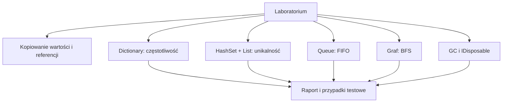

# 6. Laboratorium i zadania z rozwiązaniami

## Cel laboratorium

Student ma przejść od wyboru typu danych do działającego programu: rozpoznać, czy potrzebuje kopii wartości czy wspólnego obiektu, dobrać kolekcję do operacji, zapisać kontrakt metody, uruchomić przypadki graniczne oraz wyjaśnić, co z pamięcią robi CLR.

## Przebieg laboratorium

1. Uruchom projekt kontrolny i zapisz wynik każdego zadania.
2. Do każdego problemu wypisz dane, wynik, operacje dominujące i możliwe stany puste.
3. Wybierz kolekcję: `List<T>`, `HashSet<T>`, `Dictionary<TKey, TValue>`, `Queue<T>` albo `Stack<T>`.
4. Zaimplementuj metodę obliczeniową oddzielnie od `Console.WriteLine`.
5. Dodaj przypadek typowy, pusty, z duplikatami i z nieznanym kluczem.
6. Ustaw breakpointy na zmianach kolekcji i obserwuj `Count` oraz zawartość.
7. Uruchom demonstrację GC, ale traktuj wartości pomiarów jako zależne od środowiska.

## Zadania

### Zadanie 1: kopiowanie danych

Zdefiniuj `Punkt` jako klasę i jako strukturę. Przypisz każdą wartość do drugiej zmiennej, zmień pole i opisz różnicę w wyniku. Dodaj metodę, która zmienia pole obiektu, oraz metodę, która przypisuje parametr do nowego obiektu.

### Zadanie 2: częstotliwość słów

Napisz `PoliczSlowa(string tekst)`, która po normalizacji wielkości liter zwraca `Dictionary<string, int>`. Pomiń puste elementy i znaki interpunkcyjne. Wyjaśnij, dlaczego słownik jest lepszy niż wielokrotne przeszukiwanie listy.

### Zadanie 3: unikalna kolejność

Napisz `UsunDuplikaty(IEnumerable<string> slowa)`, która zachowuje pierwsze wystąpienie każdego słowa. Użyj `HashSet<string>` do szybkiego sprawdzania i `List<string>` do zachowania kolejności.

### Zadanie 4: kolejka zadań

Zbuduj program obsługujący `Queue<Zadanie>`. Dodaj zadania, pobieraj je w kolejności FIFO i obsłuż pustą kolejkę bez wyjątku. Rozszerz rekord o priorytet, ale opisz, kiedy zwykła kolejka przestaje wystarczać.

### Zadanie 5: graf połączeń

Reprezentuj graf jako `Dictionary<string, List<string>>`. Zaimplementuj BFS od podanego węzła i zwróć kolejność odwiedzania bez powtórzeń. Obsłuż brak węzła startowego oraz cykl.

### Zadanie 6: pamięć i zasób

Zmierz liczbę alokowanych bajtów podczas tworzenia listy małych tablic. Dodaj klasę `BuforPliku` implementującą `IDisposable`, wywołaj ją w `using` i wyjaśnij, dlaczego `Dispose` nie jest tym samym co praca Garbage Collectora.

## Rozwiązania i wyjaśnienia

### Rozwiązanie 1: typy

```csharp
static void UstawX(Punkt punkt, int x)
{
    punkt.X = x;
}

static void PodmienLokalnaReferencje(Punkt punkt)
{
    punkt = new Punkt(-1, -1);
}
```

`UstawX` zmienia obiekt widoczny przez wywołującego. `PodmienLokalnaReferencje` zmienia tylko lokalną kopię referencji, więc po powrocie wywołujący nadal wskazuje na pierwotny obiekt.

### Rozwiązanie 2: słownik częstotliwości

```csharp
static Dictionary<string, int> PoliczSlowa(string tekst)
{
    Dictionary<string, int> wynik = new(StringComparer.OrdinalIgnoreCase);
    string[] slowa = tekst.Split(
        [' ', ',', '.', ';', '!', '?'],
        StringSplitOptions.RemoveEmptyEntries);

    foreach (string slowo in slowa)
    {
        string klucz = slowo.Trim().ToLowerInvariant();
        wynik[klucz] = wynik.GetValueOrDefault(klucz) + 1;
    }

    return wynik;
}
```

Słownik pozwala przejść po słowach raz i aktualizować wartość pod kluczem. `StringComparer.OrdinalIgnoreCase` ustala regułę porównywania kluczy niezależnie od bieżącej kultury.

### Rozwiązanie 3: unikalne elementy

```csharp
static List<string> UsunDuplikaty(IEnumerable<string> slowa)
{
    HashSet<string> widziane = new(StringComparer.OrdinalIgnoreCase);
    List<string> wynik = [];

    foreach (string slowo in slowa)
    {
        if (widziane.Add(slowo))
        {
            wynik.Add(slowo);
        }
    }

    return wynik;
}
```

`HashSet<T>.Add` zwraca `false`, gdy element już istnieje. Zbiór rozwiązuje problem przynależności, a lista zachowuje kolejność pierwszych wystąpień.

### Rozwiązanie 4: kolejka

```csharp
static List<string> Obsluz(Queue<string> kolejka)
{
    List<string> obsluzone = [];
    while (kolejka.Count > 0)
    {
        obsluzone.Add(kolejka.Dequeue());
    }

    return obsluzone;
}
```

Warunek `Count > 0` jest częścią kontraktu, ponieważ `Dequeue` na pustej kolejce zgłasza wyjątek. Jeżeli zadania mają być wybierane według priorytetu, zwykła FIFO nie opisuje już wymagania; można użyć sortowanej kolekcji albo kolejki priorytetowej z własnym kontraktem.

### Rozwiązanie 5: BFS

```csharp
static List<string> Bfs(
    Dictionary<string, List<string>> graf,
    string start)
{
    if (!graf.ContainsKey(start))
    {
        return [];
    }

    Queue<string> kolejka = new([start]);
    HashSet<string> odwiedzone = [start];
    List<string> wynik = [];

    while (kolejka.TryDequeue(out string? aktualny))
    {
        wynik.Add(aktualny);
        foreach (string sasiad in graf[aktualny])
        {
            if (graf.ContainsKey(sasiad) && odwiedzone.Add(sasiad))
            {
                kolejka.Enqueue(sasiad);
            }
        }
    }

    return wynik;
}
```

`HashSet` gwarantuje, że cykl nie spowoduje nieskończonego przetwarzania. `Queue` przechowuje warstwę, która ma zostać odwiedzona w następnej kolejności.

### Rozwiązanie 6: pomiar i `Dispose`

```csharp
static long ZmierzAlokacje()
{
    long przed = GC.GetAllocatedBytesForCurrentThread();
    List<byte[]> bufory = [];

    for (int indeks = 0; indeks < 1000; indeks++)
    {
        bufory.Add(new byte[64]);
    }

    return GC.GetAllocatedBytesForCurrentThread() - przed;
}
```

Pomiar pokazuje alokacje wątku, ale nie jest stabilnym benchmarkiem. Do porównań wydajnościowych trzeba wykonać wiele powtórzeń i kontrolować środowisko. `Dispose` powinno zwolnić zasób zewnętrzny natychmiast, a GC później odzyska obiekt i pamięć, gdy przestanie być osiągalny.

## Projekt kontrolny

Projekt [Kod/LaboratoriumKolekcje/Program.cs](Kod/LaboratoriumKolekcje/Program.cs) uruchamia rozwiązania zadań 2-5: zlicza słowa, usuwa duplikaty, obsługuje kolejkę i wykonuje BFS. Jest punktem startowym do dopisywania testów i obsługi danych wczytywanych z pliku.



Źródło: [diagram-laboratorium-kolekcje.mmd](diagram-laboratorium-kolekcje.mmd).

## Przypadki testowe

| Zadanie | Typowy | Graniczny | Błędny lub pusty |
| --- | --- | --- | --- |
| słownik | `ala kot ala` | pusty tekst | `null`, jeśli kontrakt go odrzuca |
| unikalność | `a b a c` | jeden element | pusta sekwencja |
| kolejka | trzy zadania | jedno zadanie | `Dequeue` na pustej |
| BFS | graf z cyklem | start bez sąsiadów | brak startu |
| typy | zmiana pola obiektu | `null` | rzutowanie złego typu |
| GC | 1000 buforów | brak alokacji | nieograniczony cache |

## Instrukcja kompilacji i debugowania

```powershell
dotnet build
dotnet run
```

Ustaw breakpointy w metodach `PoliczSlowa`, `UsunDuplikaty`, `Obsluz` i `Bfs`. Sprawdzaj `Count`, zawartość słownika, wynik `HashSet.Add`, kolejkę przed `Dequeue` i zbiór `odwiedzone`. W zadaniu GC uruchamiaj pomiar osobno i zapisuj środowisko wykonania.

## Kryteria oceny

- kolekcja odpowiada dominującej operacji,
- kod nie ukrywa przypadku pustego ani nieznanego klucza,
- metoda ma jeden cel i jawny kontrakt,
- wynik BFS nie zawiera duplikatów,
- student potrafi wyjaśnić różnicę między `Dispose` i GC,
- do rozwiązania dołączone są dane wejściowe, oczekiwany wynik i analiza kosztu.

## Źródła

- [Dictionary<TKey,TValue> Class](https://learn.microsoft.com/dotnet/api/system.collections.generic.dictionary-2),
- [`HashSet<T>` Class](https://learn.microsoft.com/dotnet/api/system.collections.generic.hashset-1),
- [`Queue<T>` Class](https://learn.microsoft.com/dotnet/api/system.collections.generic.queue-1),
- [Garbage collection](https://learn.microsoft.com/dotnet/standard/garbage-collection/),
- [IDisposable Interface](https://learn.microsoft.com/dotnet/api/system.idisposable),
- [Breadth-first search](https://en.wikipedia.org/wiki/Breadth-first_search).
