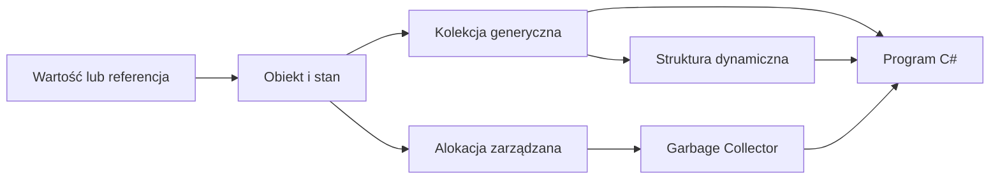

# 08. Typy referencyjne, kolekcje i pamięć w języku C sharp

Moduł wyjaśnia, jak C# przechowuje i przekazuje wartości oraz referencje, a następnie prowadzi od tablic do kolekcji generycznych i dynamicznych struktur danych. Druga część pokazuje, co robi Garbage Collector i jakie decyzje nadal należą do programisty.

Wszystkie przykłady są napisane w C# i przygotowane jako niezależne projekty konsolowe `net9.0`. Opis stosu i sterty jest używany jako model dydaktyczny; szczegóły rozmieszczenia pamięci są decyzją środowiska uruchomieniowego, a nie prostą regułą języka.

## Mapa tematów

1. [Typy wartościowe i referencyjne](01-typy-wartosciowe-i-referencyjne/README.md) - kopiowanie wartości, kopiowanie referencji, mutowalność, `null`, boxing i diagramy pamięci.
2. [Wprowadzenie do kolekcji](02-wprowadzenie-do-kolekcji/README.md) - `List<T>`, `ArrayList`, rekordy, filtrowanie, sortowanie i trzy kompletne programy.
3. [Wspólne API kolekcji](03-wspolne-api-kolekcji/README.md) - `IEnumerable<T>`, `ICollection<T>`, `IReadOnlyCollection<T>`, enumeracja i dobór kontraktu.
4. [Dynamiczne struktury danych](04-dynamiczne-struktury-danych/README.md) - `Stack<T>`, `Queue<T>`, `LinkedList<T>` i graf jako słownik list sąsiedztwa.
5. [Zarządzanie pamięcią i Garbage Collector](05-garbage-collector/README.md) - generacje, korzenie, alokacje, `IDisposable`, finalizacja i konsekwencje dla programisty.
6. [Laboratorium i zadania z rozwiązaniami](06-laboratorium-i-zadania/README.md) - zadania o typach, kolekcjach, strukturach dynamicznych i pamięci.



Źródło: [diagram-mapa-typy-referencyjne.mmd](diagram-mapa-typy-referencyjne.mmd).

## Cele modułu

Po module student potrafi:

- wyjaśnić różnicę między kopiowaniem wartości a kopiowaniem referencji,
- wskazać skutki mutowania obiektu przez kilka zmiennych typu referencyjnego,
- rozpoznać `null`, boxing i unboxing oraz unikać niejawnych kosztów,
- dobrać `List<T>` zamiast przestarzałego `ArrayList` dla nowych programów,
- korzystać z `Add`, `Remove`, `Contains`, `Count`, `foreach`, `Clear` i LINQ,
- rozdzielić kod zależny od konkretnej kolekcji od kodu używającego interfejsu,
- dobrać `Stack<T>`, `Queue<T>`, `LinkedList<T>` albo słownik list sąsiedztwa,
- opisać generacje GC i odróżnić pamięć zarządzaną od zasobów zewnętrznych,
- rozumieć, że GC zwalnia nieosiągalne obiekty, ale nie zastępuje `Dispose`,
- przygotować przypadki testowe i debugować zmiany stanu kolekcji.

## Proponowany wykład

1. Zacznij od eksperymentu: przypisz `int` i obiekt do drugiej zmiennej, zmień jedną z nich i przewidź wynik.
2. Narysuj osobno zmienną przechowującą wartość oraz zmienną przechowującą referencję do obiektu.
3. Pokaż, że `List<T>` jest generyczna, a `ArrayList` przechowuje `object` i może powodować boxing.
4. Zbuduj trzy małe programy: listę zadań, rejestr ocen i katalog kontaktów.
5. Uogólnij operacje przez `IEnumerable<T>` i `ICollection<T>`, a potem porównaj możliwości interfejsów.
6. Dobierz strukturę do operacji: LIFO, FIFO, wstawianie w środku albo sąsiedztwo grafu.
7. Omów cykl życia obiektu w GC oraz różnicę między zwolnieniem pamięci a zamknięciem pliku.
8. Zakończ analizą programu, w którym kolekcja rośnie, jest filtrowana i przekazywana między metodami.

## Proponowane laboratorium

- **Laboratorium 1:** eksperymenty z kopiowaniem wartości i referencji, `List<T>`, `ArrayList` oraz rekordami.
- **Laboratorium 2:** wspólne API kolekcji, filtracja, raportowanie, stos, kolejka i graf.
- **Laboratorium 3:** generacje GC, `IDisposable`, analiza alokacji oraz zadanie projektowe.

## Wspólna instrukcja uruchamiania

W katalogu konkretnego projektu `Kod/<NazwaProjektu>`:

```powershell
dotnet build
dotnet run
```

Z katalogu repozytorium można użyć:

```powershell
dotnet run --project src/08-typy_referencyjne/04-dynamiczne-struktury-danych/Kod/StrukturyDynamiczne/StrukturyDynamiczne.csproj
```

W Visual Studio Code ustaw punkt przerwania w miejscu przypisania, `Add`, `Remove`, `Push`, `Pop`, `Enqueue`, `Dequeue` albo alokacji. Uruchom `F5`, użyj `F10` do przechodzenia instrukcja po instrukcji, a w panelu **Locals** obserwuj `Count`, zawartość kolekcji i wartości referencji. W temacie GC dodatkowo obserwuj **Diagnostic Tools** albo wartości zwracane przez `GC.GetTotalMemory`.

## Zasady testowania

Każdy program z kolekcją powinien sprawdzić:

- pustą kolekcję,
- jeden element,
- duplikaty,
- dodawanie i usuwanie pierwszego, środkowego oraz ostatniego elementu,
- wyszukiwanie istniejącej i nieistniejącej wartości,
- przekroczenie zakładanej pojemności, jeśli omawiana jest zmiana rozmiaru,
- dane `null`, gdy kontrakt na nie pozwala,
- spójność wyniku po wielokrotnym wykonaniu operacji.

## Literatura i źródła

- [Value types - C# reference](https://learn.microsoft.com/dotnet/csharp/language-reference/builtin-types/value-types),
- [Reference types - C# reference](https://learn.microsoft.com/dotnet/csharp/language-reference/keywords/reference-types),
- [Boxing and unboxing - C# reference](https://learn.microsoft.com/dotnet/csharp/programming-guide/types/boxing-and-unboxing),
- [System.Collections.Generic](https://learn.microsoft.com/dotnet/api/system.collections.generic),
- [`List<T>` Class](https://learn.microsoft.com/dotnet/api/system.collections.generic.list-1),
- [ArrayList Class](https://learn.microsoft.com/dotnet/api/system.collections.arraylist),
- [Garbage collection](https://learn.microsoft.com/dotnet/standard/garbage-collection/),
- [Fundamentals of garbage collection](https://learn.microsoft.com/dotnet/standard/garbage-collection/fundamentals),
- [Implement a Dispose method](https://learn.microsoft.com/dotnet/standard/garbage-collection/implementing-dispose),
- [Collections overview](https://learn.microsoft.com/dotnet/standard/collections/),
- [Wzorzec numerowanych katalogów kursu Java](https://github.com/tborzyszkowski/oop-concepts-java/tree/main/02_OOP/src).

Linki do dokumentacji zostaną sprawdzone przed publikacją modułu 28 września 2026 r.
