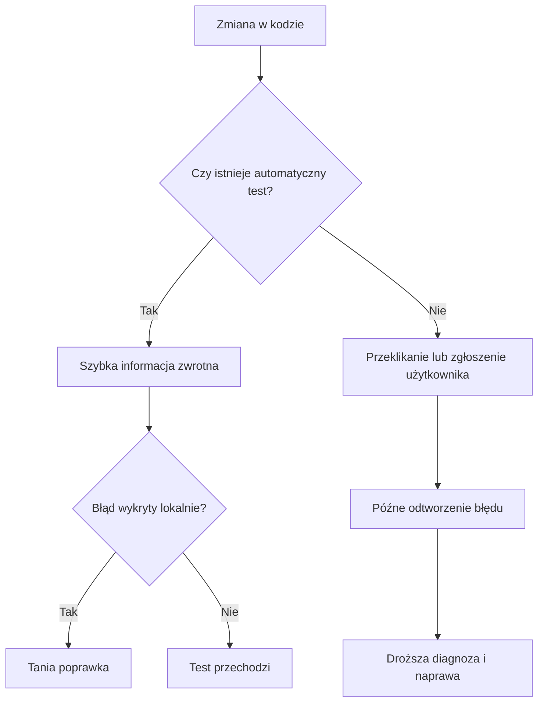

# 1. Po co w ogóle testujemy?

## Od przeklikania do informacji zwrotnej

Ręczne uruchomienie programu ma wartość: pozwala zobaczyć, czy użytkownik rozumie ekran, komunikaty i główny przepływ. Nie wystarcza jednak jako jedyna metoda sprawdzania logiki. Człowiek zwykle wybiera jeden wygodny scenariusz, pomija przypadki brzegowe i nie chce powtarzać tej samej sekwencji po każdej zmianie.

Automatyczny test zapisuje dane wejściowe, wywołanie i oczekiwanie w kodzie. Można go uruchomić wiele razy w kilka sekund i dostać jednoznaczny sygnał, gdy wcześniejsze zachowanie przestaje działać.



Źródło: [diagram-koszt-bledow.mmd](diagram-koszt-bledow.mmd).

## Koszt szybkiego i późnego wykrycia błędu

Im później błąd zostanie zauważony, tym więcej kontekstu trzeba odtworzyć. Błąd znaleziony od razu po napisaniu metody ma mały obszar poszukiwań. Błąd znaleziony na produkcji może wymagać odtworzenia danych klienta, analizy logów, komunikacji z zespołem i przygotowania bezpiecznej poprawki.

Nie chodzi o obietnicę, że testy wykryją każdy błąd. Chodzi o przesunięcie części sprawdzania bliżej miejsca, w którym powstaje kod, oraz o ochronę zachowania, które już raz zostało uznane za ważne.

| Moment wykrycia | Typowa informacja | Koszt diagnozy |
| --- | --- | --- |
| podczas pisania metody | błąd lokalny i mały zakres danych | niski |
| przed scaleniem zmiany | problem widoczny w CI albo Test Explorerze | średni |
| podczas testów ręcznych całej aplikacji | trzeba odtworzyć dłuższy scenariusz | wyższy |
| na produkcji | logi, dane użytkownika, wpływ na usługę | najwyższy |

## Czym jest test jednostkowy?

Test jednostkowy to automatyczna weryfikacja małego, odizolowanego fragmentu kodu: metody, klasy albo jednej odpowiedzialności. Test powinien znać kontrakt testowanej jednostki, ale nie powinien wymagać uruchamiania całej aplikacji, prawdziwej bazy danych czy zewnętrznego serwera.

Przykład jednostki:

```csharp
public static class KalkulatorCen
{
    public static decimal CenaPoRabacie(decimal cena, decimal rabatProcent)
    {
        if (cena < 0)
        {
            throw new ArgumentException("Cena nie może być ujemna.", nameof(cena));
        }

        if (rabatProcent is < 0 or > 100)
        {
            throw new ArgumentException("Rabat musi mieścić się w zakresie 0-100.", nameof(rabatProcent));
        }

        return cena * (100 - rabatProcent) / 100;
    }
}
```

Jednostka nie wypisuje tekstu, nie pobiera danych z konsoli i nie odwołuje się do zegara. Dzięki temu można podać dane bezpośrednio i porównać wynik z niezależnym oczekiwaniem.

## Anatomia dobrego testu

Dobry test jest:

- **deterministyczny** - dla tych samych danych daje ten sam wynik,
- **szybki** - można uruchomić go często, bez czekania na sieć lub ręczne działania,
- **niezależny** - nie potrzebuje kolejności innego testu i nie dzieli z nim zmiennego stanu,
- **czytelny** - nazwa wyjaśnia scenariusz i oczekiwany rezultat,
- **skupiony** - sprawdza jedną odpowiedzialność, a nie cały system naraz.

Nie należy mylić testu jednostkowego z testem akceptacyjnym. Test akceptacyjny pyta, czy większy przepływ spełnia potrzebę użytkownika. Test jednostkowy pyta, czy mały kontrakt kodu działa dla wybranego przypadku.

## Projekt demonstracyjny

Projekt [Kod/TestyMotywacja/Program.cs](Kod/TestyMotywacja/Program.cs) pokazuje tę samą logikę ceny jako kod niezależny od konsoli. Można go przeklikać ręcznie, ale prawdziwa korzyść pojawia się wtedy, gdy ten sam kontrakt zostanie automatycznie wywołany dla wielu przypadków w projekcie testowym.

```csharp
Console.WriteLine(KalkulatorCen.CenaPoRabacie(100, 20));
```

## Zadania

1. Uruchom program dla ceny `100` i rabatu `20`, a następnie dla ceny `0` i rabatu `100`. Zapisz oczekiwane wyniki przed uruchomieniem.
2. Wprowadź błąd polegający na dzieleniu przez `1000`. Wyjaśnij, dlaczego przeklikanie jednego przypadku może go nie zauważyć, jeśli nie porównasz wyniku z oraklem.
3. Zaproponuj trzy przypadki, które nie używają konsoli: cena ujemna, rabat ujemny i rabat większy niż `100`.
4. Wskaż, które elementy programu są jednostką, a które prezentacją wyniku.

### Rozwiązania i wyjaśnienia

1. Dla `100` i `20` oczekujemy `80`, a dla `0` i `100` oczekujemy `0`.
2. Każdy przypadek powinien mieć niezależnie zapisane oczekiwanie. Sam fakt, że program wypisał liczbę, nie świadczy o jej poprawności.
3. Dane niepoprawne powinny prowadzić do `ArgumentException`, ponieważ taki jest kontrakt metody.
4. `KalkulatorCen.CenaPoRabacie` jest logiką jednostki, a `Console.WriteLine` należy do prezentacji. Oddzielenie ich pozwala testować obliczenie bez uruchamiania interfejsu.

## Instrukcja kompilacji i debugowania

```powershell
dotnet build
dotnet run
```

Ustaw breakpoint w warunkach walidacji i przy obliczeniu wyniku. W **Locals** porównaj `cena`, `rabatProcent` i wynik pośredni. Potem przejdź do tematu 2 i przenieś oczekiwania do testów xUnit.

## Źródła

- [Unit testing in .NET](https://learn.microsoft.com/dotnet/core/testing/),
- [Unit testing C# code with xUnit](https://learn.microsoft.com/dotnet/core/testing/unit-testing-csharp-with-xunit),
- [Test pyramid - Martin Fowler](https://martinfowler.com/articles/practical-test-pyramid.html).
