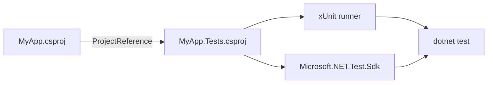

# 2. Pierwszy test w C# i xUnit

## Oddziel kod aplikacji od testów

Najprostszy układ projektu testowego rozdziela produkcyjny kod aplikacji od kodu, który go sprawdza:

```text
02-pierwszy-test-xunit/
└── Kod/
    ├── MyApp/
    │   ├── MyApp.csproj
    │   └── Kalkulator.cs
    └── MyApp.Tests/
        ├── MyApp.Tests.csproj
        └── KalkulatorTests.cs
```

`MyApp` jest biblioteką klas. Nie powinien znać xUnit ani zawierać kodu testowego. `MyApp.Tests` jest osobnym projektem, który ma referencję do `MyApp` i pakiety potrzebne do uruchamiania testów.



Źródło: [diagram-projekt-testowy.mmd](diagram-projekt-testowy.mmd).

## xUnit i alternatywy

xUnit jest jednym z popularnych frameworków testowych dla .NET. W tym module używamy atrybutów i asercji xUnit, ponieważ dobrze pokazują mały, deklaratywny test.

- **xUnit** używa między innymi `[Fact]`, `[Theory]` i `[InlineData]`.
- **NUnit** często używa `[Test]`, `[TestCase]` i własnego zestawu asercji.
- **MSTest** używa `[TestClass]`, `[TestMethod]` oraz `[DataTestMethod]`.

Idea AAA i dobór przypadków są ważniejsze niż sama nazwa frameworka. Ten sam kontrakt można przetestować w każdym z nich.

## AAA: Arrange - Act - Assert

Każdy test warto czytać jak krótką historię:

1. **Arrange** - przygotuj obiekt i dane wejściowe.
2. **Act** - wywołaj testowaną metodę.
3. **Assert** - sprawdź wynik albo wyjątek.

Przykład pojedynczego przypadku:

```csharp
[Fact]
public void Add_TwoNumbers_ReturnsTheirSum()
{
    // Arrange
    Kalkulator kalkulator = new();

    // Act
    int wynik = kalkulator.Add(2, 3);

    // Assert
    Assert.Equal(5, wynik);
}
```

## `[Fact]`: jeden nazwany przypadek

`[Fact]` oznacza test bez parametrów. Używaj go, gdy przypadek ma własne znaczenie albo wymaga osobnego przygotowania.

```csharp
[Fact]
public void Divide_DivisorIsZero_ThrowsArgumentException()
{
    Kalkulator kalkulator = new();

    Assert.Throws<ArgumentException>(() => kalkulator.Divide(10, 0));
}
```

Wartość testu wynika z nazwy: dzielenie przez zero ma zakończyć się konkretnym typem wyjątku.

## `[Theory]` i `[InlineData]`: kilka danych, jedna reguła

`[Theory]` opisuje regułę, którą sprawdzamy dla wielu zestawów danych. Każde `[InlineData]` dostarcza argumenty jednego przypadku.

```csharp
[Theory]
[InlineData(2, true)]
[InlineData(7, false)]
[InlineData(0, true)]
public void IsEven_ReturnsExpectedResult(int liczba, bool oczekiwany)
{
    Kalkulator kalkulator = new();

    bool wynik = kalkulator.IsEven(liczba);

    Assert.Equal(oczekiwany, wynik);
}
```

Drugi przykład parametryzacji może sprawdzać zwykłe dzielenie:

```csharp
[Theory]
[InlineData(10, 2, 5)]
[InlineData(9, 3, 3)]
[InlineData(-8, 2, -4)]
public void Divide_ValidArguments_ReturnsQuotient(
    int dzielna,
    int dzielnik,
    int oczekiwany)
{
    Kalkulator kalkulator = new();

    int wynik = kalkulator.Divide(dzielna, dzielnik);

    Assert.Equal(oczekiwany, wynik);
}
```

`InlineData` powinno pozostać proste. Gdy dane wymagają obiektów, pliku albo wieloetapowego przygotowania, lepszy może być osobny `[Fact]` albo bardziej zaawansowany mechanizm danych.

## Projekt demonstracyjny

Kod produkcyjny znajduje się w [Kod/MyApp/Kalkulator.cs](Kod/MyApp/Kalkulator.cs), a testy w [Kod/MyApp.Tests/KalkulatorTests.cs](Kod/MyApp.Tests/KalkulatorTests.cs). Projekt testowy ma jawne `ProjectReference` do biblioteki.

### Instrukcja uruchamiania

Z katalogu repozytorium:

```powershell
dotnet build src/09-testy/02-pierwszy-test-xunit/Kod/MyApp.Tests/MyApp.Tests.csproj
dotnet test src/09-testy/02-pierwszy-test-xunit/Kod/MyApp.Tests/MyApp.Tests.csproj
```

W Visual Studio Code testy można uruchomić z panelu **Testing** albo przez `dotnet test`. Ustaw breakpoint w `Kalkulator.cs`, uruchom test z debugowaniem i przejdź przez fazy AAA.

## Zadania do własnego rozwijania

1. Dodaj do `Kalkulator` metodę `IsPositive(int liczba)` i napisz teorię z danymi `1`, `0` i `-1`.
2. Dodaj metodę `Clamp(int liczba, int minimum, int maksimum)` i napisz co najmniej trzy przypadki graniczne.
3. Napisz osobny `[Fact]`, który sprawdza, że `Divide` z dzielnikiem `0` zgłasza wyjątek z właściwą nazwą parametru.
4. Zmień jedną wartość w `[InlineData]` tak, aby test był czerwony. Przeczytaj komunikat i napraw test albo kod zgodnie z kontraktem.

### Rozwiązania i wyjaśnienia

`IsPositive` można sprawdzić jednym `[Theory]`, bo reguła jest taka sama dla wszystkich liczb. `Clamp` wymaga osobnych przypadków dla wartości poniżej minimum, wewnątrz zakresu i powyżej maksimum. Test wyjątku powinien sprawdzać nie tylko typ, gdy komunikat jest częścią kontraktu, ale nie należy uzależniać testu od przypadkowego tekstu.

## Źródła

- [Unit testing C# code with xUnit](https://learn.microsoft.com/dotnet/core/testing/unit-testing-csharp-with-xunit),
- [xUnit.net getting started](https://xunit.net/docs/getting-started/v2/getting-started),
- [NUnit documentation](https://docs.nunit.org/),
- [MSTest documentation](https://learn.microsoft.com/dotnet/core/testing/unit-testing-mstest-writing-tests).
